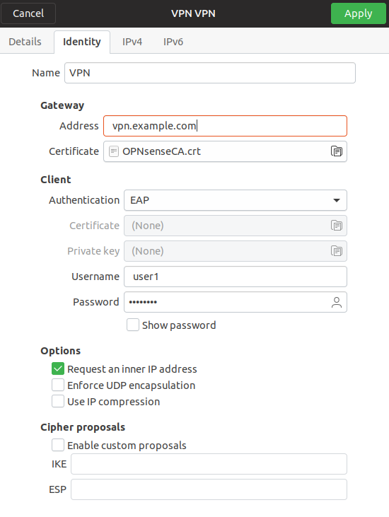

================================
IPsec: Setup Linux Remote Access
================================

.. contents:: Index

Here you can see the configuration options for all compatible VPN types.
We assume that you are familiar with adding a new VPN connection.

The tests were done with Ubuntu 18.04 and network-manager-stronswan installed, Ubuntu only supports
OpenVPN and PPTP with the default install.

----------------------------
Step 1 - Download Certificte
----------------------------

Download the Root CA from the OPNsense Firewall since it's needed for all EAP types with IKEv2.

---------------------------
Step 2 - Add VPN Connection
---------------------------

Open the network manager and add a new VPN connction. Choose **IPSec/IKEv2**, give it a **Name** and set
the **Address** to the FQDN matching the one of the certificate at your Firewall.

----------------------------------
IKEv2 + EAP-MSCHAPv2 or EAP-RADIUS
----------------------------------

   
