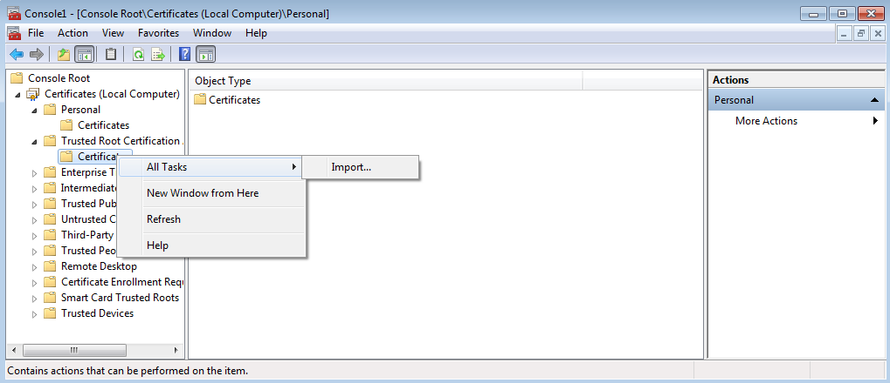
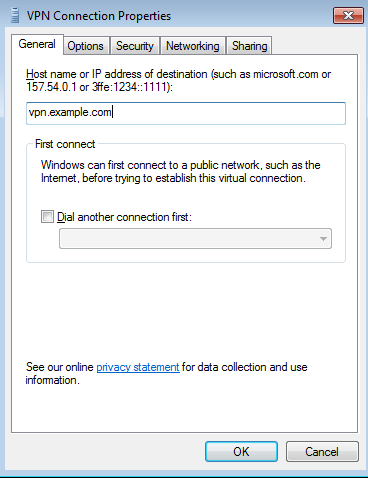
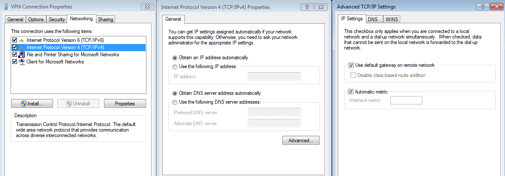
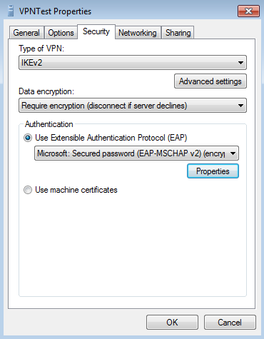

==================================
IPsec: Setup Windows Remote Access
==================================

.. contents:: Index

Here you can see the configuration options for all compatible VPN types.
We assume that you are familiar with adding a new VPN connection.

The tests were done with Windows 7 and 10.

All screenshot were taken from :menuselection:`Network and Sharing Center --> Change adapter settings`.

---------------------------
Step 1 - Install Certificte
---------------------------

Since Windows 7 also supports IKEv2 we need to install your Root Certificate Authority.
Hit the Windows Start button and type *mmc* in search box. Go to :menuselection:`File --> Add/Remove Snap-In`.
Choose :menuselection:`Certificates --> Add --> Computer account`.
Open **Certificate** and navigate to **Trusted Root Certificate Authorities**, right click,
**All taks** and import. Select the Root CA and install. 

If you are using client certificates for authentication (e.g EAP-TLS) use a PKCS12/PFX and install 
it under **Personal** instead of **Trusted Root Certificate Authorities**. All included certificates 
will be installed in the correct folders.

---------------------------
Step 2 - Add VPN Connection
---------------------------

Add a new VPN connection via **Network and Sharing Center** and choose as **Internet Address**
the correct FQDN. This is imporatant when using certificates since the FQDN of your connection
and the one in the certificate has to match!
Then set a **Username** and **Password** and leave **Domain** emtpy.

-------------------
Step 3 - Finetuning
-------------------

Via **Network and Sharing Center** go to **Change adapter settings** and open the properties
of your newly created adapter. Check that the FQDN is correct:

On tab **Networking** in IPv4 configuration under **Advanced** is the option **Use defaut gateway on remote network**.
If this option is enabled, all traffic will be sent through the VPN (if IPsec SA matches). When unchecked, you have
to set specific routes sent via VPN. 

----------------------------------
IKEv2 + EAP-MSCHAPv2 or EAP-RADIUS
----------------------------------

   
