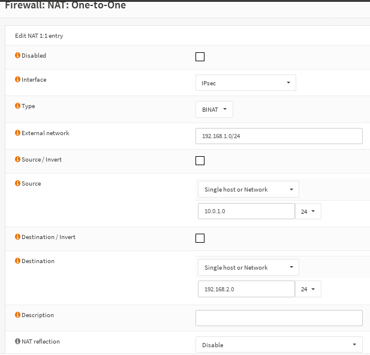

=================================
IPSec - BINAT (NAT before IPSec)
=================================

.. nwdiag::
  :scale: 100%

    nwdiag {

      span_width = 90;
      node_width = 180;

      network LANA {
        label = " LAN Site A";
        address ="10.0.1.0/24";
        lana [label="Network A"];
      }

      network NATA {
        label = " Tunnel network";
        address ="192.168.1.0/24";
        lana [label="Network A"];
        virtuala [label="Virtual net A", shape = cloud];
      }

      network NATB {
        label = " Tunnel network";
        address ="192.168.2.0/24";
        virtuala [label="Virtual net A", shape = cloud]
        virtualb [label="Virtual net B", shape = cloud];
      }

      network LANB  {
        label = " LAN Site B";
        virtualb [label="Virtual net B", shape = cloud];
        lanb [label="Network B"];
      }

    }

Assume company A has local LAN 10.0.1.0/24 and company B has local LAN 10.0.2.0/24.
Also we assume that on both sides the other networks are already in use, e.g. in company A the network 10.0.2.0/24 is used for Voice and in company B network 10.0.1.0/24 is used for Guest Wi-Fi.

We have to define new networks for the Phase 2 with unused ones and create NAT entries to reach the final systems.

To make it easier we create a Phase2 with company A using 192.168.1.0/24 as *Local Network* and 192.168.2.0/24 as *Remote Network* and with company B using 192.168.2.0/24 as *Local network* and 192.168.1.0/24 as *Remote Network*.
Now we need to add on each side the local LAN in the field "Manual SPD entries". So for company A we set 10.0.1.0/24 in the field and for B 10.0.2.0/24.
This allows the NAT process to speak with the Security Policy Database.

Finally we have to create NAT entries since a client in LAN A (10.0.1.10) tries to reach 192.168.2.10, but this address has to be rewritten to 10.0.2.10 on Firewall B.

Create the rule like in the screenshot and vice versa on Firewall A:

