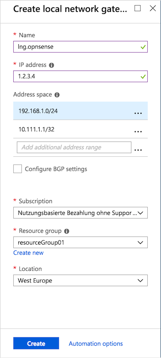
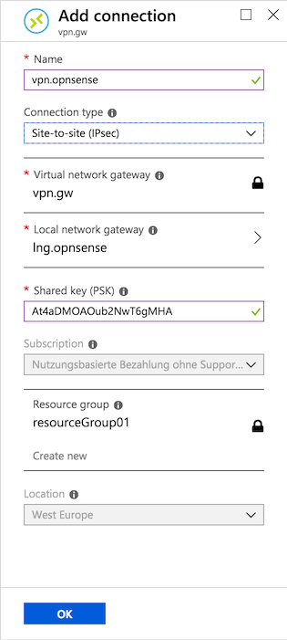

===============================
Microsoft Azure Route-based VPN
===============================

Microsoft Azure offers three VPN types:

* policy-based (restricted to a single S2S connection)
* route-based
* route-based with BGP (not available in the virtual network gateway SKU "Basic")

This how-to covers setting up a route-based S2S VPN.

----------------
Before you start
----------------
Before starting with the configuration of an IPsec tunnel you need to have a
working OPNsense installation and an Azure virtual network setup with a unique
LAN IP subnets for each side of your connection (your local networks need to be
different from your remote networks).

For setting up a Microsoft Azure virtual network and virtual network gateway
refer to the Microsoft Azure documentation:

https://docs.microsoft.com/en-us/azure/vpn-gateway/vpn-gateway-howto-site-to-site-resource-manager-portal

------------
Sample Setup
------------
This sample configuration uses an OPNsense box and the basic Azure virtual network
gateway, with the following configuration:

OPNsense
--------
==================== =============================
 **Hostname**         OPNsense
 **WAN IP**           1.2.3.4
 **LAN Network**      192.168.1.1/24
==================== =============================

|

-----------------------------

Azure
-----

====================================== =============================
 **Hostname**                           Azure
 **Virtual Network Gateway Public IP**  4.3.2.1
 **Virtual Network Address Space**      192.168.2.0/24
====================================== =============================

|

-----------------------------

-----------------------
Firewall Rules OPNsense
-----------------------
To allow IPsec tunnel connections, the following should be allowed on WAN for on
sites (under :menuselection:`Firewall --> Rules --> WAN`):

* Protocol ESP
* UDP Traffic on port 500 (ISAKMP)
* UDP Traffic on port 4500 (NAT-T)

.. image:: images/ipsec_wan_rules.png
    :width: 100%

.. Note::

    You can further limit the traffic by the source IP of the remote host.

-------------------------
Step 1 - Phase 1 OPNsense
-------------------------
(Under :menuselection:`VPN --> IPsec --> Tunnel Settings` Press **+**)
We will use the following settings:

General information
-------------------
========================= ============== ======================================================
**Connection method**      Respond only
**Key Exchange version**   V2
**Internet Protocol**      IPv4
**Interface**              WAN            *Choose the interface connected to the internet*
**Remote gateway**         4.3.2.1        *The public IP address of your Azure virtual network*
**Description**            IPsec Azure    *Freely chosen description*
========================= ============== ======================================================

Phase 1 proposal (Authentication)
---------------------------------
=========================== ====================== ======================================
 **Authentication method**   Mutual PSK             *Using a Pre-shared Key*
 **My identifier**           My IP address          *Simple identification for fixed IP*
 **Peer identifier**         Peer IP address        *Simple identification for fixed IP*
 **Pre-Shared Key**          At4aDMOAOub2NwT6gMHA   *Random key*. **CREATE YOUR OWN!**
=========================== ====================== ======================================

Phase 1 proposal (Algorithms)
-----------------------------
========================== =============== ===========================================
 **Encryption algorithm**   AES 256         *refer to Azure docs for details*
 **Hash algoritm**          SHA256
 **DH key group**           2 (1024 bit)
 **Lifetime**               28800 sec       *Lifetime before renegotiation*
========================== =============== ===========================================

.. Note::

    Possible parameters are listed here:
    https://docs.microsoft.com/en-us/azure/vpn-gateway/vpn-gateway-about-vpn-devices

Advanced Options
----------------
======================= =========== ========================================================
**Install Policy**       Unchecked   *This has to be unchecked since we want plain routing*
**Disable Rekey**        Unchecked   *Renegotiate when connection is about to expire*
**Disable Reauth**       Unchecked   *For IKEv2 only re-authenticate peer on rekeying*
**NAT Traversal**        Disable     *For IKEv2 NAT traversal is always enabled*
**Dead Peer Detection**  Unchecked
======================= =========== ========================================================

Save your setting by pressing:

.. image:: images/btn_save.png

-------------------------
Step 2 - Phase 2 OPNsense
-------------------------
Press the button that says '+ Show 0 Phase-2 entries'

.. image:: images/ipsec_s2s_vpn_p1a_show_p2.png

You will see an empty list:

.. image:: images/ipsec_s2s_vpn_p1a_p2_empty.png
    :width: 100%

Now press the **+** at the right of this list to add a Phase 2 entry.
As we do not define a local and remote network, we just use tunnel addresses,
you might already know from OpenVPN. In this example we use ``10.111.1.1`` and 
``10.111.1.2``. These will be the gateway addresses used for routing

General information
-------------------
======================= =================== =============================
 **Mode**                Route-based         *Select Route-based*
 **Description**         Azure VNET          *Freely chosen description*
======================= =================== =============================

Tunnel Network
--------------
======================= ================== =====================
 **Local Address**       Local Tunnel IP    *Set IP 10.111.1.1*
 **Remote Address**      Remote Tunnel IP   *Set IP 10.111.1.2*
======================= ================== =====================

Phase 2 proposal (SA/Key Exchange)
----------------------------------
========================== =========== ===================================
**Protocol**                ESP         *Choose ESP for encryption*
**Encryption algorithms**   AES / 256   *refer to Azure docs for details*
**Hash algortihms**         SHA256
**PFS Key group**           off         *Not supported*
**Lifetime**                27000 sec
========================== =========== ===================================

Save your settings by pressing:

.. image:: images/btn_save.png

-----------------------------

Enable IPsec for OPNsense, select:

.. image:: images/ipsec_s2s_vpn_p1a_enable.png

Save:

.. image:: images/btn_save.png

And apply changes:

.. image:: images/ipsec_s2s_vpn_p1a_apply.png
    :width: 100%

------------------

.. image:: images/ipsec_s2s_vpn_p1a_success.png
    :width: 100%

-------------------------
Step 3 - Set MSS Clamping
-------------------------
(Under :menuselection:`Interfaces --> IPsec Azure`)
We will use the following settings:

Setup
-------------------
=================================== ====================== ==================================================
**MSS**                              1350                   *Required*
=================================== ====================== ==================================================

Leave the other settings as per default.

Save:

.. image:: images/btn_save.png

**You are almost done configuring OPNsense (only some firewall settings remain, which will be addressed later).**
**We will now proceed setting up Azure.**

-----------------------------

-------------------------------------------
Step 4 - Azure: Setup local network gateway
-------------------------------------------
(Under `All resources` press **+ Add**, then search and **Create** `Local network gateway`)
We will use the following settings:

Setup
-------------------
=================================== ====================== ==================================================
**Name**                             lng.opnsense           *Freely chosen name*
**IP address**                       1.2.3.4                *The public IP address of your remote OPNsense*
**Address space**                    192.168.1.0/24         *LAN Network*
**Address space**                    10.111.1.1/32          *Local Tunnel IP*
=================================== ====================== ==================================================

Press the button that says 'Create':

------------------------------------
Step 5 - Azure: Setup VPN connection
------------------------------------
(Under `All resources --> Virtual network gateway --> Connections` Press **+ Add**)
We will use the following settings:

General setup
-------------------
=================================== ====================== ==================================================
**Name**                             vpn.opnsense           *Freely chosen name*
**Connection type**                  Site-to-site (IPsec)
**Virtual network gateway**          vpn.gw                 *Select virtual network gateway*
**Local network gateway**            lng.opnsense           *Select local network gateway*
**Shared Key (PSK)**                 At4aDMOAOub2NwT6gMHA   *Random key*. **CREATE YOUR OWN!**
=================================== ====================== ==================================================

Press the button that says 'OK':

-----------------------
Firewall Rules OPNsense
-----------------------

To allow traffic passing to your LAN subnet you need to add a rule to the IPsec
interface (under :menuselection:`Firewall --> Rules --> IPsec`).

.. image:: images/ipsec_ipsec_lan_rule.png
    :width: 100%

------------------
IPsec Tunnel Ready
------------------

The tunnel should now be up and routing the both networks.
Go to :menuselection:`VPN --> IPsec --> Status Overview` to see current status.

------------------------
Step 6 - Define Gateways
------------------------

Now that you have the VPN up and running you have to set up a gateway.
Go to :menuselection:`System --> Gateways --> Single` and add a new gateway.

OPNsense
--------
================= ============ ===============================================================
 **Name**          VPNGW        *Set a name for your gateway*
 **Interface**     IPSEC1000    *Choose the IPsec interface*
 **IP Address**    10.111.1.2   *Set the peer IP address*
 **Far Gateway**   Checked      *This has to be checked as it is a point-to-point connection*
================= ============ ===============================================================

--------------------------
Step 7 - Add Static Routes
--------------------------

When the gateway is set up you can add a route for the Azure virtual network pointing to the new gateway.
Go to :menuselection:`System --> Routes --> Configuration`.

Route OPNsense
--------------
===================== ================ =============================
 **Network Address**   192.168.2.0/24   *Azure virtual network*
 **Gateway**           VPNGW            *Select the VPN gateway*
===================== ================ =============================

Now you are all set!
