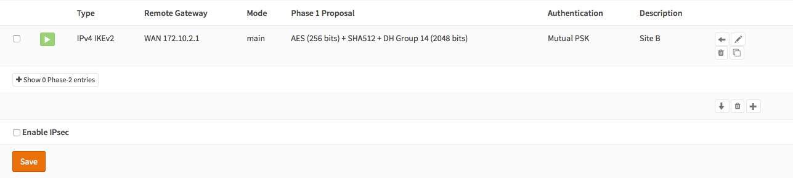
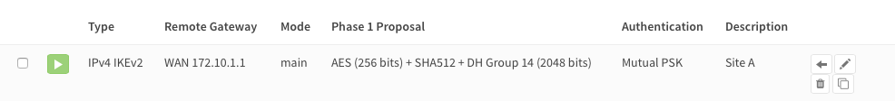
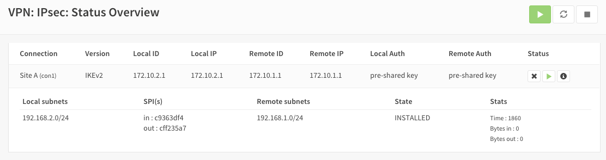
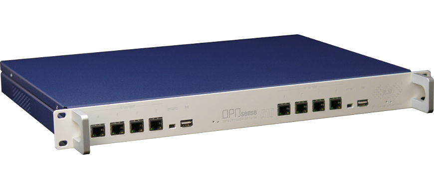

================================
Setup IPsec site to site tunnel
================================

Site to site VPN's connect two locations with static public IP addresses and allow
traffic to be routed between the two networks. This is most commonly used to
connect an organization's branch offices back to its main office, so branch users
can access network resources in the main office.

----------------
Before you start
----------------
Before starting with the configuration of an IPsec tunnel you need to have a
working OPNsense installation wit a unique LAN IP subnet for each side of your
connection (you local network need to different than that of the remote network).

.. Note::

   For the sample we will use a private ip for our WAN connection.
   This requires us to disable the default block rule on wan to allow private traffic.
   To do so, go to the **Interfaces->[WAN]** and uncheck "Block private networks".
   *(Dont forget to save and apply)*

   .. image:: images/block_private_networks.png

-----------------------------

------------
Sample Setup
------------
For the sample configuration we use two OPNsense boxes to simulate a site to site
tunnel, with the following configuration:

.. sidebar:: Network Site A

    .. nwdiag::
      :scale: 100%

        nwdiag {

          span_width = 90;
          node_width = 180;
          Internet [shape = "cisco.cloud"];
          pclana [label="PC Site A",shape="cisco.pc"];
          pclana -- switchlana;

          network LANA {
            switchlana [label="",shape = "cisco.workgroup_switch"];
            label = " LAN Site A";
            address ="192.168.1.1.x/24";
            fw1 [address="192.168.1.1/24"];
            tunnel [label=" IPsec Tunnel",shape = cisco.cloud];
          }

          network WANA  {
            label = " WAN Site A";
            fw1 [shape = "cisco.firewall", address="172.10.1.1/24"];
            Internet;
          }

        }

Site A
------
==================== =============================
 **Hostname**         fw1
 **WAN IP**           172.10.1.1/24
 **LAN IP**           192.168.1.1/24
 **LAN DHCP Range**   192.168.1.100-192.168.1.200
==================== =============================

|
|
|
|

-----------------------------

.. sidebar:: Network Site B

    .. nwdiag::
      :scale: 100%

        nwdiag {

          span_width = 90;
          node_width = 180;
          Internet [shape = "cisco.cloud"];
          pclanb [label="PC Site B",shape="cisco.pc"];
          pclanb -- switchlanb;

          network LANB {
            label = " LAN Site B";
            address ="192.168.2.1.x/24";
            fw2 [address="192.168.2.1/24"];
            tunnel [label=" IPsec Tunnel",shape = cisco.cloud];
            switchlanb [label="",shape = "cisco.workgroup_switch"];
          }

          network WANB {
            label = " WAN Site B";
            fw2 [shape = "cisco.firewall", address="172.10.2.1/24"];
            Internet;
          }

        }

Site B
------

==================== =============================
 **Hostname**         fw2
 **WAN IP**           172.10.2.1/24
 **LAN Net**          192.168.2.0/24
 **LAN DHCP Range**   192.168.2.100-192.168.2.200
==================== =============================

|
|
|
|

-----------------------------

Full Network Diagram Including IPsec Tunnel
-------------------------------------------

.. nwdiag::
  :scale: 100%
  :caption: IPsec Site-to-Site tunnel network

    nwdiag {

      span_width = 90;
      node_width = 180;
      Internet [shape = "cisco.cloud"];
      pclana [label="PC Site A",shape="cisco.pc"];
      pclana -- switchlana;

      network LANA {
        switchlana [label="",shape = "cisco.workgroup_switch"];
        label = " LAN Site A";
        address ="192.168.1.1.x/24";
        fw1 [address="192.168.1.1/24"];
        tunnel [label=" IPsec Tunnel",shape = cisco.cloud];
      }

      network WANA  {
        label = " WAN Site A";
        fw1 [shape = "cisco.firewall", address="172.10.1.1/24"];
        Internet;
      }

      network WANB {
        label = " WAN Site B";
        fw2 [shape = "cisco.firewall", address="172.10.2.1/24"];
        Internet;
      }

      network LANB {
        label = " LAN Site B";
        address ="192.168.2.1.x/24";
        fw2 [address="192.168.2.1/24"];
        tunnel;
        switchlanb [label="",shape = "cisco.workgroup_switch"];
      }
      pclanb [label="PC Site B",shape="cisco.pc"];
      pclanb -- switchlanb;

    }

------------------------------
Firewall Rules Site A & Site B
------------------------------
To allow IPsec Tunnel Connections, the following should be allowed on WAN for on
sites:

* Protocol ESP
* UDP Traffic on Port 500 (ISAKMP)
* UDP Traffic on Port 4500 (NAT-T)

.. image:: images/ipsec_wan_rules.png
    :width: 100%

.. Note::

    You can further limit the traffic by the source ip of the remote host.

To allow traffic passing to your LAN subnet you need to add a rule to the IPsec
interface.

.. image:: images/ipsec_ipsec_lan_rule.png
    :width: 100%

-----------------------
Step 1 - Phase 1 Site A
-----------------------
(Under **VPN->IPsec->Tunnel Settings** Press **+**)
We will use the following settings:

General information
-------------------
========================= ============= ================================================
**Connection method**      default       *default is 'Start on traffic'*
**Key Exchange version**   V2            *both V1 and V2 are supported*
**Internet Protocol**      IPv4
**Interface**              WAN           *choose the interface connected to the internet*
**Remote gateway**         172.10.2.1    *the public ip address of your remote OPNsense*
**Description**            Site B        *freely chosen description*
========================= ============= ================================================

Phase 1 proposal (Authentication)
---------------------------------
=========================== ====================== ======================================
 **Authentication method**   Mutual PSK             *Using a Pre-shared Key*
 **Negotiation mode**        Main                   *Use Main. Aggressive is insecure*
 **My identifier**           My IP address          *Simple identification for fixed ip*
 **Peer identifier**         Peer IP address        *Simple identification for fixed ip*
 **Pre-Shared Key**          At4aDMOAOub2NwT6gMHA   *Random key*. **CREATE YOUR OWN!**
=========================== ====================== ======================================

Phase 1 proposal (Algorithms)
-----------------------------
========================== ============= ===========================================
 **Encryption algorithm**   AES           *For our sample we will Use AES/256 bits*
 **Hash algoritm**          SHA512        *Use a strong hash like SHA512*
 **DH key group**           2048 bit      *2048 bit should be sufficient*
 **Lifetime**               28800 sec     *lifetime before renegotiation*
========================== ============= ===========================================

Advanced Options
----------------
======================= =========== ===================================================
**Disable Rekey**        Unchecked   *Renegotiate when connection is about to expire*
**Disable Reauth**       Unchecked   *For IKEv2 only re-authenticate peer on rekeying*
**NAT Traversal**        Disabled    *For IKEv2 NAT traversal is always enabled*
**Dead Peer Detection**  Unchecked
======================= =========== ===================================================

Save your setting by pressing:

.. image:: images/btn_save.png
    :width: 100%

Now you should see the following screen:

-----------------------
Step 2 - Phase 2 Site A
-----------------------
Press the button that says '+ Show 0 Phase-2 entries'

.. image:: images/ipsec_s2s_vpn_p1a_show_p2.png
    :width: 100%

You will see an empty list:

.. image:: images/ipsec_s2s_vpn_p1a_p2_empty.png
    :width: 100%

Now press the *+* at the right of this list to add a Phase 2 entry.

General information
-------------------
======================= ================== =============================
 **Mode**                Tunnel IPv4        *Select Tunnel mode*
 **Description**         Local LAN Site B   *Freely chosen description*
======================= ================== =============================

Local Network
-------------
======================= ================== ==============================
 **Local Network**       LAN subnet        *Route the local LAN subnet*
======================= ================== ==============================

Remote Network
--------------
============== =============== ==========================
 **Type**       Network         *Route a remote network*
 **Address**    192.168.2.1/24  *The remote LAN subnet*
============== =============== ==========================

Phase 2 proposal (SA/Key Exchange)
----------------------------------
=========================== ============ =======================================
**Protocol**                 ESP           *Choose ESP for encryption*
**Encryption algorithms**    AES / 256     *For the sample we use AES 256*
**Hash algortihms**          SHA512        *Choose a strong hash like SHA512*
**PFS Key group**            2048 bit      *Not required but enhanced security*
**Lifetime**                 3600 sec
=========================== ============ =======================================

Save your setting by pressing:

.. image:: images/btn_save.png
    :width: 100%

-----------------------------

Enable IPsec for Site A, Select:

.. image:: images/ipsec_s2s_vpn_p1a_enable.png
    :width: 100%

Save:

.. image:: images/btn_save.png
    :width: 100%

And Apply changes:

.. image:: images/ipsec_s2s_vpn_p1a_apply.png
    :width: 100%

------------------

.. image:: images/ipsec_s2s_vpn_p1a_success.png
    :width: 100%

**You are done configuring Site A.**

-----------------------------

-----------------------
Step 3 - Phase 1 Site B
-----------------------
(Under **VPN->IPsec->Tunnel Settings** Press **+**)
We will use the following settings:

General information
-------------------
========================= ============= ================================================
**Connection method**      default       *default is 'Start on traffic'*
**Key Exchange version**   V2            *both V1 and V2 are supported*
**Internet Protocol**      IPv4
**Interface**              WAN           *choose the interface connected to the internet*
**Remote gateway**         172.10.1.1    *the public ip address of your remote OPNsense*
**Description**            Site A        *freely chosen description*
========================= ============= ================================================

Phase 1 proposal (Authentication)
---------------------------------
=========================== ====================== ======================================
 **Authentication method**   Mutual PSK             *Using a Pre-shared Key*
 **Negotiation mode**        Main                   *Use Main. Aggressive is insecure*
 **My identifier**           My IP address          *Simple identification for fixed ip*
 **Peer identifier**         Peer IP address        *Simple identification for fixed ip*
 **Pre-Shared Key**          At4aDMOAOub2NwT6gMHA   *Random key*. **CREATE YOUR OWN!**
=========================== ====================== ======================================

Phase 1 proposal (Algorithms)
-----------------------------
========================== ============= ===========================================
 **Encryption algorithm**   AES           *For our sample we will Use AES/256 bits*
 **Hash algoritm**          SHA512        *Use a strong hash like SHA512*
 **DH key group**           2048 bit      *2048 bit should be sufficient*
 **Lifetime**               28800 sec     *lifetime before renegotiation*
========================== ============= ===========================================

Advanced Options
----------------
======================= =========== ===================================================
**Disable Rekey**        Unchecked   *Renegotiate when connection is about to expired*
**Disable Reauth**       Unchecked   *For IKEv2 only re-authenticate peer on rekeying*
**NAT Traversal**        Disable     *For IKEv2 NAT traversal is always enabled*
**Dead Peer Detection**  Unchecked
======================= =========== ===================================================

Save your setting by pressing:

.. image:: images/btn_save.png
    :width: 100%

Now you should see the following screen:

-----------------------
Step 4 - Phase 2 Site B
-----------------------

Press the button that says '+ Show 0 Phase-2 entries'

.. image:: images/ipsec_s2s_vpn_p1a_show_p2.png

You will see an empty list:

.. image:: images/ipsec_s2s_vpn_p1a_p2_empty.png
    :width: 100%

Now press the *+* at the right of this list to add a Phase 2 entry.

General information
-------------------
======================= ================== =============================
 **Mode**                Tunnel IPv4        *Select Tunnel mode*
 **Description**         Local LAN Site A   *Freely chosen description*
======================= ================== =============================

Local Network
-------------
======================= ================== ==============================
 **Local Network**       LAN subnet         *Route the local LAN subnet*
======================= ================== ==============================

Remote Network
--------------
============== =============== ==========================
 **Type**       Network         *Route a remote network*
 **Address**    192.168.1.1/24  *The remote LAN subnet*
============== =============== ==========================

Phase 2 proposal (SA/Key Exchange)
----------------------------------
=========================== ============ =======================================
**Protocol**                 ESP           *Choose ESP for encryption*
**Encryption algorithms**    AES / 256     *For the sample we use AES 256*
**Hash algortihms**          SHA512        *Choose a strong hash like SHA512*
**PFS Key group**            2048 bit      *Not required but enhanced security*
**Lifetime**                 3600 sec
=========================== ============ =======================================

Save your setting by pressing:

.. image:: images/btn_save.png
    :width: 100%

-----------------------------

Enable IPsec for Site B, Select:

.. image:: images/ipsec_s2s_vpn_p1a_enable.png
    :width: 100%

Save:

.. image:: images/btn_save.png
    :width: 100%

And Apply changes:

.. image:: images/ipsec_s2s_vpn_p1a_apply.png
    :width: 100%

-----------------------------

.. image:: images/ipsec_s2s_vpn_p1a_success.png
    :width: 100%

**You are done configuring Site B.**

------------------
IPsec Tunnel Ready
------------------

The tunnel should now be up and routing the both networks.
Go to **VPN->IPsec->Status Overview** to see current status.
Press on the **(i)** to see the details of the phase 2 tunnel(s), like this:

.. Note::

    If the tunnel did not come up, try to restart the service on both ends.

--------------------
Sample configuration
--------------------
For test purposes we used two OPNsense boxes integrated into one unit and a
cross-cable between the WAN ports.

To route traffic the WAN interfaces have been configured to use a /16 segment and
they are each others default gateway. Other than that the sample is equal to this
how-to.

Configuration Site A
    :download:`Config.xml Site A <resources/config-OPNsense-ipsec-Site-A.xml>`

Configuration Site B
    :download:`Config.xml Site B <resources/config-OPNsense-ipsec-Site-B.xml>`

----------------
Trouble shooting
----------------

Phase 1 won't come up
---------------------
That is a difficult one. First check you firewall rules to see if you allow the
right ports and protocols (ESP, UDP 500 & UDP 4500) for the WAN interface.

Check your ipsec log to see if that reviels a possible cause.

Common issues are unequal settings. Both ends must use the
same PSK and encryption standard.

Phase 1 works but no phase 2 tunnels are connected
---------------------------------------------------

Did you set the correct local and remote networks. A common mistake is to fill in
the ip address of the remote host in stead of its network ending with **x.x.x.0**

Common issues are unequal settings. Both ends must use the same encryption standard.

.. Note::

  If you are testing locally with your pc connected to one of the two test boxes
  as in the sample configuration, then make sure you have no other network
  connections (f.i. wifi).
