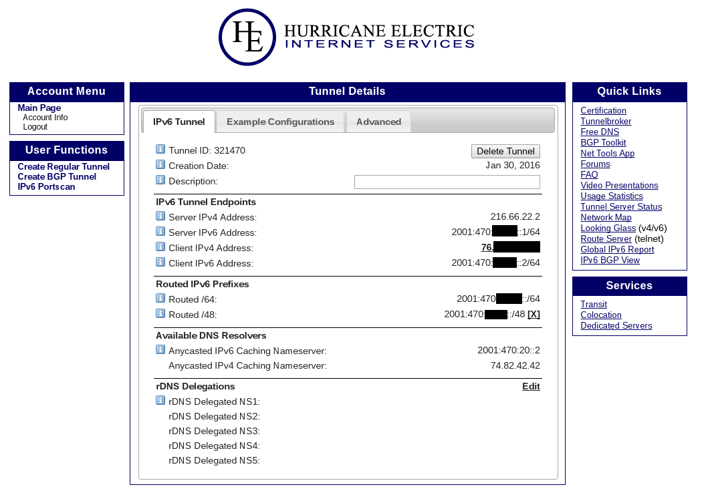
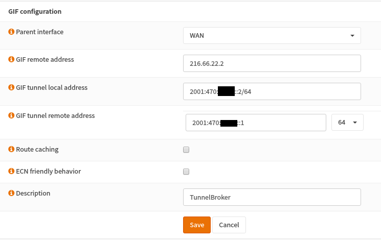
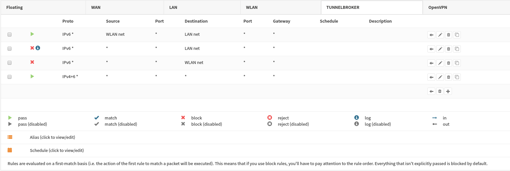
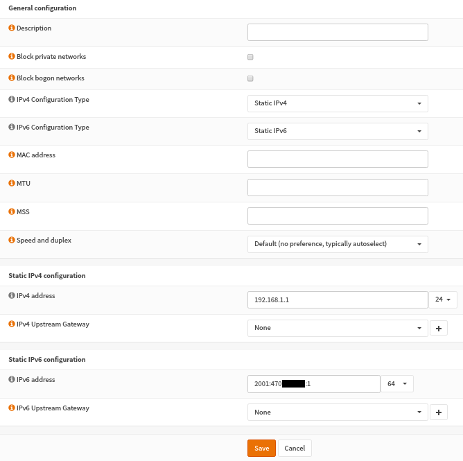
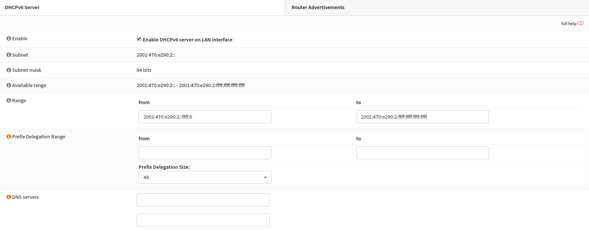

============================
Configure IPv6 Tunnel Broker
============================
**Original Author:** Shawn Webb

------------
Introduction
------------

OPNsense supports native IPv6 as well as tunneled IPv6. This article shows how
to set up TunnelBroker, Hurricane Electric's IPv6-in-IPv4 tunnel, with OPNsense.
If you're based in the US and you use Netflix, you might not want to follow these
instructions. Netflix now blocks TunnelBroker.

If you use IRC or need access to SMTP over the TunnelBroker connection,
Hurricane Electric requires you to go through their free IPv6 certification process.
Their "sage" level is the highest level and will allow you to enable IRC and SMTP.
Note that your OPNsense firewall must be directly connected to the Internet.
Being behind a NAT will not work.

The rest of this article assumes you already have a TunnelBroker account. If not,
sign up and go through the free IPv6 certification process. Screenshots are provided
throughout this article.

----------
Background
----------

Enable ICMP on the WAN side of your OPNsense firewall. TunnelBroker's UI will
tell you an IP to use when you're setting up your tunnel on their end.

Now add a tunnel. Make sure to add a routed /48 as we will need that to dish out
individual /64 slices to each network. Once configured, your tunnel settings
should look like this:

-----------------------
Step 1 - Add GIF tunnel
-----------------------

To configure OPNsense start with adding a new gif interface.
Go to **Interfaces->Other Types->GIF** and click on **Add** in the upper tight corner
of the form.

Use the following settings and copy in the IPv4&6 addresses from your TunnelBroker's UI.

============================== ============================
 **Parent interface**           *WAN*
 **GIF remote address**         *Server IPv4 Address*
 **GIF tunnel local address**   *Client IPv6 Address*
 **GIF tunnel remote address**  *Server IPv6 Address/64*
 **Route caching**              *disabled*
 **ECN friendly behavior**      *disabled*
 **Description**                *Tunnel Broker*
============================== ============================

.. Note::

  Make sure to include the **/64** prefixes!

----------------------------------------------------
Step 2 - Configure the GIF tunnel as a new interface
----------------------------------------------------

The newly created GIF tunnel must now be assigned as a new interface.
Go to **Interfaces->Assignments**, select the GIF tunnel for **New interface**
and click the **+** sign next to it.

Then under **Interfaces->[OPTX]** check **Enable Interface** and change the
description to e.g. TUNNELBROKER before hitting **Save**.

The newly created interface must now be set as the default IPv6 gateway
under **System->Gateways->All** by editing the new gateway entry
TUNNELBROKER_TUNNELV6 and checking **Default Gateway** before saving.

-----------------------------
Step 3 - Basic Firewall Rules
-----------------------------

Now add basic firewall rules. Since I have a LAN network and a WLAN network, I
allow WLAN to initiate connections to LAN, but not the other way around. I only
have servers on LAN whereas most of my clients are on WLAN (Wireless LAN).
I block all incoming to LAN and WLAN. Of course, outbound connections are fine.

--------------------------------
Step 4 - Configure LAN interface
--------------------------------

Now configure your LAN interface. The static IPv6 address we'll give it is a
**/64** address from your assigned **/48**. I won't show the WLAN settings simply
because it's the very same. You'll repeat the same process for further networks,
but assigning the next interface a separate **/64** address.

-------------------------------
Step 5 - Configure DHCPv6 SLAAC
-------------------------------

We'll next configure OPNsense for Stateless Address Auto Configuration (SLAAC).
We're going to set up the DHCPv6 service. Go to **Services->DHCPv6->Server**.

Simply choose a range for clients to use. Save your settings. Next go to the
Router Advertisements sub tab on that same page. Set the **Router Advertisements**
setting to *Assisted* and the **Router Priority** setting to *Normal*.

Save your settings.

--------------------------------
Step 6 - Test your Configuration
--------------------------------

You should now be set up for IPv6. To test your configuration, bring online an
IPv6 machine, use your favorite tool to determine you have an IPv6 address. If
you're using SLAAC, it may take up to 30 seconds or more to get an IPv6 address.
If you see that your interface has an IPv6 address, you can try going to an
IPv6 only test site, such as http://6.ifconfig.pro/
