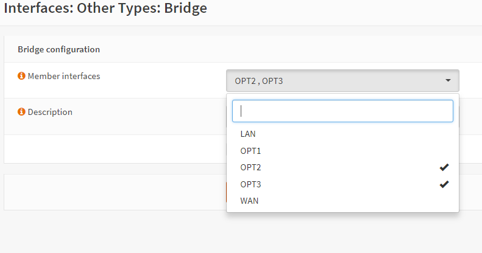
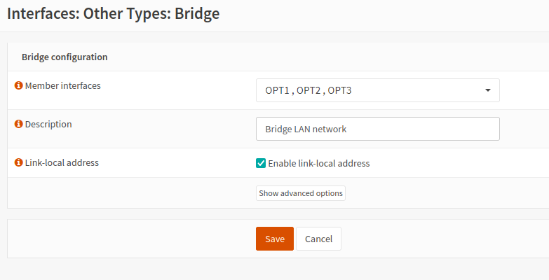
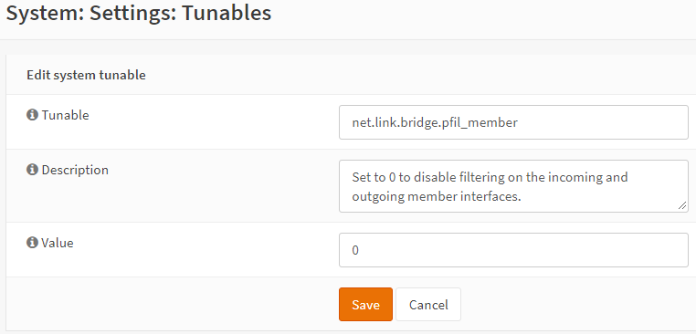
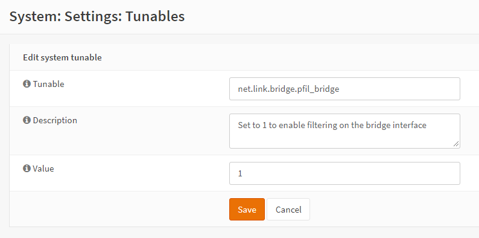

==============================
LAN Bridge
==============================

**Original Author:** Martin Wasley

**Introduction**
-----------------
LAN Bridges should really only be used where the LAN secondary, tertiary and other interfaces
are not heavily used, if that is the case then it is recommended that an external switch
be used instead. That being said, if the CPU is fast enough then it will easily cope with
the extra load placed upon it by the bridge.

When creating a LAN bridge it is essential that you have physical access to the device,
you will need to swap the LAN  connection at a certain point.

**Step One**
-----------------
Configure OPNsense as normal, with a single LAN interface, make sure that it works correctly.
It's a good idea to add the extra NIC interfaces ( OPTx ) during installation.

**Step Two**
-----------------
Create the bridge itself. Select :menuselection:`Interfaces --> Devices --> Bridge` and ADD a new bridge. Select
from the member interfaces the unused interfaces you wish to add to the bridge, OPT2,OPT3 etc.
    

Now Save the new bridge.

.. Note::
    It is imperative that the member interfaces have nothing set within them for IPv4 or IPv6,
    each member interface should be enabled. Edit their rows under :menuselection:`Interfaces --> Assignments`
    and set both configuration types to ``None``.
    
**Step Three**
-----------------
Select :menuselection:`Interfaces --> Assignments`, edit LAN, select the bridge as its **Device**, then click
**Save** and **Apply**.

At this point you will need to swap your LAN cable from the existing LAN connection to one of
the NICs that were added to the bridge interface, once connected then you must wait, it can take some
time for the interface to come back up, but keep refreshing the web interface until it does.

**Step Four**
-----------------
The Original LAN interface is now unassigned and will need to be re-assigned. Go to
:menuselection:`Interfaces --> Assignments`, click **Add**, select the NIC itself (``igb*``, ``em*``) as the
**Device**, enable the assignment and click **Save** and **Apply**.

**Step Five**
-----------------
Select :menuselection:`Interfaces --> Devices --> Bridge` and add the interface created in Step Four to the bridge.
Also check `Enable link-local address` checkbox in case you are using IPv6 and press Save.
Remember to check the new assignment and ensure **Enabled** is selected as in Step Two.

**Step Six**
-----------------    
We now need to make two changes to the System Tunables to ensure that filtering is carried
out on the bridge itself, and not on the member interfaces. Go to :menuselection:`System --> Settings --> Tunables`
and select using the pen button net.link.bridge.pfil_member and set the value to 0
(add a new record if this entry doesn't exist on your installation).

Select the tunable net.link.bridge.pfil_bridge and set the value to 1

**Final**
-----------------    
Once complete, verify the bridge and its member devices on the :menuselection:`Interfaces --> Assignments` page.

Now reboot, when the system restores you should have a fully functional bridge interface.
