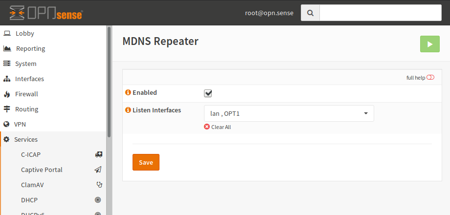

===================
Multicast DNS Proxy
===================

If you want to connect multicast DNS of multiple networks, you will need to proxy between them.

------------
Installation
------------

First of all, you have to install the mdns-repeater plugin (os-mdns-repeater) from the plugins view.

.. image:: ../images/menu_plugins.png

After a page reload you will get a new menu entry under services for MDNS Repeater.
Select it and you will get to the following screen:

-------------
Configuration
-------------

.. Warning::
    mdns-repeater requires at least 2 interfaces to work.

The configuration is fairly simple. Just enable the service and add the interfaces.
For example:

========== ==================
Property   Value
========== ==================
Enabled    checked
Interfaces LAN, OPT1, OPT2
========== ==================

