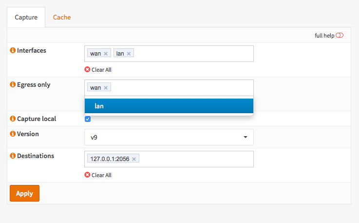

--------------------------
Configure Netflow Exporter
--------------------------

Configuring the Netflow Exporter is a simple task. Go to :menuselection:`Reporting --> NetFlow`.

Select all **Interfaces** you want to collect/export data from, usually one would
select all available interfaces here.

If you do not want to record traffic originating or going to the firewall itself
then add the interfaces to **Egress only** to prevent double counting of the same traffic
flow (See also :doc:`/manual/netflow` for more information).

For local analysis using Insight also enable **Capture local**.

Depending on the application you would like to use select **Version** 5 or 9.
Remember that version 5 does not support IPv6.

Add your **Destinations** (ip:port then enter) local IP will be added automatically
if Capture local is selected.
