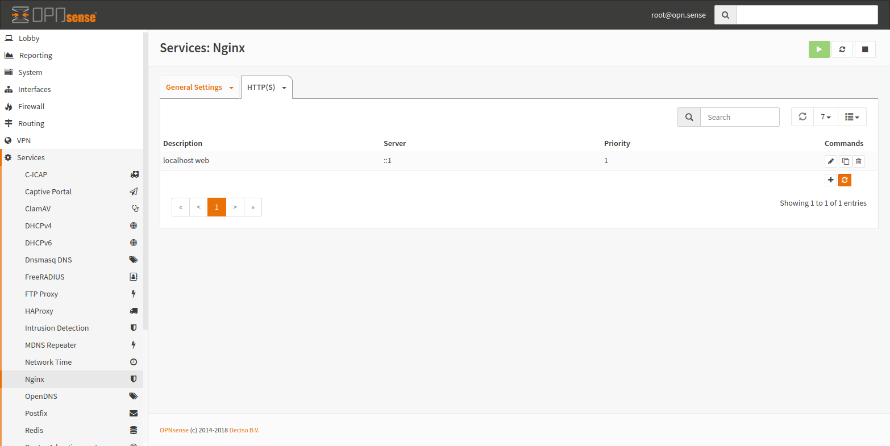
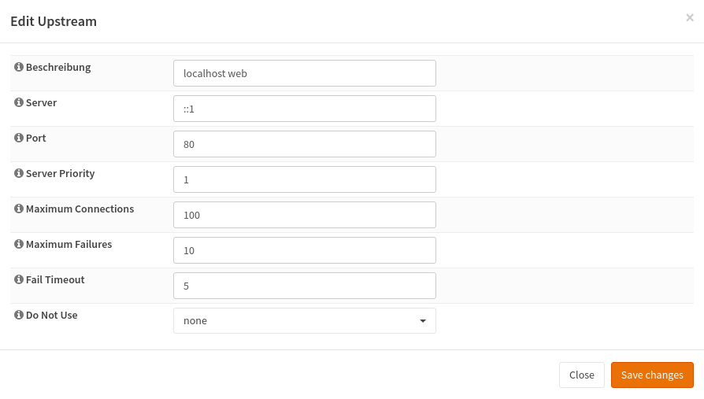
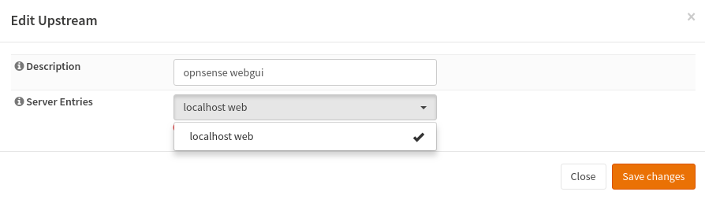
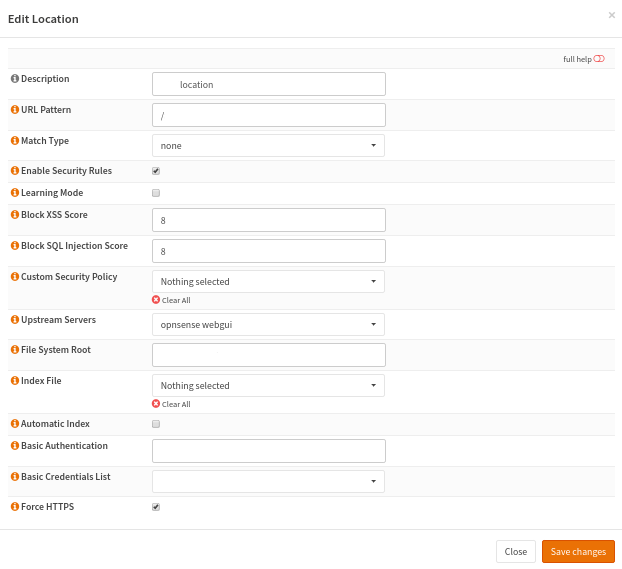
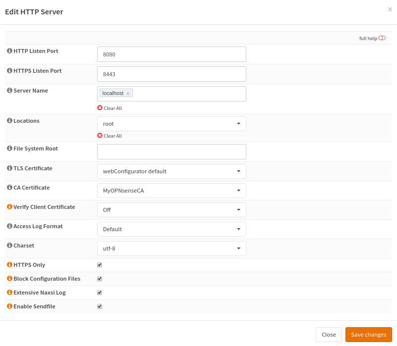

===========================
nginx: Basic Load Balancing
===========================

1) Create Upstream Servers
--------------------------

Create a server with a description and IP of the server. The priority is not important if you have a single server.
It is used as a weight for round robin. Servers with a higher weight will receive more traffic.

2) Create An Upstream
---------------------

Group upstream servers to an upstream. An upstream is a group of servers to load balance between.
Give it a useful name and choose the previously created server.

3) Create A Location
--------------------

Locations are are used to map URLs to upstreams, directories, settings and so on.
In our case we want to proxy the request to the previously created upstream.
If we want to match everything, we use "/" without a special matcher.
Now save the location.

4) Create A HTTP Server
-----------------------

In the last step, we have to create a port.
This happens in a "http" block, which contains some basic configuration and the location blocks.

Enter the domain name into the "Server Name" field and select the previously created location.
If you want to use support TLS, you have to add a certificate. 

5) Restart nginx
----------------

Click the reload button and you are done.
