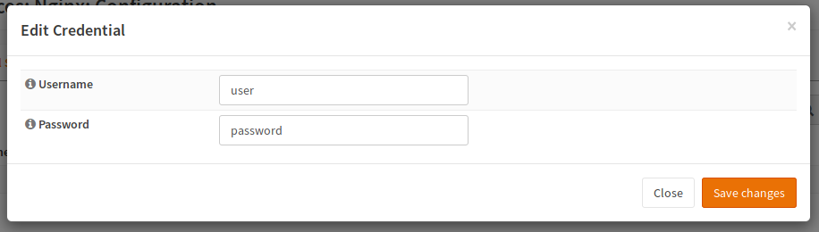
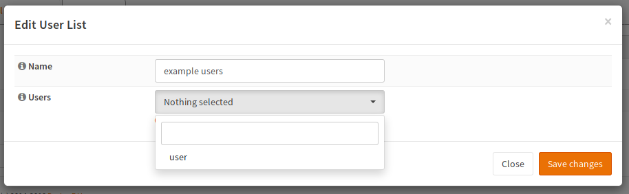
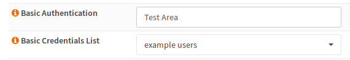

===========================================
nginx: Basic Authentication & Authorization
===========================================

.. Warning::

    Passwords in password files cannot be stored securely.
    Your passwords are stored in plain text in the configuration and as md5 in the
    nginx password files. Secure password hashes like bcrypt_, scrypt_ or
    Argon_ 2 are currently not supported by nginx.
    
    Please also note that basic authentication transfers the credentials in plain text
    to the server. It is recommended that you only use it via HTTPS because otherwise
    every attacker with a network sniffer such as Wireshark_ (and maybe some additional
    man in the middle tools like ettercap_ or fake_router6_) will be able to intercept
    your connection to the server and read your password.

.. _Argon: https://github.com/P-H-C/phc-winner-argon2
.. _bcrypt: https://en.wikipedia.org/wiki/Bcrypt
.. _scrypt: https://en.wikipedia.org/wiki/Scrypt
.. _Wireshark: https://www.wireshark.org/
.. _ettercap: https://www.ettercap-project.org/
.. _fake_router6: https://github.com/vanhauser-thc/thc-ipv6

Background Information
======================

Basic authentication encodes the username and the password in Base64 in a HTTP header.
Because it is really simple to implement, almost every HTTP client supports it.
For this reason, people use it to protect REST interfaces and so on.
Also authentication for the OPNsense API supports this kind of authentication.

Configuration
=============

Create Users
------------

Navigate to the "Credential" tab.

Enter a username and a password and press ok

Create An User List
-------------------

Navigate to the tab "User List".

Select all users, that should have access to a specific resource and give this group a name.

Assign it to a Location
-----------------------

In the last step, the user list must be added to the location.

As soon as you restart the server,
you will need to log in to access the contents of this directory.
To do so, you can enter any string in the basic authentication field,
which will be sent as an realm. The user list is the list previously
created.

Reload the server.

Testing
=======

You can use curl to check if it works. In a browser like Firefox, a dialog asking for credentials should open.

.. code-block:: sh

    curl -v -u user:password  "http://example.com/restricted/image.png"

Advanced Authentication
=======================

The entry advanced authentication is used to call an external authentication
provider. In the case of OPNsense, this is currently a special script,
which authenticates agains the local database. If you want to use it,
do not enter a realm nor select a user list.
Please note that this feature may change in the future.
