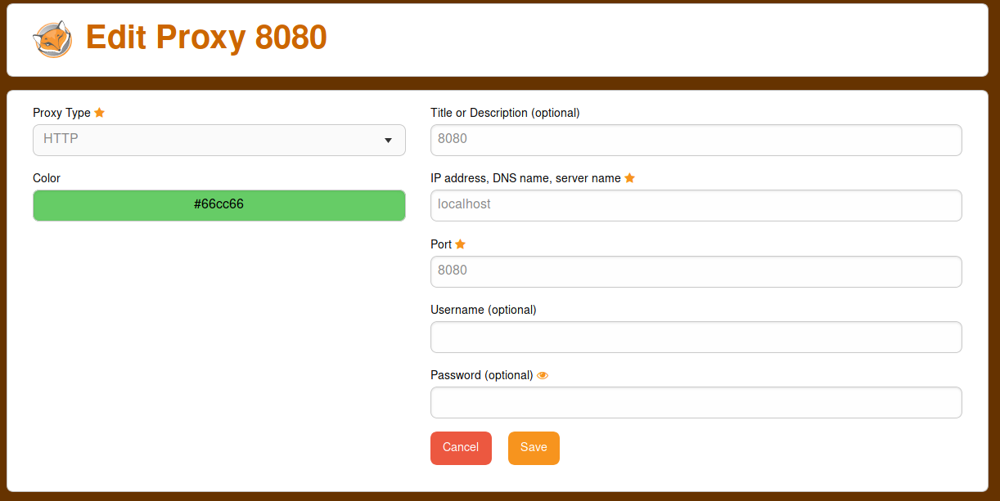
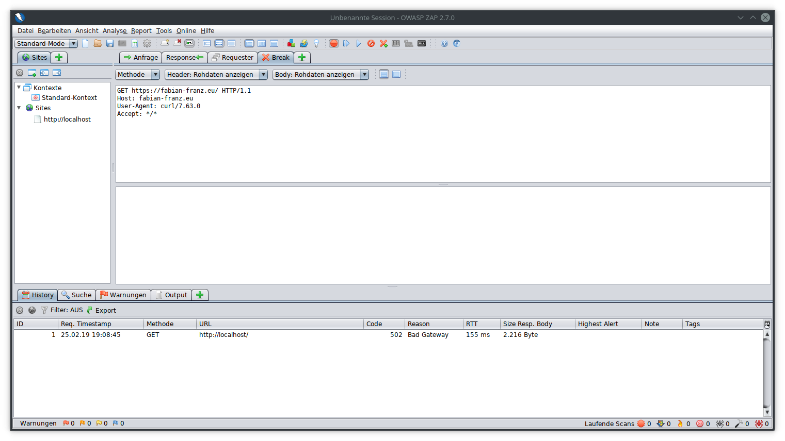
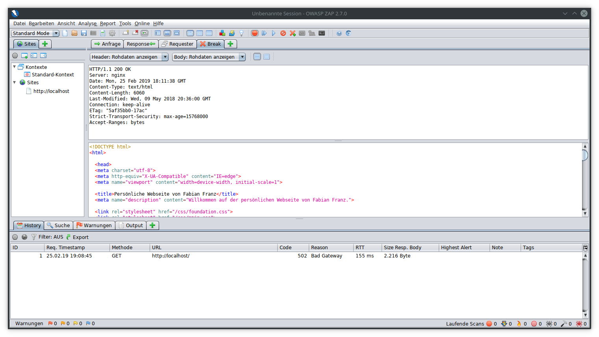
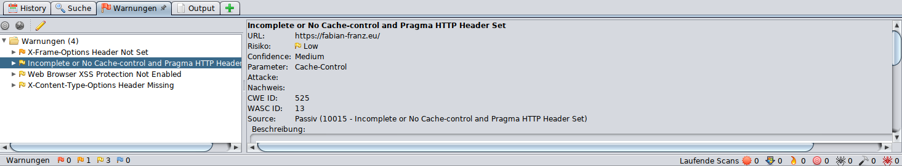
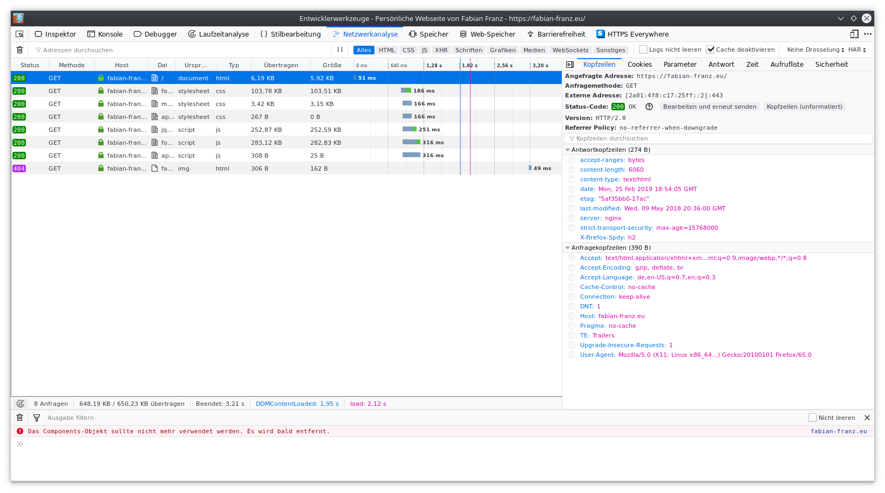

=======================
nginx: Header Hardening
=======================

.. Note::

    Except for some specific configuration directives, this is **NOT**
    specific to the nginx plugin. Please note that you can also debug your
    frontend code this way.

Background Information
======================

HTTP headers can control what a web application is allowed to do and what it is
not. This can be used to harden the web application against some **client side risks**.

Testing Web Applications Using A Local Proxy
============================================

Configuration of Firefox
------------------------

For this tests, you should install and configure FoxyProxy_.

.. _FoxyProxy: https://addons.mozilla.org/de/firefox/addon/foxyproxy-standard/

After it is installed, click on the proxy settings and add a new one:

As a proxy, enter localhost (or 127.0.0.1 in case localhost does not work) and
the port 8080. Save the settings.

Downloading A Proxy Software For Testing
----------------------------------------

Well known Test tools are:

* OWASP ZAP (https://github.com/zaproxy/zaproxy)
* Burp (https://portswigger.net/burp)
* mitmproxy (https://mitmproxy.org/)

When it is downloaded, you usually have to unpack it into a fitting directory.``
When it is unpacked, you need to run it. In case of ZAP, doubleclick the
``zap.sh`` or ``zap.bat`` depending on your operating system.

Next regenerate and export the certificate under
:menuselection:`Tools --> Options --> Dynamic SSL certificates` and import it into the Firefox
key store (:menuselection:`Preferences --> Data Protection & Security --> Show Certificates`) with
full trust.

Start Testing
-------------

Click on the FoxyProxy icon and select the localhost proxy defined first.
Next just use the application as usual. If you click the red button,
can stop the request in ZAP and it allows you to edit it:

When you are done, just click one of the play buttons to disable halting or wait
for the next request / response to edit that as well. For example the response
could look like this one:

You can see a lot of important information here like the used protocol (HTTP/1.1),
the status code 200 (which means it was successful) and a lot of headers.
Some of those headers impact security and ZAP will try to make a recommendation,
which may not be always correct but it may help you to find some (forgotten)
issues:

The colors of the flags show how high the risk is rated so the redder it is,
the more impact it has on security. The left view contains a list of the
findings, the right view contains a detailed description of them.
Based on this information, you have to decide your further actions.

Testing Web Applications Using Developer Tools
==============================================

When you right click on the web site, you can inspect the element but the
opening tools also have a tab for networking.

The network tab works like the main view of the proxy.
You can see which headers are sent and which ones are received.
The advantage here is that you get some errors on the console tab (for example
if the CSP has an error). The disadvantage of the console is, that is is not so
easy to intercept and modify data.

Inject Missing Headers Via The nginx Plugin
===========================================

Security headers in the nginx plugin can be injected by creating a new security
header configuration:

.. Image:: images/nginx_security_headers.png

If you set a setting here, it will override what the webserver sets.
You can inject this security setting into a location or HTTP server.

You can read about the headers in the `Mozilla Wiki <https://developer.mozilla.org/en-US/docs/Web/HTTP/Headers>`_ or in the RFCs.

.. Warning::

   Not all headers are supported by all browsers.

In short, the headers are:
   
========================= ======================================================================
Referrer                  Control what a page sees when you link on it
XSS Protection            Enable or disable the detection for (reflected) XSS
Don't Sniff Content Type  Disable content type detection when the original is incorrect
Strict Transport Security TLS only and enforce valid certificate
HPKP                      Pin the public key, not widely used and dangerous [1]_ if misconfigured
Content Security Policy   Controls resources and JS functions
========================= ======================================================================

.. [1] If you switch the certificate without announcing its public key first
    via this header in a rollover time span, you will lock this clients out
    because they expect being targetted by a MITM attack and refuse the connection
    and it is hard to reset this pin in the browser.
