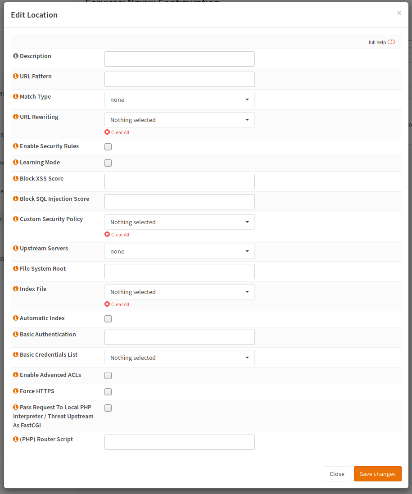
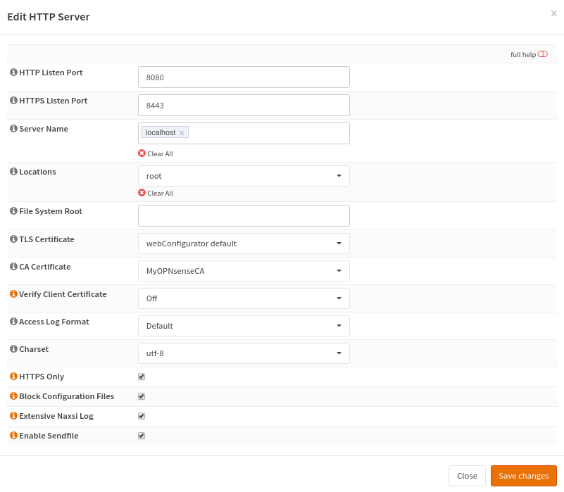

============================
nginx: Local Website Hosting
============================

.. Warning::

    Even if you can host websites directly from OPNsense, it is not recommended for security reasons - especially when
    sending requests to a local PHP interpreter. Do NOT consider using the feature to serve PHP content locally in
    enterprise networks. It is intendet for home users who want to save money by saving power and know what they are
    doing. If you do not know how to handle a webserver properly, DO NOT ENABLE THIS FEATURE.
    
Prepare
=======

First of all, a directory has to be created. For example `/srv/web_application1`. Please note that this directory must be
accessable by nginx and PHP (both running as `www`).

For example, you can chmod it (+rx for directories, +r for files for this user) or `chown` it.

When the directory exists, you can create a file in this directory. Let's say, it should be called test.php and should show
some information about PHP:

.. code-block:: sh

    cat > /srv/web_application1/test.php
    <?php phpinfo();

Press control + d to end the input.

.. Note::

    you can also use vim if you install vim-lite via pkg.

Configure Locations
===================

For a location, the following directives are important:

=============================== ======================================================================
Directive                       Description                                                           
=============================== ======================================================================
Match Type and URL Pattern      How to match the location and the pattern                             
File System Root                directory of web applicaton                                           
Upstream Servers                Send it to a remote interpreter instead of using the local one        
Pass Request To PHP Interpreter Check if you want to enable php (runs locally as user www) or remotely
Router Script                   Sends all request to a specific script (entry point of application)   
=============================== ======================================================================

=============================== ============================
Directive                       Value
=============================== ============================
Match Type and URL Pattern      ~* .*.php or simmilar
File System Root                /srv/web_application1
Upstream Servers                empty
Pass Request To PHP Interpreter checked
Router Script                   empty
=============================== ============================

Configure HTTP Server
=====================

Configuring the HTTP server is simple. You need a hostname (for example website.test), a port (8080/TCP is the
HTTP alternative port, so it is good for testing. For production sites you should stick with the defaults).
Please select the prevously created location to serve web content. Please also configure a root here,
because all requests, which do not match, will be handled by the server default. The default server will
just serve the static file.

Testing
=======

To test if you web server is running, you can paste call it by its IP and port.

.. Note::

    Please note that IPv6 addresses must be enclosed within square brackets like http://[::1]/ or http://[::1]:8080/.

.. code-block:: sh

    curl "http://192.168.0.1:8080/test.php"

Security Considerations
=======================

* This is nginx and not httpd. It will not care about your .htaccess files.
  Do not put secret data in unprotected directories. You can protect those directories by yourself,
  but make sure you don't forget them. Some application depend on this file.
* Do not overlap nor use OPNsense directories as root
* Do not upload badly maintained software. If your firewall gets compromised,
  it will become easy to compromise your hosts too.
* All your applications run under the same user (www)
* Watch out for advisories_
* Install updates ASAP
* Check your logs regularly.
* Consider hardening your directory and file access permission (like making directories and files read only
  for nginx and PHP)

.. _advisories: https://nginx.org/en/security_advisories.html

