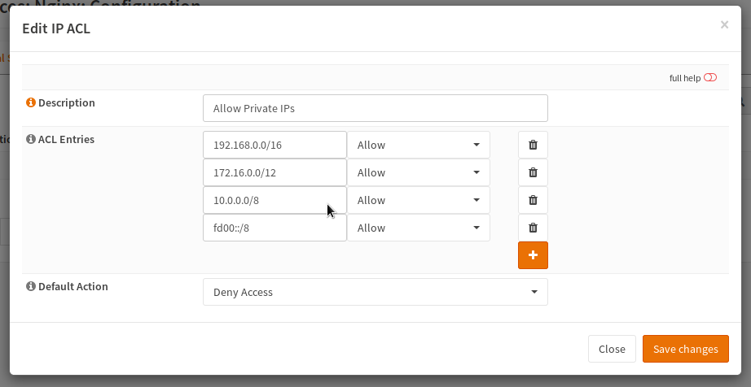
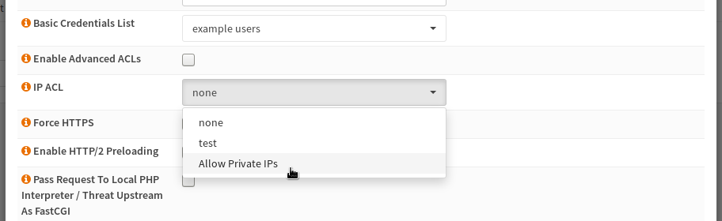

====================================
nginx: IP Based Access Control Lists
====================================

.. Warning::

    Source IPs of UDP may be spoofed because the protocol is connectionless.
    If there is an attacker who can manipulte your WAN, the attacker can also
    use any WAN IP which has been whitelisted. It is safer, not to use this
    as the only protection for your webservices.

Background Information
======================

IP based ACLs can be externally used to allow access (whitelist strategy) to a
specific web service only by customers so you can easily get rid of most of the
malicious traffic to the application server.
This also has some downsides: For example, the site will probably
not be visible to search engines and will therefore not be indexed.
On the other hand you can also blacklist (blacklist strategy) some bot IPs and
some bulletproof_ hosting ranges.

.. _bulletproof: https://en.wikipedia.org/wiki/Bulletproof_hosting

Configuration
=============

Create Users
------------

Navigate to the :menuselection:`Access --> IP ACL` tab.

.. image:: images/nginx_ip_acl_01_list_view.png

Click the + button to create a new ACL.

Next enter a reasonable title, for example here "Allow Private IPs" was used.
Now the different IP addresses or IP ranges can be entered. In this case some
common private IP ranges were allowed and the default rule was set to block.
A new line can be added by clicking the + icon while the trash can icon deletes the row.
This means that this service should be only visible internally.

.. Warning::
    Keep in mind that carrier grade NAT (CGN) may cause some trouble with these
    ACLs too. Please check how your traffic is handled first.

Assign it to a Location, HTTP or Stream-Server
-----------------------------------------------

In the last step, the user list must be added to the object, that supports it.
At the moment this are the HTTP Server, the Stream Server and the HTTP
locations. For example to add the ACL to a location, open it and select the
ACL in the dropdown:

After saving the location and restarting nginx, you are done.

