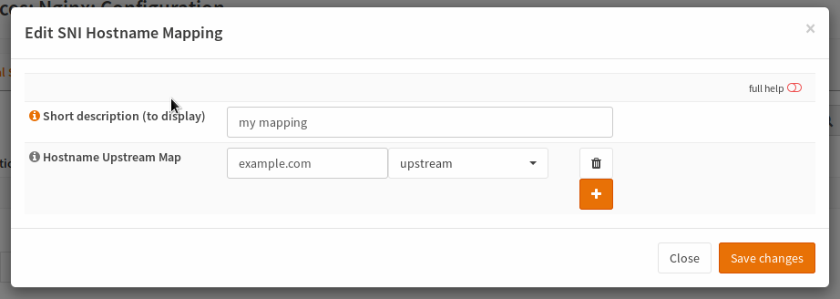
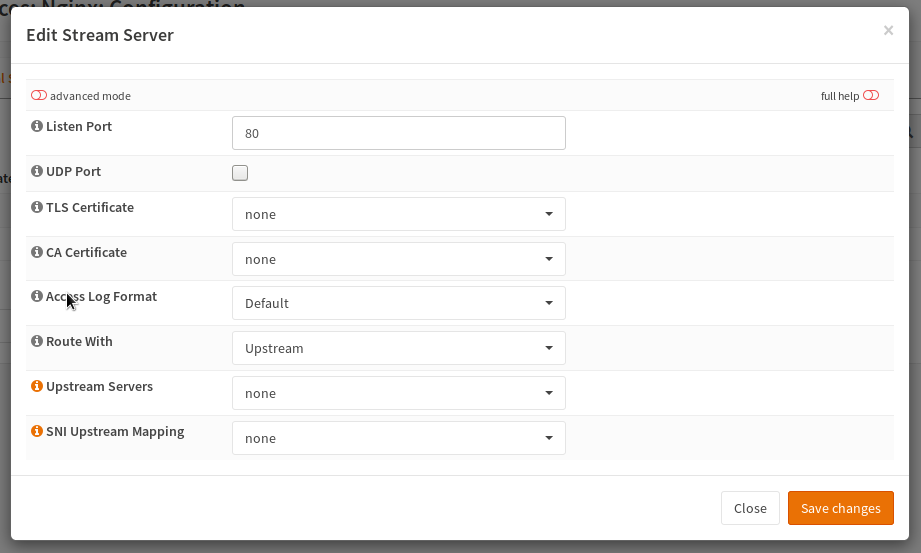

==========================
nginx: TCP And UDP Streams
==========================

Background Information
======================

Beside HTTP, nginx is also able to handle TCP- and UDP-traffic as well and it
can also inspect the so called Client Hello of TLS_ using the preread_ module,
to route based on SNI_ (Server Name Indication) which is an extension in TLS.

.. _TLS: https://en.wikipedia.org/wiki/Transport_Layer_Security
.. _preread: https://nginx.org/en/docs/stream/ngx_stream_ssl_preread_module.html
.. _SNI: https://tools.ietf.org/html/rfc6066#section-3

OPNsense specific Information
=============================

OPNsense offers two modes of operation:

* Pass through and route based on SNI
* Read and forward the data which can also terminate TLS

Configuration
=============

.. Note::
    For Upstreams, please visit the :doc:`nginx` page.
    This expects that the upstreams are correctly set up.

SNI Upstream Maps
-----------------

SNI Upstream Maps are a powerful feature if you have multiple servers behind your
reverse proxy and every server maintains their own certificate and you do not want
to or cannot use your own certificate. In such cases, you can use it to forward
the traffic based on the Server Name Indication extension in the TLS protocol (given
that TLS is used).

.. Warning::
    This will not work anymore with ESNI which may be published with TLS 1.3.
    If it causes trouble, do not enable encrypted SNI and stay with plain SNI.
    Also keep in mind that when SNI Upstream Maps are used, the connection will
    not be decrypted on OPNsense, so you cannot load balance a TLS connection
    to unencrypted servers.

===================== ==========================================================================================
Short description     short description to show in dropdowns
Hostname Upstream Map Enter a hostname and choose the upstream to forward the connection to for each combination
===================== ==========================================================================================

Upstream Servers
----------------

The upstream servers are the TCP and UDP load balancing feature of nginx.
You may use it to proxy DNS, some proprietary protocols etc.

.. Warning::
    This will not work with protocols which need some special
    handling like FTP or SIP

The listen port is the port used to expose the service to the clients.
You should use the standard_ port defined by IANA to maintain best
compatibility with most clients.

In case you are proxying UDP datagrams, you must enable the "UDP Port" checkbox.

Select a certificate if you want to terminate the TLS connection.
If you route directly with upstream property, the upstream TLS settings
are used, to choose if the backend connection should be TLS encrypted (again).

If you want to use an SNI Upstream Map, switch the entry in "Route With"
and choose a mapping in the corresponding entry.

.. _standard: https://www.iana.org/assignments/service-names-port-numbers/service-names-port-numbers.xhtml

.. Note::
    In the advanced settings, you can also force TLS based authentication
    for upstream backends (not supported in SNI Upstream Mapping).

Test
====

You can test your setup using the following command:

.. code-block:: sh

    curl https://HOSTNAME:PORT -vkI --resolve HOSTNAME:PORT:IP
    
=========== ==============================================
HOSTNAME    The hostname you want to connect (example.com)
PORT        The port you run the proxy on
IP          IP of your OPNsense device (to override DNS)
=========== ==============================================

