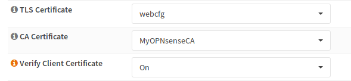

=========================================
nginx: TLS Authentication & Authorization
=========================================

.. Warning::

    Even if this is probably the most secure way to authenticate,
    a lot of clients do not support it. In addition, configuring
    client certificates can also be hard to do for users.
    
    This authentication mechanism is recommended for machine to
    machine communication and experienced users.

Background Information
======================

TLS authentication happens when the HTTPS connection is set up and for
this reason you can not configure it per directory (this information has
not been received yet). If you want to use this authentication type in
a custom application, the nginx plugin configures nginx to send you
the required information like the CN).

Configuration
=============

First of all, you need a CA, a client and a server certificate.

Please create it like described in :doc:`sslvpn_client`. If you want,
that your VPN users can log into your application using the same certificate,
you may use the same CA.

Next, choose the CA, the certificate and choose *on* as for client validation.
This will reject any connection by a client, who has no valid certificate.

Testing
=======

.. code-block:: none

    curl https://192.168.1.1:444/file.txt --cacert ../MyOPNsenseCA.crt 
    <html>
    <head><title>400 No required SSL certificate was sent</title></head>
    <body bgcolor="white">
    
<h1>400 Bad Request</h1>

    
No required SSL certificate was sent

    

nginx

    </body>
    </html>

.. code-block:: none

    curl https://192.168.1.1:444/file.txt --cert ../nginx_client_test_cert.crt --key ../nginx_client_test_cert.key --cacert ../MyOPNsenseCA.crt
    Hello World
