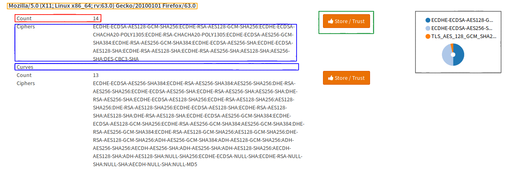

=======================
nginx: TLS Fingerprints
=======================

.. Warning::

    This manual page is for advanced users only as the feature is not designed to be used by beginners.
    Maybe the curves are not provided by the TLS implementation and you get an empty string.
    If this is the case, it is normal but you should expect trouble if you use them as a later
    version of the software may implement them and then all your connections will be flagged
    as intercepted.
    
Requirements
============

* To use this feature, you must have an HTTPS server running which writes some logs.
* Different browsers from different operating systems as clients

Analysis Page
=============

The analysis page is grouped into some sections:

======= ================================================================================
Color   Description
======= ================================================================================
Orange  User-Agent string (HTTP-Header) - technical description of the client
Red     Total count of hits in the log of the UA with this ciphers and curves
Blue    Supported Ciphers and Curves in order of the Client hello - our fingerprint
Green   If you click this button, you can take the fingerprint over to the configuration
Gray    Pie chart of the fingerprints count and the User-Agent (visualized)
======= ================================================================================

The pie chart is important to know if a fingerprint is
intercepted because many intercepting software changes the client hello.
Let's take a look at this one:

There is one small one, which we probably can ignore,
so lets look at the other two fingerprints:
One contains ciphers, hashes etc., browsers should not support anymore (for
example NULL, MD5, ...) so this is probably intercepted (it actually is OWASP 
ZAP_ 2.7.0) in this screenshot, which is intercepting a connection from
Firefox 63.
In this case there is onle one big segment left, which is very likely the real
browser fingerprint (or another proxy).

In the following example, take a look at the pie chart
(especially the segment with the cursor on it):

The segment has a huge share of the requests with this User-Agent.
In such a case it can be either always the same client requesting a resource
and probably only few users are using it or, which is more likely if it is a
browser, it that it is probably the right fingerprint.

.. Warning::
   Some proxies are mirroring the client hello, so they won't be detected.
   Also be careful because for example if you have a big customer generating
   a lot of traffic, a big segment of the pie chart (even the biggest one),
   may be intercepted.
   
   For security reasons you should also take the absolute count into account
   when you are working on a real world sample and that software may be compiled
   width different which may also replace the crypto library which also means
   that it will have a different fingerprint.

.. _ZAP: https://github.com/zaproxy/zaproxy

If you click on the store button, a dialog will open and you can create a new
entry in your configuration, which will be visible on the configuration page.

For example, our fingerprint could be imported into the configuration like
shown in the following screenshot:

Configuration Page
==================

Now in the configuration page under :menuselection:`HTTP --> TLS Fingerprints` there will be an
entry for the created fingerprint, so it can be edited:

.. image:: images/nginx_fingerprint_settings.png

Trusted Fingerprints
====================

A trusted fingerprint is a fingerprint, which will be used to detect man in the
middle attacks by comparing the client hello of the fingerprint with the data
sent by the client. If there are additional ciphers or curves, you will get
this information via an HTTP header into your application.
Please note that you can have only one fingerprint per User-Agent.
