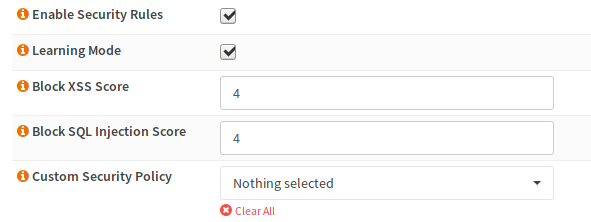

===============================
nginx: Web Application Firewall
===============================

.. Warning::

    This page is for advanced users only. A misconfiguration here may block requests to your API endpoints or website.
    
    A web application firewall is no replacement for properly implemented security in front- and backend.

Background Information
======================

The OPNsense WAF uses NAXSI_, which is a loadable module for the nginx_ web server.
NAXSI has two rule types:

.. _NAXSI: https://github.com/nbs-system/naxsi
.. _nginx: https://nginx.org/

* Main Rules: This rules are globally valid. Usual use case: Blocking code fragments that may be used to gain access to the server without permission (for example SQL_-/XPATH_-injection for data access) or to gain control over a foreign client (for example XSS_).
* Basic Rules: This rules are usually used in the locations to whitelist stuff inside a location or for additional rules.

.. _SQL: https://www.owasp.org/index.php/SQL_Injection
.. _XPATH: https://www.owasp.org/index.php/XPATH_Injection
.. _XSS: https://www.owasp.org/index.php/Cross-site_Scripting_(XSS)

.. Note::

    A good place to start are the OWASP_ Cheat Sheets.

.. _OWASP: https://www.owasp.org/index.php/OWASP_Cheat_Sheet_Series

In addition to the self defined rules, NAXSI contains libinjection which is available directly in the location configuration.
The NAXSI project itself has a high quality documentation for the module online_.
A good ruleset_ to start can be found at GitHub on the project page.
It cannot be provided by the plugin because of license issues (GPL cannot be used in BSD 2 Clause code),
but you may enter it manually by yourself.

.. _online: https://github.com/nbs-system/naxsi/wiki
.. _ruleset: https://github.com/nbs-system/naxsi/blob/master/naxsi_config/naxsi_core.rules

OPNsense specific Information
=============================

* OPNsense blocks User Agents used by Bots automatically - this cannot be configured
* The error pages are stored under /usr/local/etc/nginx/views

Configuration
=============

WAF Rules
---------

WAF rules are used to trigger an action if a condition evaluates to true or false (negated).
The usual use case is increasing a score which can be checked afterwards, but a rule can for example also block instantly (the plugin only supports a score).
WAF rules are grouped to a WAF policy, which then can evaluate the aggregated score.

The description will be shown in the GUI and the Message will appear in the log. Negate will switch the condition form "if" to "unless". The ID must be unique. You should use a scheme like 1000 to 2000 are SQL injection or similar because that improves log evaluation if needed (for example you could create pie charts because you can group by the id range).

The next section describes the rule type and the match.
You can scan the match value like `truncate` (an SQL keyword to delete the content of the table) in different places in the HTTP request. Mostly all of them can be checked or as an alternative, you can use a name so it will only match a specific header for example. Please note that not all of them are compatible with each other so please consult the NAXSI docs.

WAF Policy
----------

The name is used in the location select box,
rules are a collection of the previously created rules.

.. warning::

    Reuse of main rules will not work, clone them if needed.
    The reason is that they would conflict in id + score variable

======== =========================================================
Name     a good name like "block sql injection"
Rules    select the rules to group
Value    a compare value
Operator choose a compare Operator to compare score operator value
Action   usually block
======== =========================================================

As an (incomplete) example:

======== ===============================================================
Name     block SQLi
Rules    contains select, contains from, contains union, contains delete
Value    16
Operator bigger or equal
Action   block
======== ===============================================================

Location
--------

In the last step, the rules must be applied to the location.

To enable the WAF in a location you have to check the "Enable Security Rules" checkbox.
At the beginning, it would make sense, if the "Learning Mode" is enabled (nothing is blocked but logged, so you can add whitelists until you don't get any false positives anymore).

The next two boxes are the score for libinjection. Both will add a score of 8 if they trigger.
So values up to 8 will block.

In the next dropdown, you can select your custom policies, which will be applied now.

Testing
-------

If you trigger the WAF by creating a request looking evil to the WAF,
you should get a message in the server error log as well as an OPNsense
branded error page (Request Denied For Security Reasons).

You may use curl to trigger it (if you block the following SQL keywords):

.. code-block:: sh

    curl "http://example.com/index.php?a=select&b=union&c=from"

.. Note::

    You can use "NAXSI" as a filter in the filter box of the log viewer when viewing the error log.
