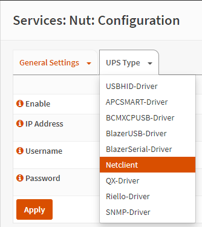

==========================
NUT - Network UPS Tools
==========================

--------------------------
What is NUT
--------------------------

NUT is a tool that enables the use of a UPS device via either USB or Network communication. 

--------------------------
Installation
--------------------------
NUT is available as a plugin in OPNSense via the plugin **os-nut**. You can install the plugin via **System > Firmware > Plugins > os-nut**.

--------------------------
How to Setup - Netclient
--------------------------
1. Navigate to the NUT services page and fill in the following values, then click apply:

==================== ============================================
Enable NUT            Checked
Service Mode          netclient
Name                  <choose a name>
Listen Address        <interface ip on which the server lives>
==================== ============================================

2. Click on the arrow down next to **UPS Type** and choose **Netclient**.

3. Fill in these values, then click apply:

==================== ============================================
Enable                Checked
IP Address            <ip of NUT Server>
Username              <username, if applicable>
Password              <password, if applicable>
==================== ============================================

4. Click on **Diagnostics** in the left menubar. If configured correctly this page will show, after waiting a few seconds, information about the UPS. Loook for **device.mfr** and **device.model** to check if the correct UPS is detected. 

--------------------------
References
--------------------------
-  `Official website of NUT <https://networkupstools.org/>`__
