Orange France FTTP IPv4 & IPv6
==============================

**Authors:** Kev Willers, David Néel

**Introduction**
-----------------
This guide is for Orange France FTTP using DHCP to connect (this method currently excludes the users of the PRO package).

The guide deals with just the internet connection. Setting up of TV or Phone is not covered here.

**Getting ready to make the connection**
----------------------------------------

Orange requires that the WAN is configured over VLAN 832. So the first step is to set up the VLAN on the intended WAN nic as shown below :menuselection:`Interfaces --> Other Types --> VLAN`

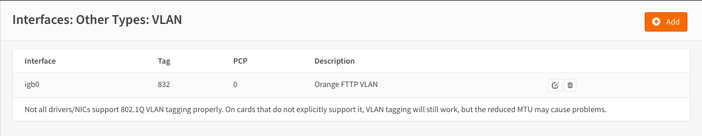

and the WAN interface assignment should hence look something like this.

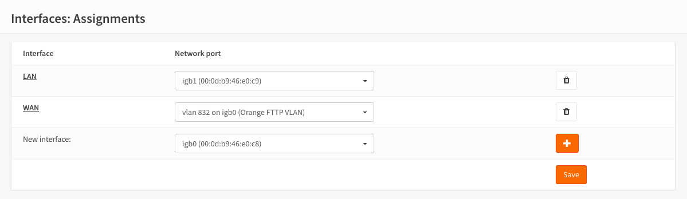

Finally, set the DUID for IPv6 WAN interface :menuselection:`Interfaces --> Settings`

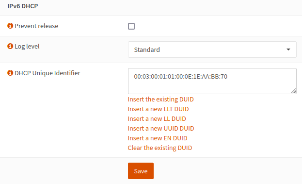

.. Note::
    You can use the mac address of the WAN interface (not necessarily the Livebox MAC address) - 00:03:00:01:01:XX:XX:XX:XX:XX:XX where XX is the MAC address

**Configuring the WAN Interface**
---------------------------------

In order to establish the IPv4 and IPv6 connection Orange requires that the correct parameters are passed for the DHCP and DHCP6
requests respectively

select options DHCP and DHCPv6 in general configuration

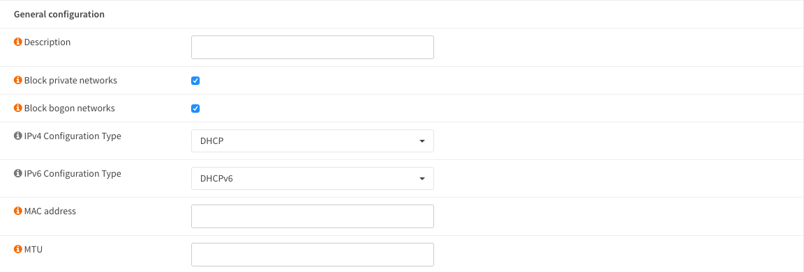

**On the DHCP request it is a requirement to pass the following:**

* dhcp-class-identifier "sagem"
* user-class "+FSVDSL_livebox.Internet.softathome.Livebox6"
* option-90 00:00:00:00:00:00:00:00:00:00:00:66:74:69:2f:65:77:74:FF:AB:XX:XX
  (hex conversion of the the userid supplied by Orange which looks like fti/xxxxxxx)
* dhcp-client-identifier 01:XX:XX:XX:XX:XX:XX
  (you MUST use the same MAC address for the XX:XX as the one use for the DUID above)

.. Note::
    You can use this tool to generate the option-90 chain : https://jsfiddle.net/kgersen/3mnsc6wy/

These parameters should be passed as comma separated options in the 'Send Options' area of their WAN DHCP request

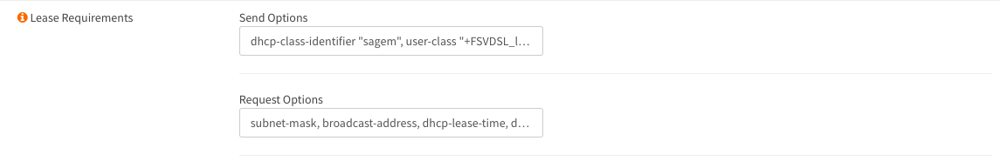

.. Note::
    It is necessary to specify the following 'Request Options'

* subnet-mask
* broadcast-address
* dhcp-lease-time
* dhcp-renewal-time
* dhcp-rebinding-time
* domain-search, routers
* domain-name-servers
* option-90
* domain-name
* option-120
* option-125

These parameters should be passed as comma separated options in the 'Request Options' area of their WAN DHCP request

Orange require that the DHCP and DHCP6 requests are made with a VLAN-PCP of 6. This can be done via 'Use VLAN priority' interface settings. Make sure to set this for both DHCP and DHCP6 at the same time.

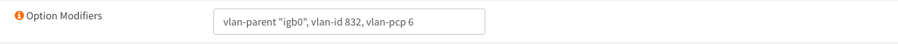

On the DHCP6 request we need to use raw options

Firstly select 'Advanced' and set 'Use VLAN priority' to 'Internetwork Control (6)'

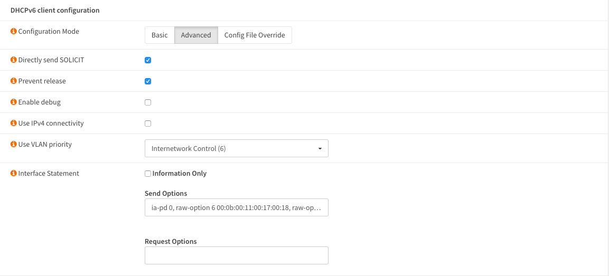

then add the following options in the 'Send Options' field

* ia-pd 0
* raw-option 6 00:0b:00:11:00:17:00:18
* raw-option 15 00:2b:46:53:56:44:53:4c:5f:6c:69:76:65:62:6f:78:2e:49:6e:74:65:72:6e:65:74:2e:73:6f:66:74:61:74:68:6f:6d:65:2e:4c:69:76:65:62:6f:78:36
* raw-option 16 00:00:04:0e:00:05:73:61:67:65:6d
* raw-option 11 00:00:00:00:00:00:00:00:00:00:00:66:74:69:2f:65:77:74:FF:AB:XX:XX
  (hex conversion of the the userid supplied by Orange which looks like fti/xxxxxxx)

.. Note::
    Use the exact same chain for IPv6 raw-option 11 and IPv4 option-90

Finally set the Identity Association and Prefix interface as shown

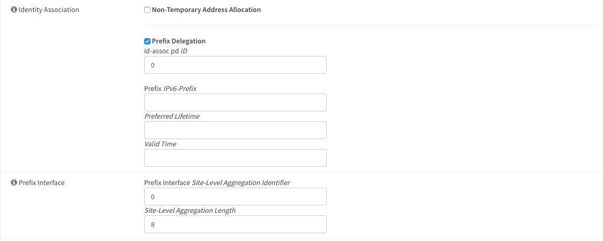

Click ‘Save’ and then ‘Apply’.

**LAN Interface**
-----------------

Select :menuselection:`Interfaces --> [LAN]` and set IPv4 to “Static IPv4” and IPv6 Configuration Type to
“Track Interface”.

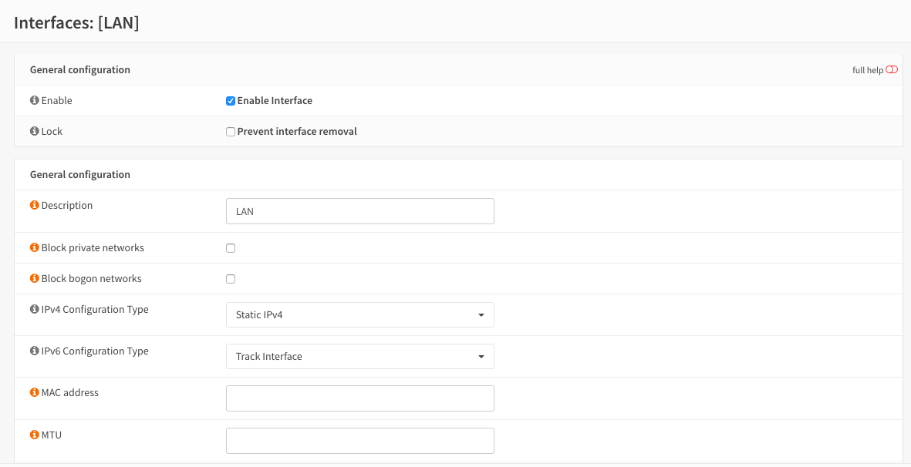

Finally, set the Track IPv6 Interface to WAN and set the IPv4 address to your chosen address.

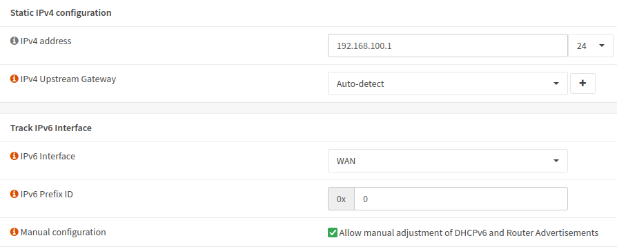

Click ‘Save’ and then ‘Apply’.

Select :menuselection:`Services --> Router Advertisements` On the Lan interface and set as below (use any IPv6 DNS)

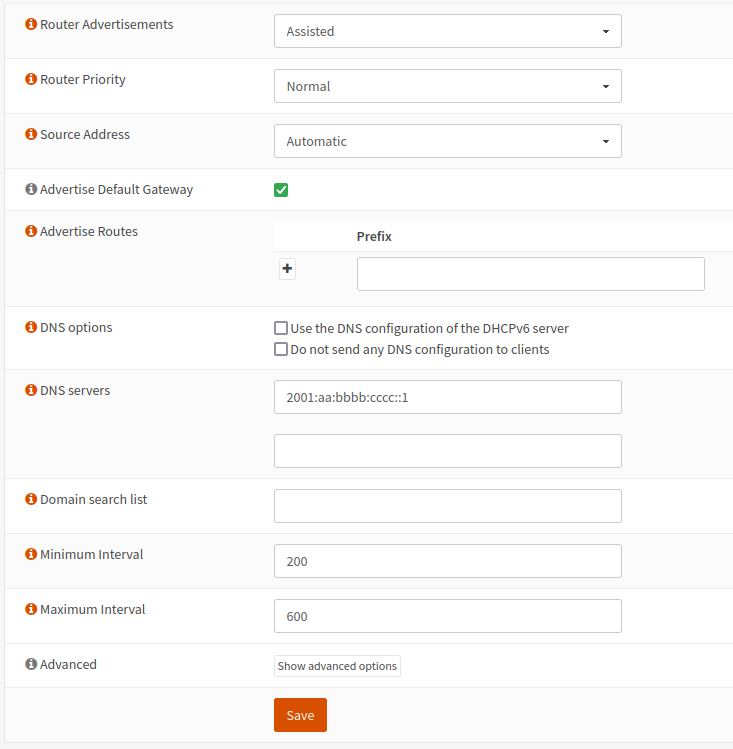

Click ‘Save’

It is advisable at this point to reboot the system.
