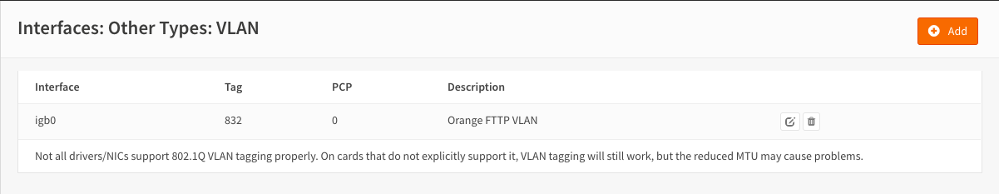
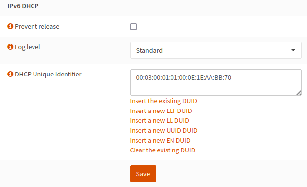
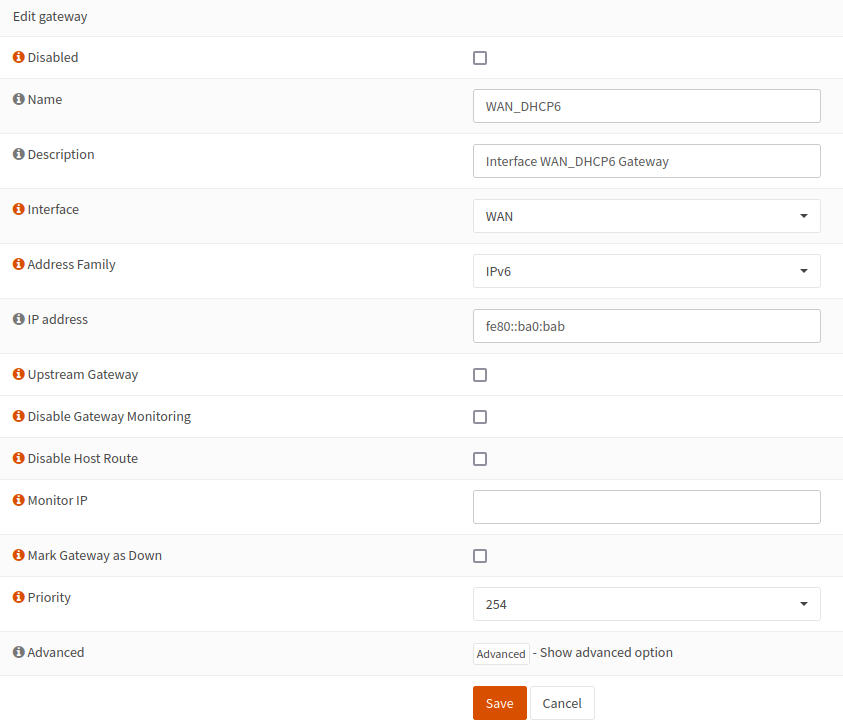
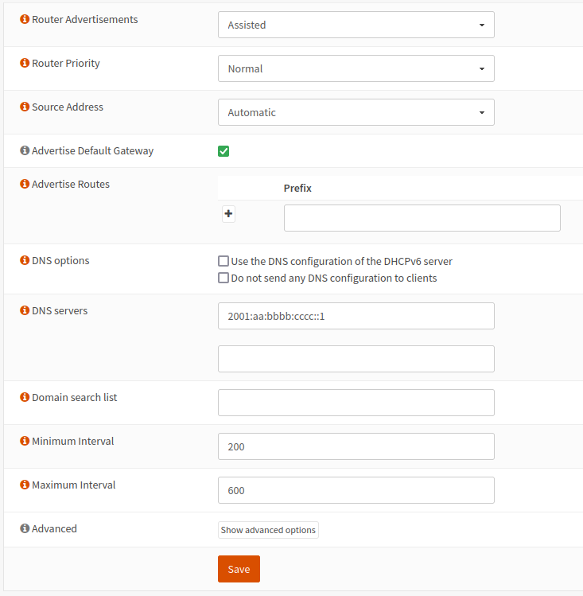
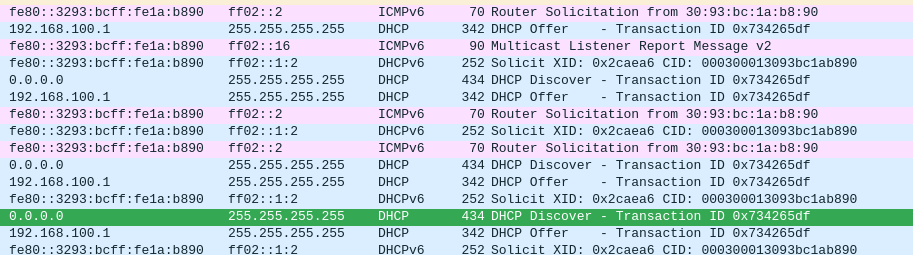
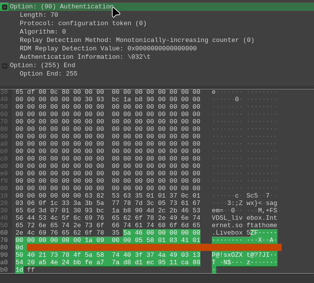

==================================
Orange France FTTH IPv4 & IPv6
==================================

**Authors:** Kev Willers, David Néel

**Introduction**
-----------------
This guide is for Orange France FTTP using DHCP to connect (this method currently excludes the users of the PRO package).

The guide deals with just the internet connection. Setting up of TV or Phone is not covered here.

**Getting ready to make the connection**
----------------------------------------

Orange requires that the WAN is configured over VLAN 832. So the first step is to set up the VLAN on the intended WAN nic as shown below :menuselection:`Interfaces --> Devices --> VLAN`

and the WAN interface assignment should hence look something like this.

Finally, set the DUID for IPv6 WAN interface :menuselection:`Interfaces --> Settings`

.. Note::
    You can use the mac address of the WAN interface (not necessarily the Livebox MAC address) - 00:03:00:01:01:XX:XX:XX:XX:XX:XX where XX is the MAC address

**Configuring the WAN Interface**
---------------------------------

Go to :menuselection:`Interfaces --> Assignments` and edit WAN. In order to establish the IPv4 and IPv6 connection,
Orange requires that the correct parameters are passed for the DHCP and DHCP6 requests respectively.

Select DHCP and DHCPv6 as the IPv4 and IPv6 configuration types.

**On the DHCP request it is a requirement to pass the following:**

* dhcp-class-identifier "sagem"
* user-class "+FSVDSL_livebox.Internet.softathome.Livebox6"
* option-90 00:00:00:00:00:00:00:00:00:00:00:66:74:69:2f:65:77:74:FF:AB:XX:XX
  (hex conversion of the userid supplied by Orange which looks like fti/xxxxxxx)
* dhcp-client-identifier 01:XX:XX:XX:XX:XX:XX
  (you MUST use the same MAC address for the XX:XX as the one use for the DUID above)

.. Note::
    You can use this tool to generate the option-90 chain : https://jsfiddle.net/kgersen/3mnsc6wy/

Enable advanced mode and enter these parameters in **Send Options**, one per line.

.. Note::
    It is necessary to specify the following 'Request Options'

* subnet-mask
* broadcast-address
* dhcp-lease-time
* dhcp-renewal-time
* dhcp-rebinding-time
* domain-search
* routers
* domain-name-servers
* option-90
* domain-name
* option-120
* option-125

Enter these parameters in **Request Options**, one per line.

Orange require that the DHCP and DHCP6 requests are made with a VLAN-PCP of 6. This can be done via 'Use VLAN priority' interface settings. Make sure to set this for both DHCP and DHCP6 at the same time.

On the DHCP6 request we need to use raw options

Select **Request prefix only** and set **Prefix delegation size** to 56.

Set **Use VLAN priority** to **Internetwork Control (6)**.

then add the following options in the 'Send Options' field

* raw-option 6 00:0b:00:11:00:17:00:18
* raw-option 15 00:2b:46:53:56:44:53:4c:5f:6c:69:76:65:62:6f:78:2e:49:6e:74:65:72:6e:65:74:2e:73:6f:66:74:61:74:68:6f:6d:65:2e:4c:69:76:65:62:6f:78:36
* raw-option 16 00:00:04:0e:00:05:73:61:67:65:6d
* raw-option 11 00:00:00:00:00:00:00:00:00:00:00:66:74:69:2f:65:77:74:FF:AB:XX:XX
  (hex conversion of the userid supplied by Orange which looks like fti/xxxxxxx)

.. Note::
    Use the exact same chain for IPv6 raw-option 11 and IPv4 option-90

Finally, set **Optional prefix IAID** to ``0``. Prefix delegation and the matching prefix-interface statement are
generated from this value, **Prefix delegation size**, and the tracked LAN interface.

Click ‘Save’ and then ‘Apply’.

Update IPv6 Gateway

Select :menuselection:`System --> Gateway --> Configuration` and edit IPv6 gateway to add 'fe80::ba0:bab' as IP address

**LAN Interface**
-----------------

Go to :menuselection:`Interfaces --> Assignments`, edit LAN and set IPv4 to “Static IPv4” and IPv6 Configuration Type to
“Track Interface (legacy)”.

Finally, choose WAN as the **Parent interface**, set **Assign prefix ID** to ``0x0`` and set the IPv4 address to your chosen address.

Select **Manual configuration**.

Click ‘Save’ and then ‘Apply’.

Select :menuselection:`Services --> Router Advertisements` On the Lan interface and set as below (use any IPv6 DNS)

Click ‘Save’

It is advisable at this point to reboot the system.

**Troubleshooting**
-------------------

getting the option-90 chain from the Livebox
--------------------------------------------

Rarely, the authentication option from the generator doesn't work, you can instead use the one from the Livebox

Plug the WAN interface of the Livebox in your network (green port)
Use Wireshark on any other computer in the network and look for DHCP Discover packets

decode DHCP packets
-------------------

In this packet, look for Option: (90) Authentication

You can copy paste the full option without the first 2 bytes (5a 46) in your WAN configuration
