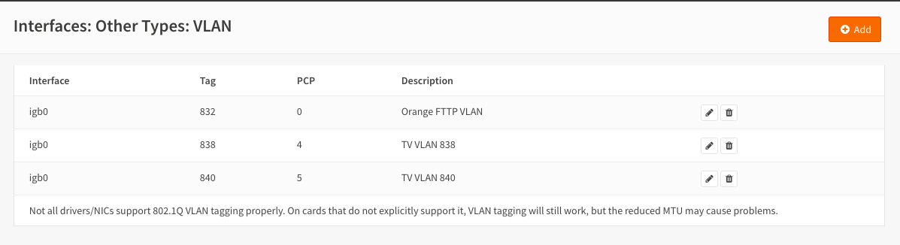
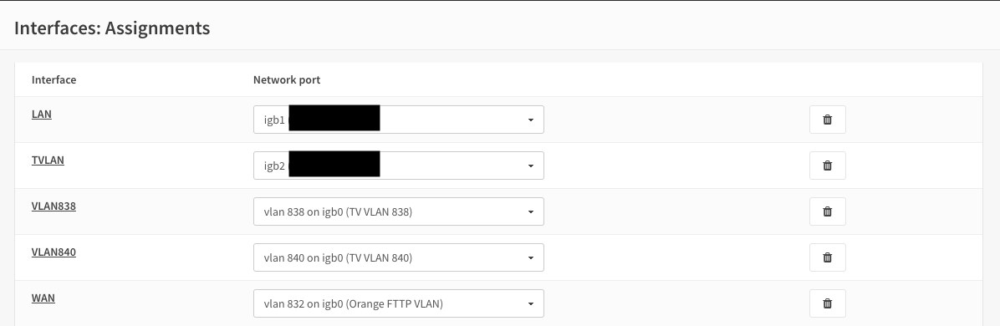

**Orange France IPTV setup**
============================

**Original Author:** Kev Willers

**Introduction**
-----------------
This guide is for setting up Orange France IPTV and assumes you already have a working internet connection.

**Getting ready**
-----------------

Orange uses two VLANs for TV. VLAN 838 and 840 
Create and assign them as shown.

Take note of the PCP values

Assign the VLANs as shown and also assign TVLAN for use later. 

igb0 is the WAN in this example. Select the interface that corresponds to WAN in your setup.

TVLAN is assigned to a free port on your router which the TVDecoder is plugged into later.

**VLAN 838 setup**
------------------

SEND OPTIONS

dhcp-client-identifier 1:xx:xx:xx:xx:xx:xx,      
REPLACE xx with MAC Address of the Livebox (NOT the TVDecoder) the leading 1 is important

dhcp-class-identifier "sagem",

user-class "'FSVDSL_livebox.MLTV.softathome.Livebox3".   
NOTE the leading ‘  before the string. Also although not strictky necessary Livebox3 part of the string is for LiveBox3 users if you are Livebox4 user change as required.

REQUEST OPTIONS

subnet-mask,routers, ntp-servers, www-server, classless-routes

**VLAN 840 setup**
------------------

.. image:: images/tv_image06.png
	:scale: 100%

The dummy IP address is important or IGMPproxy does not start 

**TVLAN setup**
---------------

(not needed to make things work, but much neater config and prevents IGMPproxy warning messages on LAN)

.. image:: images/tv_image07.png
	:scale: 100% 

Use a different subnet to current LAN 

Turn on the DHCP service for TVLAN

NOTE YOU MUST specify the ORANGE DNS servers for the TV to work 

.. image:: images/tv_image09.png
	:scale: 100% 

Now reboot and you should have an IP address on VLAN 838 of 10.x.x.x

**IGMPproxy setup**
-------------------

The latest version of IGMPproxy has bugs which are being corrected.
Until that is complete version 1.2 MUST be used.

Install this version using  

# pkg add -f https://pkg.opnsense.org/FreeBSD:11:amd64/snapshots/igmpproxy-0.1_2,1.txz

Then, lock the package in place to stop future updates of OPNsense overwriting it. 

# pkg lock igmpproxy

Once complete we can configure IGMPproxy as follows 

.. image:: images/tv_image10.png
	:scale: 100% 

NOTE: downstream interface is TVLAN

**FIREWALL setup**
------------------

We need to allow traffic to flow on the VLANs and TVLAN and also to connect with Orange servers

.. image:: images/tv_image13.png
	:scale: 100% 

.. image:: images/tv_image14.png
	:scale: 100% 

NOTE the Source is "*"

And finally the outbound

.. image:: images/tv_image16.png
	:scale: 100% 

Make sure you have clicked Save & Apply 
 
It is advisable at this point to reboot the system.

Plug in your TVDecoder to the port defined for TVLAN, turn on the decoder and after a few minutes you should see TV.