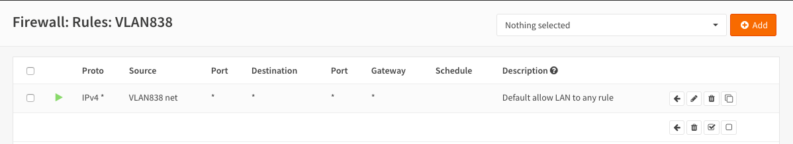
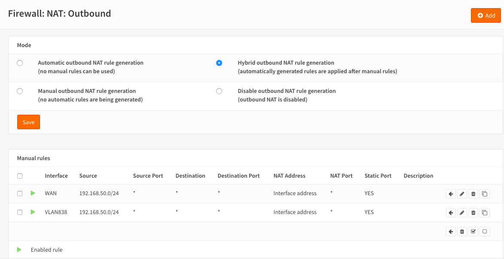

**Orange France IPTV setup**
============================

**Original Author:** Kev Willers

**Introduction**
-----------------
Based on v18.7 of OPNsenese

This guide is for setting up Orange France IPTV and assumes you already have a working internet connection.

**Getting ready**
-----------------

Orange uses a VLAN 840 for TV
Create and assign as shown.

.. image:: images/tv_image01.png
	:width: 100%

Take note of the PCP values

Assign the VLAN as shown and also assign TVLAN for use later.

.. image:: images/tv_image02.png
	:width: 100% 

igb0 is the WAN in this example. Select the interface that corresponds to WAN in your setup.

TVLAN is assigned to a free port on your router which the TVDecoder is plugged into later.

**VLAN 840 setup**
------------------

.. image:: images/tv_image05.png
	:width: 100%

The dummy IP address is important or IGMPproxy does not start 

**TVLAN setup**
---------------

(not needed to make things work, but much neater config and prevents IGMPproxy warning messages on LAN)

.. image:: images/tv_image08.png
	:width: 100% 

Use a different subnet to current LAN 

Turn on the DHCP service for TVLAN

NOTE YOU MUST specify the ORANGE DNS servers for the TV to work 

**IGMPproxy setup**
-------------------

Before proceeding the IGMPproxy PLUGIN should be installed.

Then configure IGMPproxy as follows:

.. image:: images/tv_image11.png
	:width: 100% 

NOTE: downstream interface is TVLAN

.. image:: images/tv_image12.png
	:width: 100% 

**FIREWALL setup**
------------------

We need to allow traffic to flow on the VLAN and TVLAN and also to connect with Orange servers

NOTE the Source is "*"

.. image:: images/tv_image15.png
	:width: 100% 

Note on both the above rules you must allow options

And finally the outbound

Make sure you have clicked Save & Apply. 
 
It is advisable at this point to reboot the system.

Plug in your TVDecoder to the port defined for TVLAN, turn on the decoder and after a few minutes you should see TV.