================
Setup WPAD / PAC
================

---
PAC
---

Introduction
============

OPNsense supports generating PAC files to provide automatic proxy configuration
files to clients. For example if your web GUI is running at http://192.168.0.1/,
your PAC URL will be http://192.168.0.1/wpad.dat.

In Firefox you can configure your proxy using PAC by the following steps
manually:

* Click the menu Icon and open "Settings"
* Scroll down to "Network Proxy" and click "Settings"
* Check "Automatic Proxy Configuration Address"
* Enter the URL of the PAC file like mentioned in the paragraph above into
  the text field and click "OK"

.. Warning::
    Your browser may be unable to connect to the internet if the PAC file is
    not available. This type of configuration is not recommended on mobile
    devices like laptops if employees can use the devices for home office.
    For such devices WPAD should be used.

    
Configuring PAC
===============

First Step: Creating Matches
----------------------------

Go to 'Services' -> Proxy -> Configuration and open Match

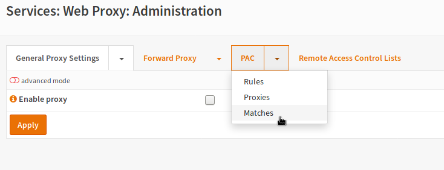

Enter a name for the match and an optional description.
Then choose what to match on.

=========== ==================================================
Name        A unique name for the match to call it from rules.
Description A short description for your own reference.
Negate      Inverts the match (any that does not match)
Match Type  Choose what you want to match on
=========== ==================================================

The rest of the fields depend on the used `Match Type`.
For example if we match on "Plain Hostname", we do not need any
additional parameters.

The match "Plain Hostname means no dots inside the domain so if we
want to create a fqdn match, we can simply invert this:

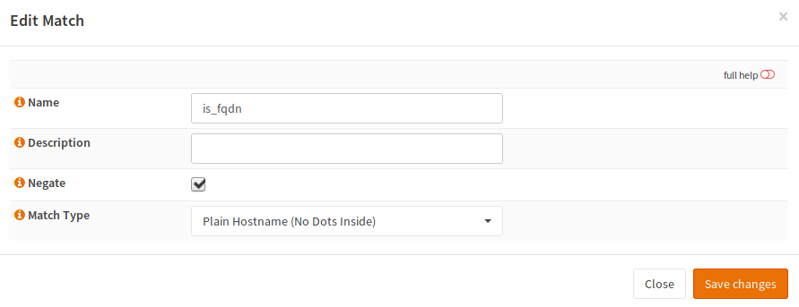

=========== ==============
Name        is_fqdn
Description can stay empty
Negate      checked
Match Type  Plain Hostname
=========== ==============

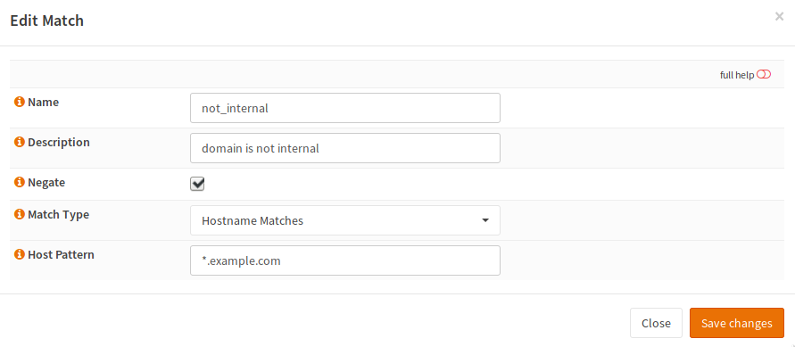

============ =================================
Name         not_internal
Description  can stay empty
Negate       checked
Match Type   Hostname matches
Host Pattern Wildcard for your internal domain
============ =================================

Second Step: Create Proxy Servers
---------------------------------

Now switch to PAC -> Proxies and add new proxy servers.

=========== ================================================================
Name        Enter a name which will be shown at the rules view for selection
Description You can add an optional description for this proxy
Proxy Type  Enter a Proxy type or DIRECT if no proxy should be used
URL         Enter the Proxy URL unless DIRECT has been choosen
=========== ================================================================

In this case it is assumed that only a single LAN and a DMZ exists and that
internal connections should not run over the proxy.
To make meaningful rules, we need two possible return values:

* The LAN Proxy
* No Proxy

No proxy is quite simple to configure:

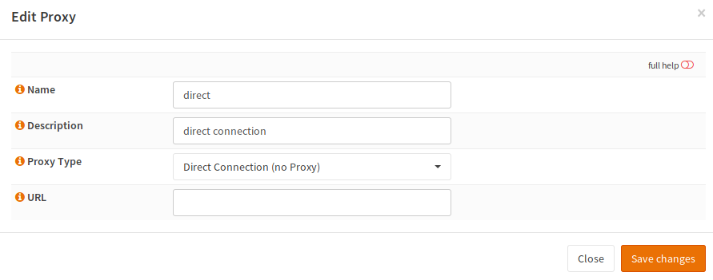

=========== =================
Name        direct
Description can stay empty
Proxy Type  Direct Connection
URL         empty
=========== =================

For outgoing connectins we need the proxy:

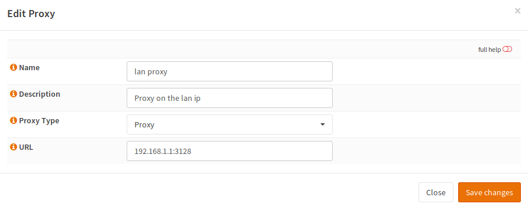

=========== ===========================
Name        lan_proxy
Description can stay empty
Proxy Type  Proxy
URL         Proxy IP + ':' + Proxy Port
=========== ===========================

Third Step: Create Rules
------------------------

Now as the matches and the proxies exist, rules can be built.
For that, switching to PAC -> Rules is required.

Now the following rule needs to be created:

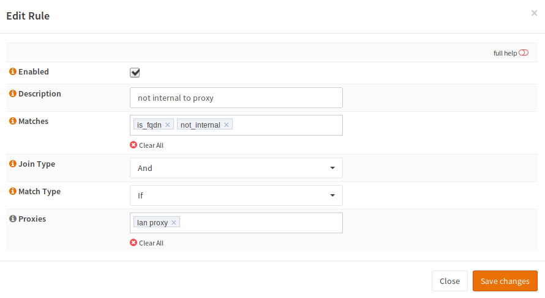

=========== ===========================
Enabled     checked
Description a description for your reference
Matches     the two previously created matches
Join Type   And
Match Type  If
Proxies     Select the LAN proxy
=========== ===========================

Click the orange reload button and you are done.

----
WPAD
----

Web Proxy Auto Discovery is used to find the PAC file for the domain.

Using DNS (Unbound)
===================

Variant 1: Automatic Configuration
----------------------------------

.. Warning::
    When you use this option, the wpad hosts and the TXT records for
    the domain will be overridden. This may break some other records
    like TXT records for SPF for this particular domain.

In Unbound, you can simply check the following checkbox:

.. Image:: images/wpad_dns_unbound2.png

This will define the host records of any domain configured in DHCP
as CNAME for your firewall host. It will also override TXT records
resolve to the URL to the PAC file.

Variant 2: Manual Configuration
-------------------------------

.. Warning::
    When DNS is used, OPNsense must respond via HTTP on port 80.

Open the page Services -> Unbound DNS -> Overrides and add a new host override
for the `wpad` host:

.. image:: images/wpad_dns_unbound.png

=========== =========================================================
Host        wpad
Domain      your domain
Type        A or AAAA
IP          IP of your OPNsense (where the Web interface is reachable
Description can stay empty
=========== =========================================================

Save the settings and apply the changes.

Using DHCP
==========

Variant 1: Automatic Configuration
----------------------------------

In the DHCP server settings, you can check the following checkbox:

In this case, an entry for the protocol and the port of the web interface
will be created with the domain you choose in your system settings
(domain of the firewall). The hostname is `wpad`. If you are running
the OPNsense web interface on port 80 with HTTP. The following URL will be
created:

    http://wpad.example.com:80/wpad.dat

Variant 2: Manual Configuration
-------------------------------

Open the page Services -> DHCP -> Server, select the correct interface and
scroll down to the "Additional Options".

Add this line and save:

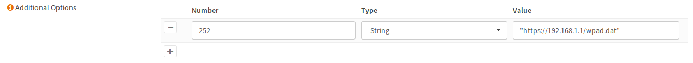

====== ======================================
Number 252
Type   String
Value  PAC file URL enclosed in double quotes
====== ======================================

---------------------
Firefox Configuration
---------------------

Open Settings Menu
==================

First, the settings menu must be opened. There are two ways. You can either

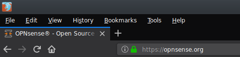

first click `Edit`

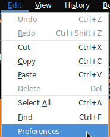

then click `Preferences` or you can also

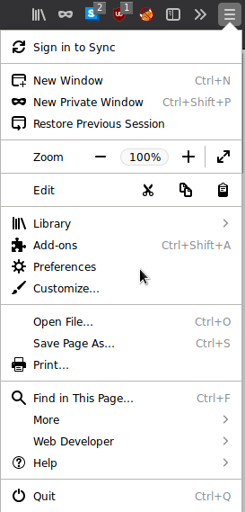

click the menu icon and then click `Preferences`.

Configure Proxy
===============

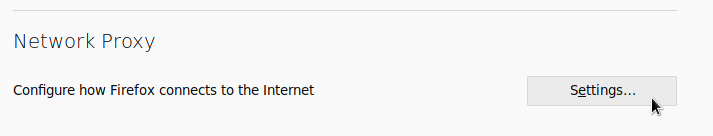

Then scroll down to the bottom of the page and click `Settings` in the
`Network Proxy` settings.

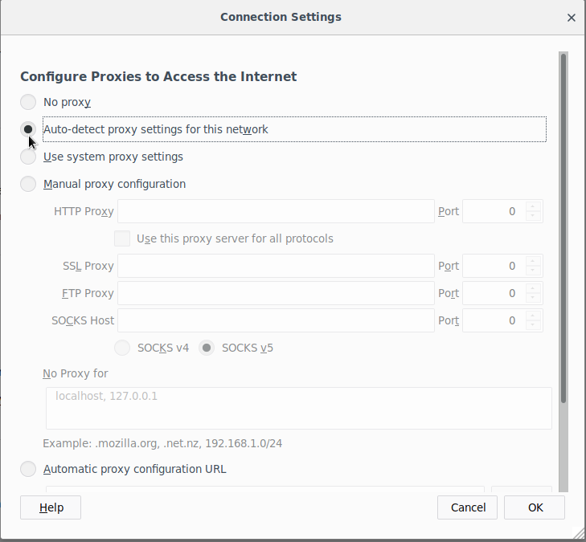

In the newly opened window, you can setup your proxy settings.
If you want to force Firefox to use WPAD/PAC, choose
`Auto-detect proxy settings for this Network`.
Click save and you are done.

