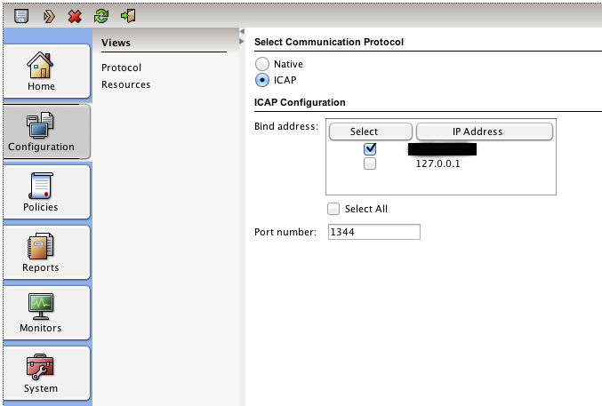

===========================
Setup Anti Virus Protection
===========================
OPNsense can offer http and https protection by utilizing its highly flexible
proxy and the industry standard ICAP. An external engine from one of the known
vendors is used to offer maximum protection against malware, such as ransomware,
trojans and viruses. This protection can be further enhanced by the build-in Intrusion
Prevention System and Category Based Web filtering.

This How To will utilize Symantec's Protection Engine, but any other vendor that
support ICAP will work just as well.

.. Note::
    The Anti Virus Engine can protect you against malicious websites and infected
    file downloads, it does not protect the local clients. Therefore it is always
    a good idea to install a client based solution as well to protect against other
    forms of infection such as through emails or usb stick.

.. image:: images/SPE_home.png
    :width: 100%

Step 1 - Setup the Proxy
------------------------
Start with setting up the proxy with its basic configuration, see :doc:`cachingproxy`.

Step 2 - Setup Transparent Mode
-------------------------------
To setup the transparent mode, see: :doc:`proxytransparent`.

Step 3 - Configure the Engine
-----------------------------
For this example we have used Symantecs Protection Engine.
The installation is straight forward, please refer to Symantecs documentation for
full installation and configuration instructions.

We installed the Engine for Web Proxy purpose and enabled ICAP with its default settings.

Step 4 - Connect the Engine
---------------------------
Now connect the server that the engine is installed on to OPNsense trough either
a switch or a direct cable connection. Preferable use a separate network for this
traffic to make sure the unencrypted ICAP traffic can's be tapped.

.. Note::
  ICAP traffic is not encrypted, meaning you have to make sure the traffic is not
  visible to anyone else. When using transparent https mode it is best to configure
  a separate interface for ICAP traffic and connect the Server (Engine) directly
  with a crosslink cable. Alternatively one may use a VLAN for this purpose.

Step 5 - Configure ICAP
-----------------------
To configure ICAP go to **Services->Proxy->Administration** And select **ICAP Settings**
for the **Forward Proxy** tab.

Select enable ICAP and filling the Request and Response URL's.
For Symantecs Protection Engine the look like this:

======================== ===================================
 **Request Modify URL**   icap://192.168.2.1:1344/avscanreq
 **Response Modify URL**  icap://191.168.2.1:1344/avscan
======================== ===================================

Now click on **Apply**

Step 6 - Test using EICAR
-------------------------
To test if the engine is operational and functional go to http://www.eicar.org/85-0-Download.html
on this page you will find several files you can test.

First test the http protocol version and if that works the https version if you
have also configured the transparent ssl proxy mode.

.. Warning::
    **IMPORTANT NOTE** :
    YOU DOWNLOAD THESE FILES AT YOUR OWN RISK!

If everything went well you should see something similar to this in you browser:

.. code-block:: guess

  The content you just requested contains EICAR Test String and was blocked by the
  Symantec Protection Engine based on local administrator settings. Contact your
  local administrator for further information.

**DONE**
