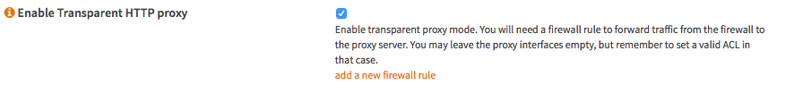
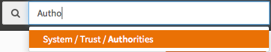
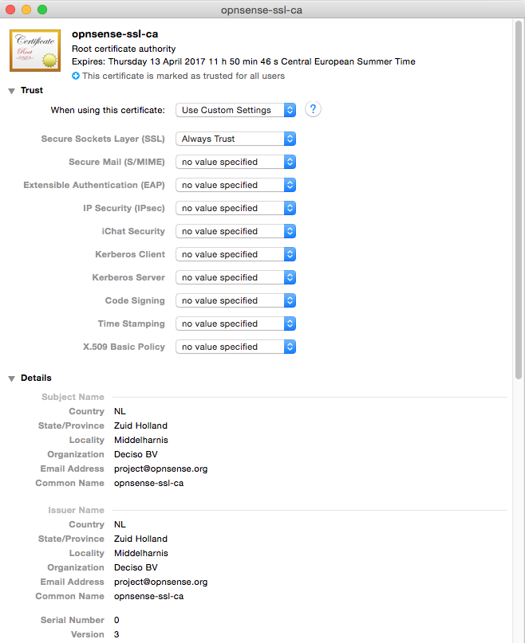

=======================
Setup Transparent Proxy
=======================
OPNsense offers a powerful proxy that can be used in combination with category
based web filtering and any ICAP capable anti virus/malware engine. The proxy
can be configured to run in transparent mode, this mean the clients browser does
not have to be configured for the web proxy, but all traffic is diverted to the
proxy automatically by utilizing Network Address Translation.

In this How To, we will explain the basic http as well as https (ssl bump) transparent
proxy modes.

.. Warning::
    The Transparent SSL/HTTPS proxy mode uses a technique also called man-in-the-middle,
    only configure and use this if your know what you are doing. When configured wrong
    you may end up in lessing your security defenses significantly instead of enhancing
    them. Using a transparent https proxy can be a dangerous practice and may not be
    allowed by the services you use, for instance e-banking.

Step 1 - Basic Proxy Setup
--------------------------
To setup the transparent mode(s) a functional basic proxy setup is required.
For basic configuration please refer to :doc:`cachingproxy`.

Step 2 - Transparent HTTP
--------------------------------
Go to **Services->Proxy->Administration**

Then select **General Forward Settings** under the **Forward Proxy Tab**.

Select **Enable Transparent HTTP proxy**
And Click **Apply**.

Step 3 - NAT/Firewall Rule
---------------------------------
A simple way to add the NAT/Firewall Rule is to click on the **(i)** icon on the
left of the **Enable Transparent HTTP proxy** option and click on **add a new firewall rule**.

**For reference, these are the default settings:**

============================ =================================
 **Interface**                LAN
 **Protocol**                 TCP
 **Source**                   LAN net
 **Source port range**        any - any
 **Destination**              any
 **Destination port range**   HTTP - HTTP
 **Redirect target IP**       127.0.0.1
 **Redirect target port**     other/3128
 **Description**              redirect traffic to proxy
 **NAT reflection**           Enable
 **Filter rule association**  Add associated filter rule
============================ =================================

The defaults should be alright, just press **Save** and **Apply Changes**.

Step 4 - CA for Transparent SSL
--------------------------------------
Before we can setup transparent SSL/HTTPS proxy we need to create a Certificate
Authority. Go to **System->Trust->Authorities** or use the search box to get there
fast.

Click on **add or import ca** in the upper right corner of the screen to create
a new CA.

For our example we use the following data:

======================== ===========================================
 **Descriptive name**     OPNsense-SSL
 **Method**               Create an internal Certificate Authority
 **Key length (bits)**    2048
 **Digest Algorithm**     SHA256
 **Lifetime (days)**      356
 **Country Code**         NL (Netherlands)
 **State or Province**    Zuid Holland
 **City**                 Middelharnis
 **Organization**         OPNsense
 **Email Address**        spam@opnsense.org
 **Common Name**          opnsense-ssl-ca
======================== ===========================================

**Save**

Step 5 - Transparent SSL
-------------------------------------
Go to **Services->Proxy->Administration**
Then select **General Forward Settings** under the **Forward Proxy Tab**.

Select **Enable SSL mode** and set **CA to use** to the CA you have just created.
Then Click **Apply**.

Step 6 - Configure No SSL Bump
------------------------------
This step is very important and requires careful consideration!
To make sure that known sites are not bumped and keep their original security layer
intact, one needs to add those including all subdomain to the **SSL no bump sites**
field.

To enter a new item type in the field and hit enter to accept. start with a . (dot)
to add all subdomains as well. Example: To add all of paypal.com , type .paypal.com
and hit enter.

.. Note::
  Make sure that all banking sites and sites that you provide personal or login
  information for are added to this field. If you are not sure what to add, please
  reconsider using transparent SSL as its clearly not intended for you!

Step 7 - SSL NAT/Firewall Rule
-------------------------------------
A simple way to add the NAT/Firewall Rule is to click on the **(i)** icon on the
left of the **Enable SSL mode** option and click on **add a new firewall rule**.

**For reference, these are the default settings:**

============================ =================================
 **Interface**                LAN
 **Protocol**                 TCP
 **Source**                   LAN net
 **Source port range**        any - any
 **Destination**              any
 **Destination port range**   HTTPS - HTTPS
 **Redirect target IP**       127.0.0.1
 **Redirect target port**     other/3129
 **Description**              redirect traffic to proxy
 **NAT reflection**           Enable
 **Filter rule association**  Add associated filter rule
============================ =================================

The defaults should be alright, just press **Save** and **Apply Changes**.

Step 8 - Configure OS/Browser
-----------------------------
Since the CA is not trusted by your browser, you will get a message about this
for each page you visit. To solve this you can import the Key into your OS and
set as trusted. To export the Key go to **System->Trust->Authorities** and click
on the icon to export the CA certificate. Of course one may choose to accept the
certificate for each page manually, but for some pages that may not work well unless
not bumped.

.. image:: images/export_CA_cert.png
    :width: 100%

Import and change trust settings on your favorite OS. Per example on OSX it looks
like this:

.. Warning::
    Again be very careful with this as your system will accept any page signed with
    this CA certificate. As long as no-one gains access to the private key that
    is no problem, but if any one can get a get a hold of it then all traffic
    can be decrypted except those in the *do not bump* list. You have been warned!

.. Note::
    On Android devices, you may get notified about the device being unable to access
    the internet. This happens because the certificates are pinned to protect the
    connection against man in the middle attacks otherwise trusted certificates.
    If you want to make the connection work again, you have to whitelist the following
    Google domains in your "No Bump Hosts" settings.

    * Your local Google domain (for example: google.at for Austria, google.de for Germany, …)
    * .google.com
    * .googleapis.com
    * .gstatic.com
    * .1e100.net

**DONE**
