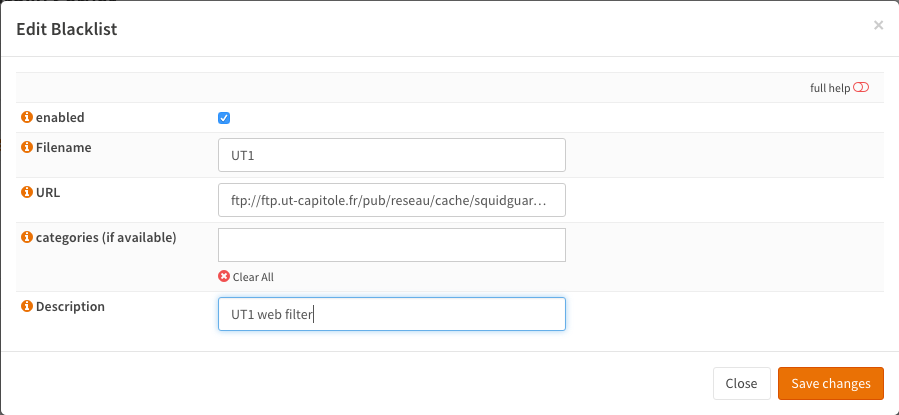
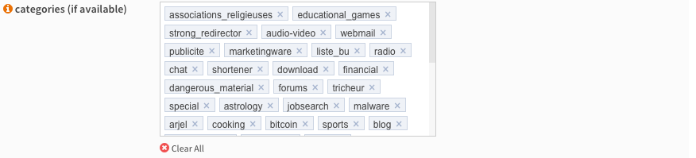
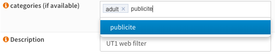

====================
Setup Web Filtering
====================
Category based web filtering in OPNsense is done by utilizing the build-in proxy
and one of the freely available or commercial blacklists.

For this this How-to we will utilize the `UT1 "web categorization list" <https://dsi.ut-capitole.fr/blacklists/index_en.php>`__ from the
Université Toulouse managed by Fabrice Prigent. This list is supplied for free
under the `Creative Commons license <http://creativecommons.org/licenses/by-sa/4.0/>`__.

Other popular lists that are expected to work well with OPNsense are:

* Shallalist.de <http://www.shallalist.de/>
    Free for personal usage and partly for commercial usage
* URLBlacklist.com <http://urlblacklist.com/>
    Commercial paid service
* Squidblacklist.org <http://www.squidblacklist.org/>
    Commercial paid service

For this tutorial we will assume:

* Proxy has his default settings / is not configured
* We only want web filtering and nothing else (no caching, no authentication)

.. Note::
    For other general/basic setup item of the proxy see :doc:`cachingproxy`

-------------------------------
Step 1 - Disable Authentication
-------------------------------
To start go to **Services->Proxy->Administration**.

Click on the arrow next to the **Forward Proxy** tab to show the drop down menu.
Now select **Authentication Settings** and click on **Clear All** to disable user
authentication. And click **Apply** to save the change.

----------------------------
Step 2 - Configure Blacklist
----------------------------
Click on the tab **Remote Access Control Lists**.
Now click on the **+** in the lower right corner of the from to add a new list.

A screen will popup, enter the following details:

================= ======================= ===========================================
 **Enabled**       Checked                 *Enable/Disable*
 **Filename**      UT1                     *Choose a unique filename*
 **URL**           (copy/paste the URL)    *The URL of the blacklist*
 **categories**    (Leave blank)           *If left blank the full list will be fetched*
 **Description**   UT1 web filter          *Your description*
================= ======================= ===========================================

The URL of the full compressed UT1 category based list is:
  ftp://ftp.ut-capitole.fr/pub/reseau/cache/squidguard_contrib/blacklists.tar.gz

Press **Save Changes**.

--------------------------------
Step 3 - Download the Categories
--------------------------------
Now press Download ACL's, please note that this will take a while (can be several
minutes) as the full list (>19MB) will be converted to squid acl's.

-------------------------
Step 4 - Setup Categories
-------------------------
Now we can select the categories we want to use by clicking on the pencil icon next
to the description of the list. This will open the edit window again, but now you
will see all available categories extracted from the list.

For our example we will filter ads and adult content. The easiest way to do so is
clear the list and select the following from the drop down list:

Now **Save changes** and press **Download ACLs** again to download and reconstruct
the list with only the selected categories. This will take roughly the same amount
of time as the first fetch as the adult alone section is ~15MB.

---------------------
Step 5 - Enable Proxy
---------------------
To enable the proxy just go to **Services->Proxy Server->Administration** and
check **Enable proxy** en click on **Apply**. The proxy will bind to LAN and port 3128.

It may take a while for the proxy to start and the play icon on the top right corner
of the screen will turn red. Refresh the page to see if the proxy is done loading
(play icon will turn green).

-----------------------------
Step 6 - Disable Proxy Bypass
-----------------------------
To make sure no-one can bypass the proxy you need to add a firewall rule.
Go to **Firewall->Rules** and add the following to the top of the list rule on the
LAN interface (if LAN is where your clients and proxy are on).

============================ =====================
 **Action**                   Block
 **Interface**                LAN
 **Protocol**                 TCP/UDP
 **Source**                   LAN net
 **Destination Port Range**   HTTP
 **Category**                 Block Proxy Bypass
 **Description**              Block http bypass
============================ =====================

**Save**

And one more rule to block HTTPS access:

============================ =====================
 **Action**                   Block
 **Interface**                LAN
 **Protocol**                 TCP/UDP
 **Source**                   LAN net
 **Destination Port Range**   HTTPS
 **Category**                 Block Proxy Bypass
 **Description**              Block https bypass
============================ =====================

**Save** & **Apply changes**

.. image:: images/proxy_firewall.png
    :width: 100%
