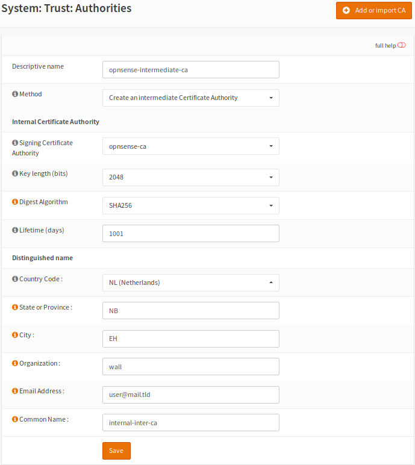
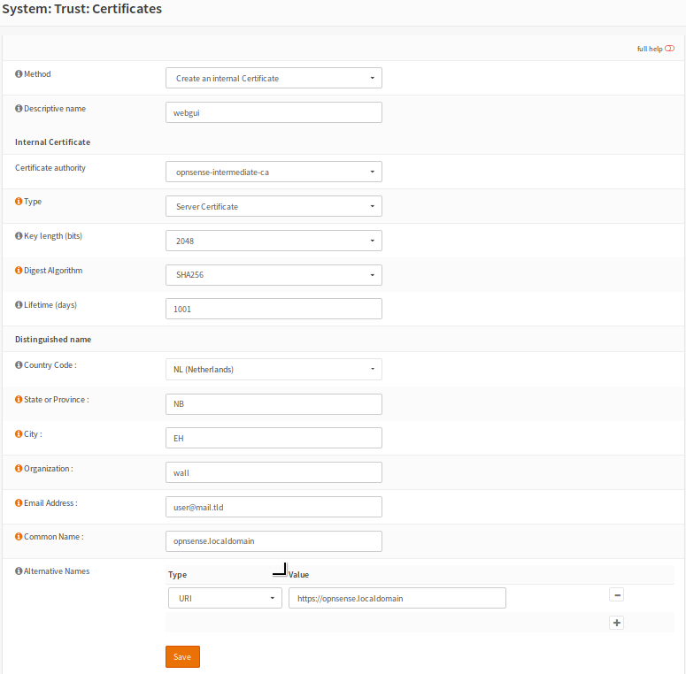
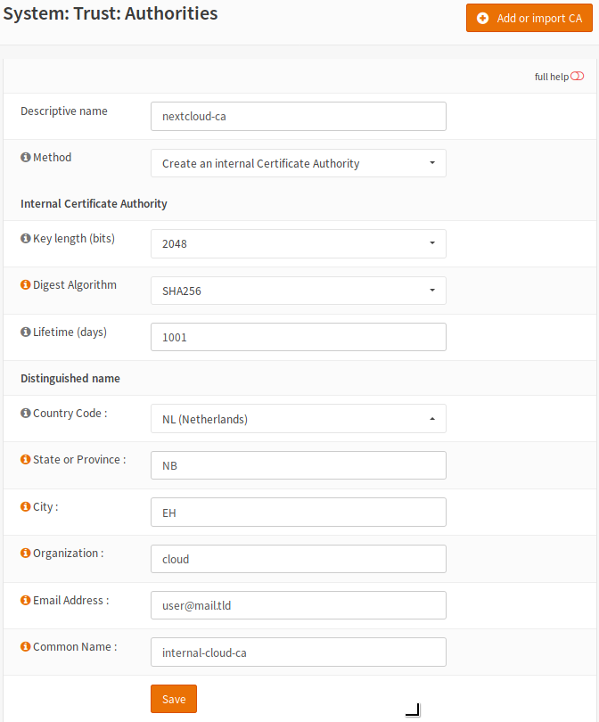

==================================================
Setup self signed certificate chains with OPNsense
==================================================

This how-to describes the process of creating **self signed certificate chains**
with the help of OPNsense which has all the tools available to do so.

Chains give the possibility to verify certificates where a single one is nothing
more than that, a single certificate.

Look at the default install, one certificate is created for the webgui/dashboard. There's
nothing wrong with that certificate if we use a real world CA, but we don't. We
create our own chain so that one has no purpose once done.

Should you even consider using **self signed certificate chains**? in this age of free available certificates?

   * Self signed certificate are just as secure as real world certificates.
   * They are trustworthy chains, you **know** all parties
   * Intranets are often set up with these chains
   * Depending on what you do with your network/servers this is a good solution.
   * Creating your own chain will give some insight in the process.
   * Only use them if you're sure you can, read about the concept in common lots of info on the net.

What you shouldn't do with a self signed chain

   * Use them for a web facing server
   * Install them unless you are the issuer

What you shouldn't do with single self signed certs

   * Install them from unknown parties at all.

A chain will need at least the next ingredients:

  * **CA** ``=`` certificate authority ``=`` root certificate ``-->`` signs intermediate certificates
  * **Intermediate CA** ``=`` subordinate certificate ``=`` signed by CA  ``-->`` signs certificates
  * **Certificate** ``=`` signed by Intermediate CA ``=`` used for different services

Please backup before you procede.

---------------------------
Create a chain for OPNsense
---------------------------

The Authority
-------------

The first certificate to create is the **CA**. The only thing this CA
does is sign the **intermediate CA** next in the line of trust.

Go to **trust/Authorities** and add a new CA.
Some entries in the form are showed here. Click on the thumbnail for a picture.

When you are done save the form, the CA is now generated.

====================== =================================== ========================================
 **Descriptive name**   opnsense-ca                         *Choose a name that makes sense to you*
 **Method**             create an internal ca               *Main purpose of CA*
 **Common Name**        internal-ca                         *Default is fine, change to liking*
====================== =================================== ========================================

.. image:: images/CA.png
   :scale: 15%

.. Tip::
    Use valid email addresses for your certificates always.
    Bogus addresses can pose a security risk not only for certificates btw. ;-)

The intermediate
----------------

Time to create the second CA which is an **intermediate CA** this certificate will be signed
by the root CA we just created. In return it will sign the sever certificate for OPNsense.

Have a look at the form create one and save it.

====================== =================================== ========================================
 **Descriptive name**   opnsense-ca-intermediate            *Choose a name that makes sense to you*
 **Method**             create an intermediate ca           *Main purpose of CA*
 **Common Name**        intermediate-ca                     *Default is fine, change to liking*
====================== =================================== ========================================

The certificate
---------------

The thirth certificate will be a **server certificate** signed by the intermediate CA we just created.
This will also be the last one we create for this chain.

Have a look at the next form and notice the common name, create one and save it.

====================== =================================== ========================================
 **Descriptive name**   opnsense-ca-intermediate            *Choose a name that makes sense to you*
 **Method**             create a server certificate         *Main purpose of certificate*
 **Common Name**        opnsense.localdomain                *This should reflect the FQDN see Tip*
====================== =================================== ========================================

.. Tip::
    When creating the server certificate make sure the **CN - common name**
    is in fact the the **FQDN - fully qualified domain name**.
    You can find it on **Linux/Unix** with this command ``hostname -f``

Now we need to start using the chain

  * Download the intermediate CA. 
  * Open your browser and go to **preferences/certificate/authorities**
  * Import the downloaded CA.
  * Go back to the dashboard & open **system/settings/Administration**.
  * Set **SSL-Certificate** to use the new server certificate.

Open your browser and open the OPNsense page. You should be presented with a certificate that is 
verified by your intermediate CA.

---------------------------------------
A chain for your local Nextcloud server
---------------------------------------

The local chain for Nextcloud server so we can use OPNsense backup to Nextcloud.

Let's create a new chain **CA -- intermediate CA -- server cert.**

.. Note::

    The certicate store on your OPNsense **ca-root-nss** is not aware of the CA
    we are generating that is why we need to add this CA to it's store.

.. Note::

    | Performing a **Health audit** would raise an alert after adding the CA to the store:
    | alert: **checksum mismatch for /usr/local/share/certs/ca-root-nss.crt**
    | The sum of the file doesn't match the sum saved in the system after adding the CA.

.. Tip::

    | You can still perform a check: 
    | Do a health check before you add the CA.
    | If the check was okay add the CA to the store.
    | Create a checksum & save it :
    | ``cksum /usr/local/share/certs/ca-root-nss.crt > sum.txt``
    | You can now always check the sum against the result you have stored
    | ``cksum /usr/local/share/ca-root-nss.crt | sort | diff sum.txt -``

The Nextcloud Authority
-----------------------

Go to **trust/Authorities** create a new CA for Nextcloud and save it.

====================== =================================== ========================================
 **Descriptive name**   nextcloud-ca                        *Choose a name that makes sense*
 **Method**             create a ca                         *Main purpose of CA*
 **Common Name**        nextcloud-ca                        *Change to liking*
====================== =================================== ========================================

OPNsense needs to be made aware of the Nextcloud chain we are creating.

   * Download the **CA.crt** and upload it back to OPNsense in a secure way.
   * For this you can use ``scp`` see ``man scp``
   * Install the **CA.crt** with ``cat``, you cannot just copy it to the store because it is a single file.

**The following command will append it to the store**

::

    cat nextcloud-ca.crt >> /usr/local/share/certs/ca-root-nss.crt

.. Warning::

    If **ca_root_nss** is updated your certificate is removed and needs to be added overnew.

.. Tip::

    Remove the CA from the store? Use ``vi``, the added CA will be the
    last one below **#End of file**

The Nextcloud intermediate CA
-----------------------------

Next in line will be the **intermediate CA** which will be signed by the root CA we did just create.
This intermediate CA will sign the Nextcloud server certificate, create one and save it.

====================== =================================== ========================================
 **Descriptive name**   nextcloud-intermediate-ca           *Choose a name that makes sense to you*
 **Method**             create an intermediate ca           *Main purpose of CA*
 **Common Name**        cloud.localdomain                   *Change to liking*
====================== =================================== ========================================

.. image:: images/CA-cloud-inter.png
   :scale: 15%

Download the intermediate CA and install it to your browser

   * Head to the webgui **trust/Authorities** export **nextcloud-intermediate-ca**
   * Back to the browser, open **preferences/certificate/authorities**
   * Import the intermediate CA into the certificate store from your browser.

The Nextcloud server certificate
--------------------------------

Next we create the server certificate for the Nextcloud server.

====================== =================================== ========================================
 **Descriptive name**   cloudserver-cert                    *Choose a name that makes sense to you*
 **Method**             create a server certificate         *Main purpose of certificate*
 **Common Name**        cloud.localdomain                   *Should reflect the FQDN*
====================== =================================== ========================================

.. image:: images/cloud-cert.png
   :scale: 15%

We need to install this certificate to our Nextcloud server.

   * Upload the ***.p12**  archive to your Nextcloud server, in a safe way..
   * Extact the archive into a single **PEM** file and create a certificate. 

::

    openssl pkcs12 -in nextcloud-crt.p12 -out nextcloud-crt.pem -nodes
    cp nextcloud-crt.pem nextcloud-crt.crt

-  * **/etc/ssl/localcerts** will be alright or choose your own prefered location.
   * Edit the webserver config to use the certificate, the key is included in the ***.crt**
   * There are other ways to do this.
   * Sane permissions, '400' read only owner is sufficent.

You should now be able to backup to nextcloud and have a verified page.

 - :doc:`cloud_backup`

 After setting up the Nextcloud backup everything should work.

-----------------------------
Chain for the local webserver
-----------------------------

This following **chain** we create is basically the same as the previous chain for Nextcloud server.

If needed use the pictures from the Nextcloud chain.

Create a chain for your server **CA - intermediate CA - server cert.**.

Once done go through the following points:

   * Download the server.p12 archive.
   * Upload it to the server **/etc/ssl/localcerts** or where ever you want them
   * Extract the archive and create the certificate with the next commands

::

    openssl pkcs12 -in some-server-crt.p12 -out some-server-crt.pem -nodes
    cp some-server-crt.pem some-server-crt.crt'

-  * Some sane permissions on them
   * Set the server to use the installed certificate.
   * Download the intermediate CA
   * Install it in your browser
   * Head to the webservers page and be presented with a verified certificate.

