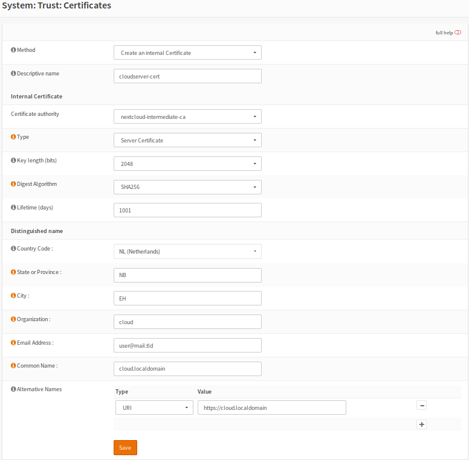

==================================================
Setup Self-Signed Certificate Chains with OPNsense
==================================================

This how-to describes the process of creating **self-signed certificate chains**
with the help of OPNsense which has all the tools available to do so.

Chains give the possibility to verify certificates where a single one is nothing
more than that, a single certificate.

Look at the default install, one certificate is created for the webgui/dashboard. There is
nothing wrong with that certificate if we use a real world CA, but we do not. We
create our own chain so that one has no purpose once done.

Should you even consider using **self-signed certificate chains** in this age of free available
certificates?

   * Self-signed certificate are just as secure as real world certificates.
   * They are trustworthy chains, you **know** all parties.
   * Intranets are often set up with these chains.
   * Depending on what you do with your network/servers this is a good solution.
   * Creating your own chain will give some insight in the process.
   * Only use them if you are sure you can. Read about the concept in common there is a lot of info on the net.
   * They are required for intercepted connections (see proxy chapter)

What you should not do with a self-signed chain:

   * Use them for a web-facing server.
   * Intercept encrypted traffic on a public wireless network (for example if you provide access in a hotel)

What you should know about self-signed certificates:

   * They are **only** as trustworty as the person, company or organization signing it, this is also true for trusted certificates.

A chain will need at least a CA and certificate; an intermediate CA is not needed, but in case of a
compromise the CA key would be compromised too.
The CA private key should be stored offline on an USB stick/HD and put in a safe, not reachable by malicious software or criminals/burglers.
The intermediate CA, which is intended for a shorter lifetime can be kept on the firewall host.

The chain we are going to create will be made with the following ingredients:

  * **CA** ``=`` certificate authority ``=`` root certificate ``-->`` signs intermediate certificates
  * **Intermediate CA** ``=`` subordinate certificate ``=`` signed by CA  ``-->`` signs certificates
  * **Certificate** ``=`` signed by Intermediate CA ``=`` can be used for different services

Please backup before you proceed.

---------------------------
Create a Chain for OPNsense
---------------------------

The Authority
-------------

The first certificate to create is the **CA**. The only thing this CA
does is sign the intermediate CA next in the line of trust.

.. Note::

    Self-signed root CA's anchor trust chains, they are vital and OpenSSL requires them for your chain of trust.

Go to **Trust/Authorities**

Some entries in the form are showed here. Click on the thumbnail for a picture.

When you are done save the form, the CA is now generated.

====================== =================================== ========================================
 **Descriptive name**   opnsense-ca                         *Choose a name that makes sense to you*
 **Method**             create an internal ca               *Main purpose of CA*
 **Common Name**        internal-ca                         *Default is fine, change to liking*
 **Lifetime(days)**     3650                                *Longer is also no problem for CA*
====================== =================================== ========================================

.. image:: images/CA.png
   :width: 100%

.. Tip::

    Always use valid email addresses for your certificates.
    Bogus addresses can pose a security risk - and not only for certificates.
    F.I.: If one should use user@example.com and someone claims example.com mail will be send there!

The Intermediate
----------------

Time to create the second CA, which is an **intermediate CA**. This certificate will be signed
by the root CA we just created. In return it will sign the sever certificate for OPNsense.

Go to **Trust/Authorities**

Have a look at the form, create an intermediate CA and save it.

====================== =================================== ========================================
 **Descriptive name**   opnsense-ca-intermediate            *Choose a name that makes sense to you*
 **Method**             create an intermediate ca           *Main purpose of CA*
 **Common Name**        intermediate-ca                     *Default is fine, change to liking*
====================== =================================== ========================================

.. image:: images/CA-inter.png
   :width: 100%

The Certificate
---------------

The third certificate will be a **server certificate** signed by the intermediate CA we just created.
This will also be the last one we create for this chain.

Go to **Trust/Certificates**

Have a look at the next form and notice the common name, create a server certificate and save it.

====================== =================================== ========================================
 **Descriptive name**   opnsense-ca-intermediate            *Choose a name that makes sense to you*
 **Method**             create a server certificate         *Main purpose of certificate*
 **SAN**                opnsense.localdomain                *This should reflect the FQDN see Tip*
====================== =================================== ========================================

.. image:: images/webgui-cert.png
   :width: 100%

.. Tip::

    When creating the server certificate make sure the **SAN - Subject Alternative Name**
    is in fact the the **FQDN - Fully Qualified Domain Name**.
    You can find it on **Linux/Unix** with this command ``hostname -f``

Now we need to start using the chain:

  * Download the intermediate CA.

.. image:: images/export_CA_cert.png

- * Open your browser and go to **Preferences/Certificate/Authorities**
  * Import the downloaded CA.
  * Go back to the dashboard & open **System/Settings/Administration**
  * Set **SSL-Certificate** to use the new server certificate.

Open your browser and open the OPNsense/webgui page. You should be presented with a certificate that is
verified by your intermediate CA.

---------------------------------------
A Chain for Your Local Nextcloud Server
---------------------------------------

The local chain for Nextcloud server so we can use OPNsense backup to Nextcloud.

Go ahead and create a new chain **CA -- intermediate CA -- server cert.**.

The Nextcloud Authority
-----------------------

Go to **Trust/Authorities** create a new CA for Nextcloud and save it.

====================== =================================== ========================================
 **Descriptive name**   nextcloud-ca                        *Choose a name that makes sense*
 **Method**             create a ca                         *Main purpose of CA*
 **Common Name**        nextcloud-ca                        *Change to liking*
 **Lifetime(days)**     3650                                *Longer is also no problem for CA*
====================== =================================== ========================================

.. image:: images/CA-cloud.png
   :width: 100%

The Nextcloud Intermediate CA
-----------------------------

Next in line will be the **intermediate CA** which will be signed by the root CA we did just create.
This intermediate CA will sign the Nextcloud server certificate.

Go to **Trust/Authorities** and create an intermediate CA.

====================== =================================== ========================================
 **Descriptive name**   nextcloud-intermediate-ca           *Choose a name that makes sense to you*
 **Method**             create an intermediate ca           *Main purpose of CA*
 **Common Name**        cloud.localdomain                   *Change to liking*
====================== =================================== ========================================

.. image:: images/CA-cloud-inter.png
   :width: 100%

Download the intermediate CA and install it to your browser:

   * Head to the webgui **Trust/Authorities** export **nextcloud-intermediate-ca.crt**
   * Back to the browser, open **Preferences/Certificate/Authorities**
   * Import the intermediate CA into the certificate store from your browser.

The Nextcloud Server Certificate
--------------------------------

Next we create the server certificate for the Nextcloud server.

Go to **Trust/Certificates** create a server certificate.

====================== =================================== ========================================
 **Descriptive name**   cloudserver-cert                    *Choose a name that makes sense to you*
 **Method**             create a server certificate         *Main purpose of certificate*
 **SAN**                cloud.localdomain                   *Should reflect the FQDN*
====================== =================================== ========================================

We need to install this certificate and key to our Nextcloud server, two ways are shown here.

   * Upload the ***.p12** archive to your Nextcloud server in a safe way.
   * Extact the archive into a single **PEM** file and create a certificate and a key.
   * Use the following commands for a key and certificate:

::

   openssl pkcs12 -in nextcloud-crt.p12 -nodes -out nextcloud.key -nocerts
   openssl pkcs12 -in nextcloud-crt.p12 -clcerts -nokeys -out nextcloud.pem
   cp nextcloud.pem nextcloud.crt

-  * Or download the key and certificate separately from OPNsense.
   * If SSH is used '-i private-key' is not needed.

::

   scp -i ~/id_ed25519 /path/to/private/nextcloud.key /etc/ssl/keys/nextcloud.key
   scp -i ~/id_ed25519 /path/to/nextcloud.pem /etc/ssl/localcerts/nextcloud.pem

-  * Or use the next quick and dirty method for a single key/certificate file:
   * Upload the ***.p12**  archive to your Nextcloud server, in a safe way..
   * Extact the archive into a single **PEM** file and create a certificate.

::

    openssl pkcs12 -in nextcloud-crt.p12 -out nextcloud-crt.pem -nodes
    cp nextcloud-crt.pem nextcloud-crt.crt

-  * **/etc/ssl/localcerts** will be alright for the certificate or choose your own prefered location.
   * If the key was extracted separatly, **/etc/ssl/private** would be a good choice.
   * Be sure to set sane permissions on the private directory, ``755`` would do it.
   * You could set ``umask`` too (see) ``man umask`` - on your Linux box.
   * Edit the webserver config to use the certificate and key or single key-cert file.
   * Sane permissions, ``400`` read only owner is sufficent.

You should now be able to backup to Nextcloud and have a verified page.

 - :doc:`cloud_backup`

 After setting up the Nextcloud backup everything should work.

-----------------------------
Chain for the Local Webserver
-----------------------------

This following **chain** we create is basically the same as the previous chain for Nextcloud server.

If needed use the pictures from the Nextcloud chain.

Create a chain for your server **CA - intermediate CA - server cert.**

Once done go through the following points:

   * Download the server.p12 archive.
   * Upload it to the server and extract the archive.
   * Store the certificate and key respectively in **/etc/ssl/localcerts** and **/etc/ssl/private**
   * Use the following commands for that:

::

   openssl pkcs12 -in server.p12 -nodes -out server.key -nocerts
   openssl pkcs12 -in server.p12 -clcerts -nokeys -out server.pem
   cp server.pem server.crt

-  * Or download the key and certificate separately from OPNsense.
   * If SSH is used '-i private-key' is not needed.

::

   scp -i ~/id_ed25519 /path/to/private/server.key /etc/ssl/keys/server.key
   scp -i ~/id_ed25519 /path/to/server.pem /etc/ssl/localcerts/server.pem

-  * Or if you want to use a single file:

::

    openssl pkcs12 -in some-server-crt.p12 -out some-server-crt.pem -nodes
    cp some-server-crt.pem some-server-crt.crt

-  * Some sane permissions on them.
   * Set the server to use the installed certificate.
   * Download the intermediate CA.
   * Install it in your browser.
   * Head to the webservers page and be presented with a verified certificate.
