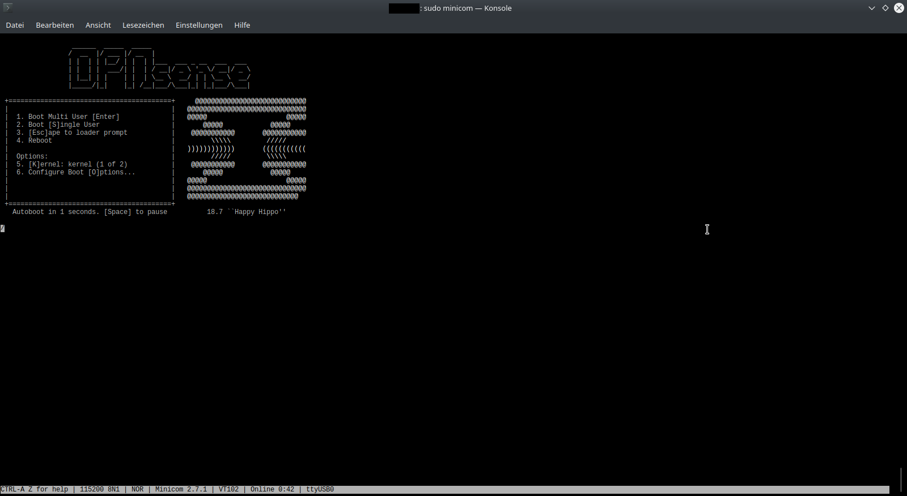

=============
Serial Access
=============

Besides the web frontend, SSH and a locally connected monitor (if your device supports it), OPNsense can also be
controlled via serial. Accessing OPNsense via serial is similar to accessing via SSH, but unlike SSH, the system can
be accessed at any time, even when OPNsense is not running. This makes it especially useful for installing OPNsense,
for emergency troubleshooting when you accidentally cut off internet access as well as for major system upgrades.

------------
Requirements
------------

* OPNsense installation must provide a serial interface (virtual or hardware)
* a software which can be used to access the serial interface (screen, minicom, PuTTY etc.)

For a bare metal installation, you also need the following (unless provided though a management interface differently,
please refer your server manual):

* a null modem cable
* if you don't have an RS232 port on your computer, you need an USB to RS232 converter

--------------------------------
Connecting to the serial console
--------------------------------

If you already installed OPNsense via a non-serial installer, serial access needs to be turned on. To do this, open
the web interface, navigate to **System->Settings->Administration**, scroll down to 'Console' and set the primary or
secondary console to 'Serial console'. Note: this is **only** necessary if you already installed OPNsense, and did not
use the serial installer to do so. In all other cases (accessing BIOS, running the serial installer, connecting to an
installation that was done via serial), serial access is already available.

On Unix-like systems, you can connect to the serial console using the ``screen`` program, with a baud rate of 115200.
The device name can differ per system and per serial device. Examples of names are:

* /dev/ttyS0 (serial port, Linux)
* /dev/ttyUSB0 (usb-to-serial, Linux)
* /dev/cuau0 (serial port, FreeBSD or HardenedBSD)
* /dev/cuaU0 (usb-to-serial, FreeBSD or HardenedBSD)
* /dev/tty.usbmodem1112421 (usb-to-serial, macOS)
* COM1, COM2, ... (Windows)

.. Note::
    If you have multiple devices of the same type like shown here:
    ::
        ls /dev/ttyUSB*
        /dev/ttyUSB0  /dev/ttyUSB1
    
    You can disconnect one of them to see which one is left or you can read the ``dmesg`` log to get the vendor information
    for the device node.
    You can search for a message containing "now attached to ttyUSB1" to find out which device it is. Afterwards you can
    compare the previous output to the output of a tool like ``lsusb``.

For example, on the Deciso DEC630, accessed from macOS, the device is named ``/dev/tty.usbmodem1112421``. Entering
the serial console thus involves opening a terminal and executing the following instruction:

::

  screen /dev/tty.usbmodem1112421 115200
  # or
  minicom -b 115200 -D /dev/tty.usbmodem1112421

.. Note::
    Access to the device is likely to be access restricted. You should run the command as root because running it as
    a user may lead to an access denied error on Linux / BSD.
  
If OPNsense is running, you will now be asked for your username and password if authentication is enabled. Otherwise
the menu is displayed (at least after pressing enter). The credentials are the same as those used for SSH.

A thing to note is that the screen won't always auto-update. If you connect and see no output, try pressing `Enter`
first before checking the other (more complex) possibilities. Another thing is that, when connecting via ``screen``,
you might not be able to scroll (but you can still pipe the output through a pager like ``more`` or ``less``).
