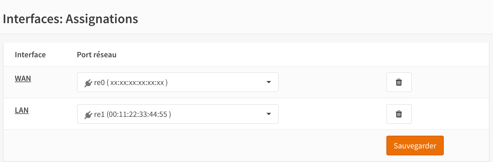
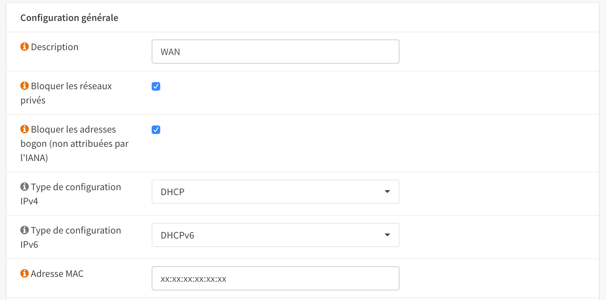
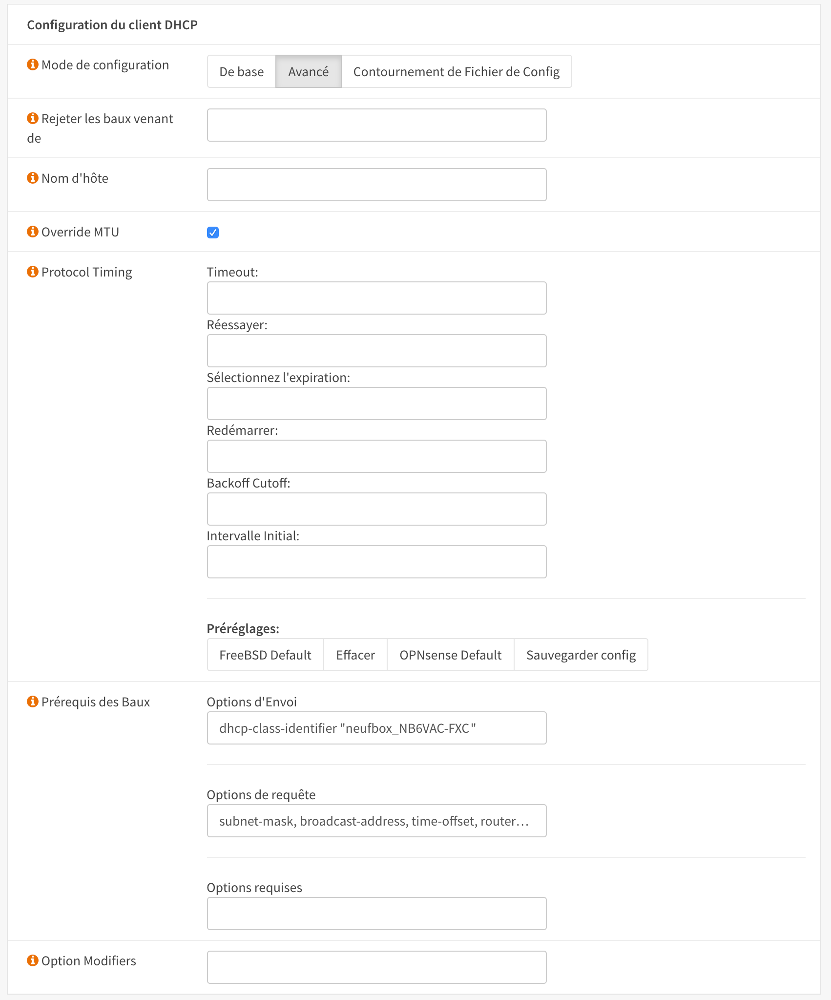
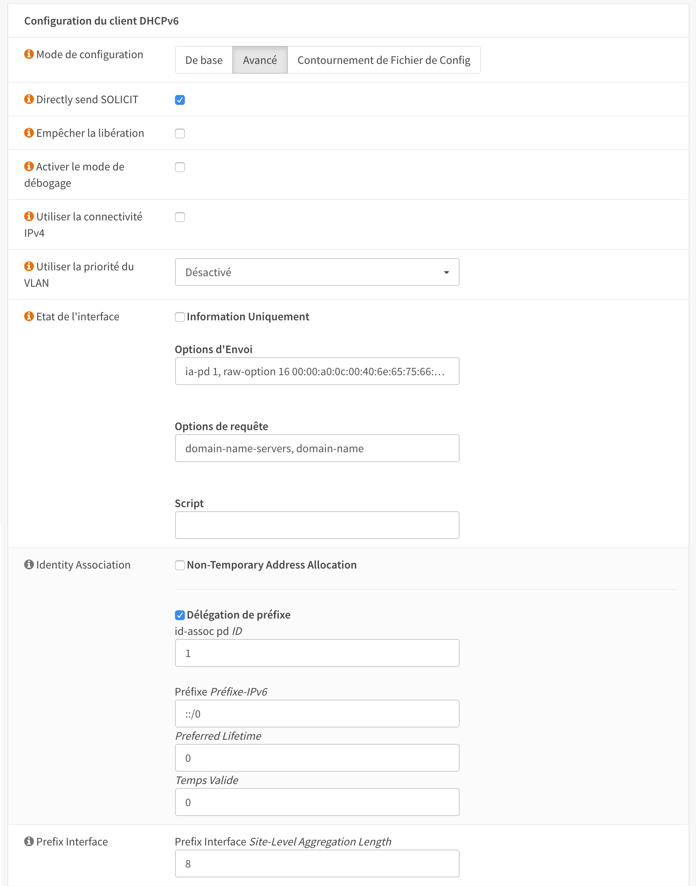
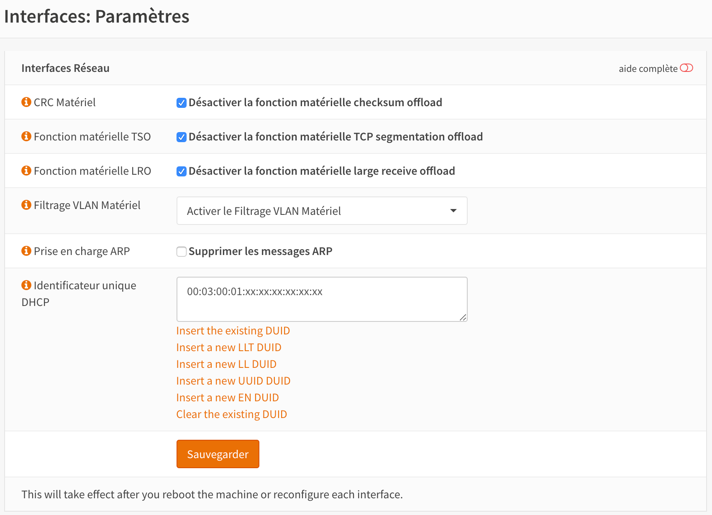
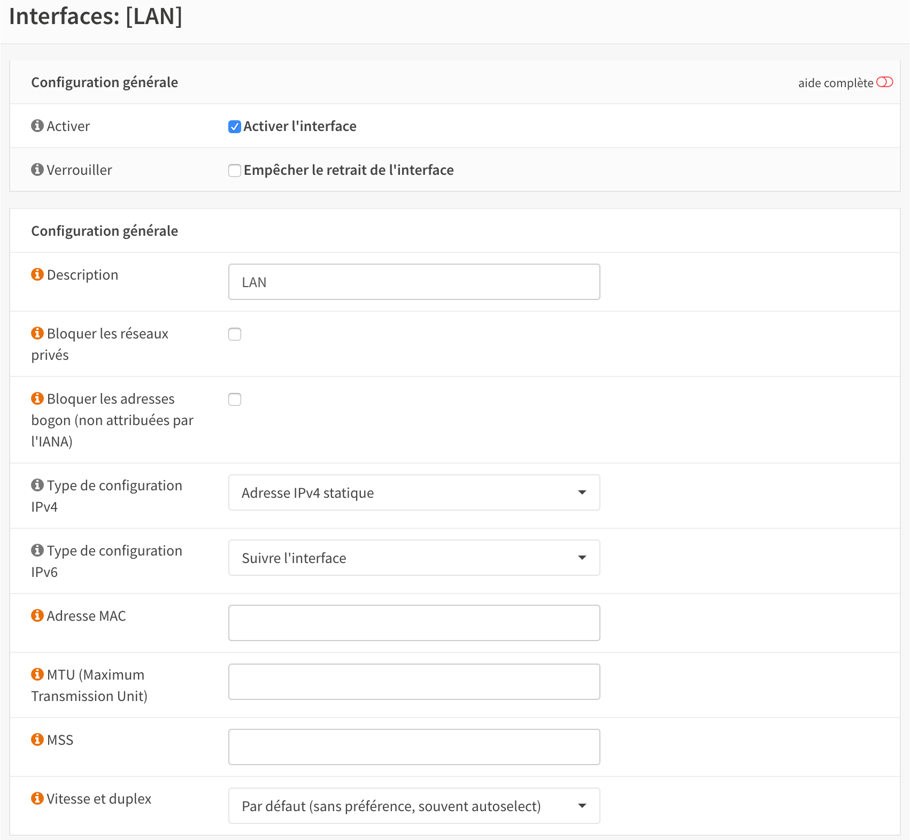
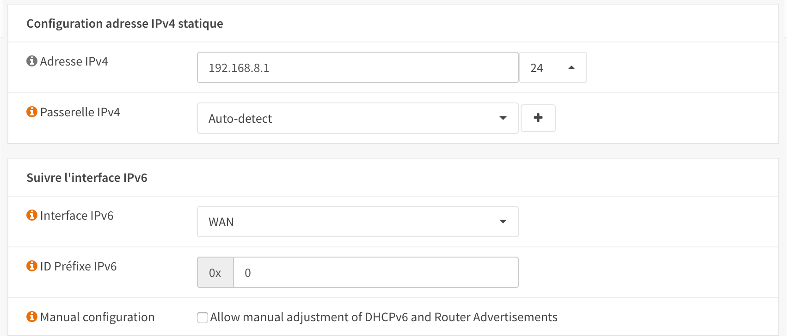

SFR/RED France FTTH IPv4 & IPv6 & Phone
=======================================

**Original Author:** Philippe Gaultier

**Introduction**
-----------------
This guide is for SFR/RED France FTTH using DHCP to connect

The guide deals with internet connection and phone. Support for TV has not been tested

.. Note::
    Before starting this guide, you should have the MAC adress of your SFR/RED Box. In the guide you should replace xx:xx:xx:xx:xx:xx by your SFR/RED Box MAC adress

**Getting ready to make the connection**
----------------------------------------

SFR/RED requires that the WAN interface assignment should hence look something like this

* WAN interface has MAC xx:xx:xx:xx:xx:xx which is the original WAN MAC of the BOX (spoofed)
* LAN interface has MAC 00:11:22:33:44:55 which is the original MAC of the firewall
* DUID is 00:03:00:01:xx:xx:xx:xx:xx:xx it's derived from the original WAN MAC of the BOX (spoofed)

**Configuring the WAN Interface**
---------------------------------

Select :menuselection:`Interfaces --> [WAN]`

In order to establish the IPv4 and IPv6 connection SFR/RED requires that the correct parameters are passed for the DHCP and DHCP6
requests respectively

select options DHCP and DHCPv6 in general configuration

**On the DHCP request it is a requirement to pass the following:**

.. Note::
    It is necessary to specify the following 'Send Options'

* dhcp-class-identifier "neufbox_NB6VAC-FXC"

.. Note::
    It is necessary to specify the following 'Request Options'

* subnet-mask, broadcast-address, time-offset, routers, domain-name, domain-name-servers, host-name, ntp-servers, nis-domain, root-path, merit-dump

**On the DHCP6 request we need to use raw options**

.. Note::
    It is necessary to specify the following 'Send Options'

* ia-pd 1, raw-option 16 00:00:a0:0c:00:40:6e:65:75:66:62:6f:78:5f:4e:42:36:56:41:43:2d:46:58:43

.. Note::
    It is necessary to specify the following 'Request Options'

* domain-name-servers, domain-name

Finally set the Identity Association and Prefix interface as shown

Click ‘Save’ and then ‘Apply’.

**Configuring the LAN Interface**
---------------------------------

Select :menuselection:`Interfaces --> Parameters` and set your DUID

.. Note::
    The DUID is based on the SFR/RED Box MAC address : 00:03:00:01:xx:xx:xx:xx:xx:xx

Click ‘Save’ and then ‘Apply’.

Select :menuselection:`Interfaces --> [LAN]` and set IPv4 to “Static IPv4” and IPv6 Configuration Type to
“Track Interface”.

Finally, set the Track IPv6 Interface to WAN and set the IPv4 address to your chosen address.

Click ‘Save’ and then ‘Apply’.

.. Note::
    It is advisable at this point to reboot the system. This will allow you to retrieve IPv4 which will be used in next part

**Configuring NGINX to provision the SFR/RED BOX**
--------------------------------------------------

In order to set up the phone, as the SIP parameters (user/password) are not public, we will add the SFR/RED box in our LAN.
This will allow us to plug our regular phone in the SFR/RED box.

.. Note::
    This how-to does not cover installation of NGINX nor the use of SSH / shell commands.

First login into you OPNSense firewall and create a folder **/srv/sfrredbox**. We will add in this folder the scripts used to spoof the SFR/RED Box requests.

In this directory create a file **index.php**

.. code-block:: php

    $currentFirewall = 'firewall.localdomain.intra';
    // can probably be replaced with
    // $currentFirewall = exec('hostname');
    if (isset($_GET['ip_dhcp'])) {
        // adjust re0 to your WAN interface
        $_GET['ip_dhcp'] = exec('ifconfig re0 | grep \'inet \' | cut -d\' \' -f2');
        // if the ifconfig command does not work, set the external IP manually
        // $_GET['ip_dhcp'] = 'your.external.ip.address';
    }
    $_SERVER['DOCUMENT_URI'] = str_replace('/index.php', '', $_SERVER['DOCUMENT_URI']);
    $parameters = http_build_query($_GET);
    $url = $_SERVER['REQUEST_SCHEME'].'://'.$_SERVER['HTTP_HOST'].'/'.trim($_SERVER['DOCUMENT_URI'], '/?') .'?'.$parameters;
    $ch = curl_init();
    curl_setopt($ch, CURLOPT_URL, $url);
    curl_setopt($ch, CURLOPT_RETURNTRANSFER, true);
    curl_setopt($ch, CURLOPT_HEADERFUNCTION, 'readHeaderLine');
    $data = curl_exec($ch);
    $data = preg_replace('/<proxy([^>]+)>([^<]+)<\/proxy>/', '<proxy$1>'.$currentFirewall.'</proxy>', $data);
    curl_close($ch);
    header('Content-Length: '.strlen($data));
    header('Content-Type: application/xml');
    echo $data;

.. Warning::
    Code cannot be copy / paste, you have to adjust the parameters and make it consistant with your own parameters

Select :menuselection:`Services --> Nginx --> Configuration`

Activate NGINX

.. image:: SFRRED_services_nginx_configuration_1.png
	:width: 100%

Select :menuselection:`Services --> Nginx --> Configuration --> HTTP(s)`

Create a new config

.. image:: SFRRED_services_nginx_configuration_2.png
	:width: 100%

Select :menuselection:`Services --> Nginx --> Configuration --> HTTP(s) --> URL Rewriting`

Add a new rewrite rule

.. image:: SFRRED_services_nginx_configuration_3.png
	:width: 100%

Select :menuselection:`Services --> Nginx --> Configuration --> HTTP(s) --> HTTP Server`

Add a new rewrite rule

.. image:: SFRRED_services_nginx_configuration_4.png
	:width: 100%

.. Note::
    NGINX should be serving the page we have created.

**Configuring Siproxd to provision the SFR/RED BOX**
-----------------------------------------------------

To allow phone to work, the easiest way is to set Siproxd on the firewall.

Select :menuselection:`Services --> Siproxd`

Define basic parameters

.. image:: SFRRED_services_siproxd_configuration_1.png
	:width: 100%

Select :menuselection:`Services --> Siproxd`

Create the configuration for outbound domain

.. image:: SFRRED_services_siproxd_configuration_2.png
	:width: 100%

.. Note::
    The IP address and the port of outbound domain was discovered using an **host** request on the proxy returned by SFR/RED while provisionning the box.
    check the <proxy></proxy> fields of **voip2.xml**

.. code-block:: shell
    host -t SRV _sip._udp.residential.p-cscf.sfr.net

.. Note::
    the host request result gives available SIP servers with the port to use (in my case 5062)

**Configuring NAT to redirect SFR/RED BOX calls to NGINX**
----------------------------------------------------------

To allow correct port forwarding, we will configure OPNSense to affect a **static** IP to the SFR/RED Box and we will create an alias for it.

Select :menuselection:`Services --> DHCPv4 --> [LAN]`

Click on `[+]` to add a static mapping

.. image:: SFRRED_services_dhcp_lan.png
	:width: 100%

Select :menuselection:`Firewall --> NAT --> Port Forward`

Add a new forwarding rule

.. image:: SFRRED_lan_port_forwarding.png
	:width: 100%

.. Note::
    Right now, everything should be ready. Restart the firewall, once ready plug the SFR/RED Box on you LAN and start it.
    You should be able to enjoy IPv4, IPv6 and Phone
