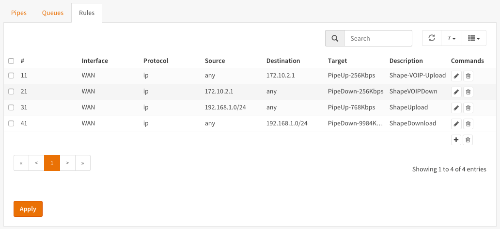
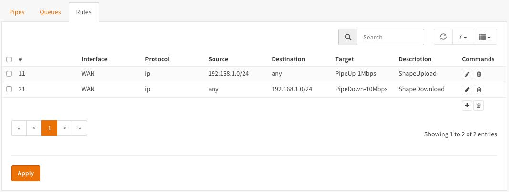
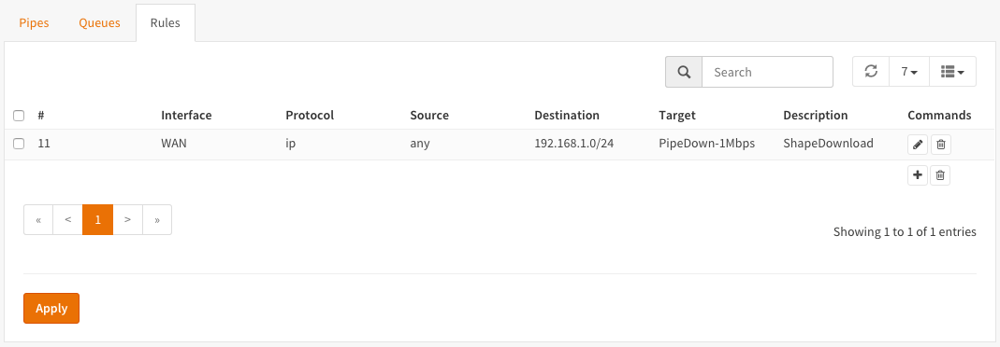

=====================
Setup Traffic Shaping
=====================

For this how-to we will look into these scenario's:

#. Reserve dedicated bandwidth for a realtime traffic such as (hosted) Voice Over IP (VOIP) server.
#. Share internet bandwidth amongst users evenly
#. Limit maximum internet bandwidth users can consume
#. Prioritize Applications (Weighted) using Queues
#. Multi Interface shaping for a GuestNet

---------------------------
Reserve dedicated bandwidth
---------------------------
In this scenario we will create a pipe dedicated for traffic going to and coming
from our realtime application. For the sample we presume a SIP trunk or hosted
Voice Over IP (VOIP) server.

For this example we presume a requirement of 4 uncompressed voice channels of 64Kbps,
resulting in a total bandwidth of 256Kbps. The internet connection in this example
has 10Mbps Download and 1Mbps Upload.

.. nwdiag::
  :scale: 100%
  :caption: Shaping hosted VOIP / SIP trunk sample

    nwdiag {

      span_width = 90;
      node_width = 180;
      Internet [shape = "cisco.cloud"];
      ip_phone [label="IP Phone",shape="cisco.ip_phone"];
      ip_phone -- switchlan;

      network LAN {
        switchlan [label="",shape = "cisco.workgroup_switch"];
        label = "LAN OPNsense";
        address ="192.168.1.x/24";
        fw1 [label="OPNsense",address="192.168.1.1/24"];
      }

      network WAN  {
        label = ".WAN OPNsense";
        fw1 [label="OPNsense", shape = "cisco.firewall", address="172.10.1.1/32"];
        Internet;
      }

      network SIPHOST {
        label = ".WAN SIP PROVIDER";
        Internet;
        sip_server [label="SIP/VOIP Server",shape="cisco.sip_proxy_werver", address="172.10.2.1/32"];
      }
    }

To start go to **Firewall->Traffic Shaper->Settings**.

Step 1 - Create Upload and Download Pipes
-----------------------------------------
On the **Pipes** tab click the **+** button in the lower right corner.
An empty **Edit Pipe** screen will popup.

Create Pipe For Upload (To our VOIP Server)

====================== ================ ================================================
 **enabled**            Checked          *Check to enable the pipe*
 **bandwidth**          256              *Numeric value of the desired bandwidth*
 **bandwidth Metric**   Kbit/s           *Metric to use with the numeric value*
 **mask**               (Empty)          *Used for auto queueing, empty for our sample*
 **description**        PipeUp-256Kbps   *Free field, enter something descriptive*
====================== ================ ================================================

Create Pipe For Upload (Other Traffic = 1024Kbps - 256Kbps = 768Kbps)

====================== ================ ================================================
 **enabled**            Checked          *Check to enable the pipe*
 **bandwidth**          768              *Numeric value of the desired bandwidth*
 **bandwidth Metric**   Kbit/s           *Metric to use with the numeric value*
 **mask**               (Empty)          *Used for auto queueing, empty for our sample*
 **description**        PipeUp-768Kbps   *Free field, enter something descriptive*
====================== ================ ================================================

Create Pipe For Download (From our VOIP Server)

====================== ================== ================================================
 **enabled**            Checked            *Check to enable the pipe*
 **bandwidth**          256                *Numeric value of the desired bandwidth*
 **bandwidth Metric**   Kbit/s             *Metric to use with the numeric value*
 **mask**               (Empty)            *Used for auto queueing, empty for our sample*
 **description**        PipeDown-256Kbps   *Free field, enter something descriptive*
====================== ================== ================================================

Create Pipe For Download (Other Traffic = 10240Kbps - 256Kbps = 9984Kbps )

====================== =================== ================================================
 **enabled**            Checked             *Check to enable the pipe*
 **bandwidth**          9984                *Numeric value of the desired bandwidth*
 **bandwidth Metric**   Kbit/s              *Metric to use with the numeric value*
 **mask**               (Empty)             *Used for auto queueing, empty for our sample*
 **description**        PipeDown-9984Kbps   *Free field, enter something descriptive*
====================== =================== ================================================

Step 2 - Create Rules
----------------------
On the **Rules** tab click the **+** button in the lower right corner.
An empty **Edit rule** screen will popup.

Create a rule for traffic directed towards the VOIP Server (Upload).

====================== ================= =====================================================
 **sequence**            11               *Auto generated number, overwrite only when needed*
 **interface**           WAN              *Select the interface connected to the internet*
 **proto**               ip               *Select the protocol, ip in our example*
 **source**              any              *The source ip to shape, leave on any*
 **src-port**            any              *The source port to shape, leave on any*
 **destination**        172.10.2.1        *The ip address of our VOIP server*
 **dst-port**            any              *Use any of the destination port if static*
 **target**             PipeUP-256Kbps    *Select the Upload 256Kbps Pipe*
 **description**        ShapeVOIPUpload   *Enter a descriptive name*
====================== ================= =====================================================

Create a rule for traffic coming from the VOIP Server (Download).

====================== ================= =====================================================
 **sequence**            21               *Auto generated number, overwrite only when needed*
 **interface**           WAN              *Select the interface connected to the internet*
 **proto**               ip               *Select the protocol, ip in our example*
 **source**              172.10.2.1       *The ip address of our VOIP server*
 **src-port**            any              *The source port to shape, leave on any*
 **destination**         any              *The destination ip to shape, leave on any*
 **dst-port**            any              *The destination port to shape, leave on any*
 **target**             PipeDown256Kbps   *Select the Download 256Kbps Pipe*
 **description**        ShapeVOIPDown     *Enter a descriptive name*
====================== ================= =====================================================

Create a rule for all other internet upload traffic

====================== ================= =====================================================
 **sequence**            31               *Auto generated number, overwrite only when needed*
 **interface**           WAN              *Select the interface connected to the internet*
 **proto**               ip               *Select the protocol, ip in our example*
 **source**              192.168.1.0/24   *The source ip's to shape, our LAN network*
 **src-port**            any              *The source port to shape, leave on any*
 **destination**         any              *the destination address, leave in any*
 **dst-port**            any              *Use any of the destination port if static*
 **target**             PipeUp-768Kbps    *Select the Upload 256Kbps Pipe*
 **description**        ShapeUpload       *Enter a descriptive name*
====================== ================= =====================================================

Create a rule for all other internet download traffic

====================== =================== =====================================================
 **sequence**            41                 *Auto generated number, overwrite only when needed*
 **interface**           WAN                *Select the interface connected to the internet*
 **proto**               ip                 *Select the protocol, ip in our example*
 **source**              any                *The source ip to shape, leave on any*
 **src-port**            any                *The source port to shape, leave on any*
 **destination**         192.168.1.0/24     *The destination ip's to shape, our LAN network*
 **dst-port**            any                *The destination port to shape, leave on any*
 **target**             PipeDown-9984Kbps   *Select the Download 256Kbps Pipe*
 **description**        ShapeDown           *Enter a descriptive name*
====================== =================== =====================================================

.. Note::

        Be aware of the sequence! It is important to make sure the right traffic
        is passed to the right pipe.

Now press |apply| to activate the traffic shaping rules.

*Screenshot Rules*

.. |apply| image:: images/applybtn.png

----------------------
Share bandwidth evenly
----------------------

For this example we presume an internet connection of 10Mbps Download and 1Mbps
Upload that we want to share evenly over all users.

.. nwdiag::
  :scale: 100%
  :caption: Shaping hosted VOIP / SIP trunk sample

    nwdiag {

      span_width = 90;
      node_width = 180;
      Internet [shape = "cisco.cloud"];
      pc [label="Connected PC's",shape="cisco.pc"];
      pc -- switchlan;

      network LAN {
        switchlan [label="",shape = "cisco.workgroup_switch"];
        label = "LAN OPNsense";
        address ="192.168.1.x/24";
        fw1 [label="OPNsense",address="192.168.1.1/24"];
      }

      network WAN  {
        label = ".WAN OPNsense";
        fw1 [label="OPNsense", shape = "cisco.firewall", address="172.10.1.1/32"];
        Internet;
      }

    }

To start go to **Firewall->Traffic Shaper->Settings**.

Step 1 - Create Upload and Download Pipes
-----------------------------------------
On the **Pipes** tab click the **+** button in the lower right corner.
An empty **Edit Pipe** screen will popup.

Create Pipe For Upload

====================== ================ ================================================
 **enabled**            Checked          *Check to enable the pipe*
 **bandwidth**          1                *Numeric value of the desired bandwidth*
 **bandwidth Metric**   Mbit/s           *Metric to use with the numeric value*
 **mask**               empty            *Select destination to share the bandwidth*
 **description**        PipeUp-1Mbps     *Free field, enter something descriptive*
====================== ================ ================================================

Create Pipe For Download

====================== ================== ================================================
 **enabled**            Checked            *Check to enable the pipe*
 **bandwidth**          10                 *Numeric value of the desired bandwidth*
 **bandwidth Metric**   Mbit/s             *Metric to use with the numeric value*
 **mask**               empty              *Select destination to share the bandwidth*
 **description**        PipeDown-10Mbps    *Free field, enter something descriptive*
====================== ================== ================================================

Step 2 - Create a Queues
------------------------
On the **Queues** tab click the **+** button in the lower right corner.
An empty **Edit queue** screen will popup.

Create Queue for Upload

====================== ================== ================================================
 **enabled**            Checked            *Check to enable the pipe*
 **pipe**               PipeUp-1Mbps       *Select our Pipe*
 **weight**             100                *Weight to use with the numeric value*
 **mask**               source             *Every source creates a match*
 **description**        QueueUp-1Mbps      *Free field, enter something descriptive*
====================== ================== ================================================

Create Queue for Download

====================== ================== ================================================
 **enabled**            Checked            *Check to enable the pipe*
 **pipe**               PipeDown-10Mbps    *Select our Pipe*
 **weight**             100                *Weight to use with the numeric value*
 **mask**               destination        *Every source creates a match*
 **description**        QueueDown-10Mbps   *Free field, enter something descriptive*
====================== ================== ================================================

Step 3 - Create Rules
----------------------
On the **Rules** tab click the **+** button in the lower right corner.
An empty **Edit rule** screen will popup.

Create a rule for traffic directed towards the internet (Upload).

====================== ================= =====================================================
 **sequence**            11               *Auto generated number, overwrite only when needed*
 **interface**           WAN              *Select the interface connected to the internet*
 **proto**               ip               *Select the protocol, ip in our example*
 **source**              192.168.1.0/24   *The source ip to shape, select the LAN network*
 **src-port**            any              *The source port to shape, leave on any*
 **destination**         any              *The destination to shape, leave on any*
 **dst-port**            any              *Use any of the destination port if static*
 **target**             QueueUp-1Mbps     *Select the Upload 1Mbps Queue*
 **description**        ShapeUpload       *Enter a descriptive name*
====================== ================= =====================================================

Create a rule for traffic coming from the internet (Download).

====================== ================= =====================================================
 **sequence**            21               *Auto generated number, overwrite only when needed*
 **interface**           WAN              *Select the interface connected to the internet*
 **proto**               ip               *Select the protocol, ip in our example*
 **source**              any              *The source address, leave on any*
 **src-port**            any              *The source port to shape, leave on any*
 **destination**         192.168.1.0/24   *The destination ip to shape, select LAN network*
 **dst-port**            any              *The destination port to shape, leave on any*
 **target**             QueueDown-10Mbps  *Select the Download 10Mbps Queue*
 **description**        ShapeDownload     *Enter a descriptive name*
====================== ================= =====================================================

Now press |apply| to activate the traffic shaping rules.

*Screenshot Rules*

------------------------
Limit bandwidth per user
------------------------

For this example we will divide the internet Download traffic between the connected
users in such manner that each user will receive up to a maximum of 1Mbps.

.. nwdiag::
  :scale: 100%
  :caption: Simple network diagram

    nwdiag {

      span_width = 90;
      node_width = 180;
      Internet [shape = "cisco.cloud"];
      pc [label="Connected PC's",shape="cisco.pc"];
      pc -- switchlan;

      network LAN {
        switchlan [label="",shape = "cisco.workgroup_switch"];
        label = "LAN OPNsense";
        address ="192.168.1.x/24";
        fw1 [label="OPNsense",address="192.168.1.1/24"];
      }

      network WAN  {
        label = ".WAN OPNsense";
        fw1 [label="OPNsense", shape = "cisco.firewall", address="172.10.1.1/32"];
        Internet;
      }

    }

To start go to **Firewall->Traffic Shaper->Settings**.

Step 1 - Create Upload and Download Pipes
-----------------------------------------
On the **Pipes** tab click the **+** button in the lower right corner.
An empty **Edit Pipe** screen will popup.

Create Pipe For Download

====================== ================ ================================================
 **enabled**            Checked          *Check to enable the pipe*
 **bandwidth**          1                *Numeric value of the desired bandwidth*
 **bandwidth Metric**   Mbit/s           *Metric to use with the numeric value*
 **mask**               destination      *Select source to limit bandwidth per client*
 **description**        PipeDown-1Mbps   *Free field, enter something descriptive*
====================== ================ ================================================

Step 2 - Create Rules
----------------------
On the **Rules** tab click the **+** button in the lower right corner.
An empty **Edit rule** screen will popup.

Create a rule for traffic coming from the internet (Download).

====================== ================= =====================================================
 **sequence**            21               *Auto generated number, overwrite only when needed*
 **interface**           WAN              *Select the interface connected to the internet*
 **proto**               ip               *Select the protocol, ip in our example*
 **source**              any              *The source address, leave on any*
 **src-port**            any              *The source port to shape, leave on any*
 **destination**         192.168.1.0/24   *The destination ip to shape, select LAN network*
 **dst-port**            any              *The destination port to shape, leave on any*
 **target**             PipeDown-1Mbps   *Select the Download 256Kbps Pipe*
 **description**        ShapeDownload     *Enter a descriptive name*
====================== ================= =====================================================

.. Note::

        If you want to limit traffic for a single ip then just enter the ip address
        in the destination field instead of the full LAN network range.

Now press |apply| to activate the traffic shaping rules.

*Screenshot Rules*

-----------------------
Prioritize using Queues
-----------------------
By utilizing queues we can influence the bandwidth within a pipe and give certain
applications more bandwidth than others based on a weighted algorithm.

The idea is simple:
Let presume we have a pipe of 10Mbps and 2 applications for instance smtp (email)
and http(s). The http(s) traffic will get a weight of 1 and the smtp traffic a
weight of 9, then when all capacity of our pipe is in use the email traffic will
get 9x more bandwidth than our http(s) traffic, resulting in 1Mbps for http(s)
and 9Mbps for smtp.

For our example we only look at download traffic, but the exact same can be done
for the upload traffic.

+----------------+--------+-------------------+
| Application    | Weight | Minimum Bandwidth |
+================+========+===================+
| SMTP (port 25) | 9      | 9Mbps             |
+----------------+--------+-------------------+
| HTTP (80)      |        |                   |
+----------------+ 1      | 1Mbps             |
| HTTPS (443)    |        |                   |
+----------------+--------+-------------------+

To start go to **Firewall->Traffic Shaper->Settings**.

Step 1 - Create Download Pipe
------------------------------
On the **Pipes** tab click the **+** button in the lower right corner.
An empty **Edit Pipe** screen will popup.

Create Pipe For Download (10Mbps)

====================== ================= ===============================================
 **enabled**            Checked          *Check to enable the pipe*
 **bandwidth**          10               *Numeric value of the desired bandwidth*
 **bandwidth Metric**   Mbit/s           *Metric to use with the numeric value*
 **mask**               (empty)          *Leave empty*
 **description**        PipeDown-10Mbps  *Free field, enter something descriptive*
====================== ================= ===============================================

Step 2 - Create Queues
----------------------
On the **Queues** tab click the **+** button in the lower right corner.
An empty **Edit queue** screen will popup.

Create Queue for SMTP

====================== ================== ================================================
 **enabled**            Checked            *Check to enable the pipe*
 **pipe**               PipeDown-10Mbps    *Select our Pipe*
 **weight**             9                  *Weight to use with the numeric value*
 **mask**               (empty)            *Leave empty*
 **description**        Queue-SMTP         *Free field, enter something descriptive*
====================== ================== ================================================

Create Queue for HTTP

====================== ================== ================================================
 **enabled**            Checked            *Check to enable the pipe*
 **pipe**               PipeDown-10Mbps    *Select our Pipe*
 **weight**             1                  *Weight to use with the numeric value*
 **mask**               (empty)            *Leave empty*
 **description**        Queue-HTTP         *Free field, enter something descriptive*
====================== ================== ================================================

Step 3 - Create Rules
----------------------
On the **Rules** tab click the **+** button in the lower right corner.
An empty **Edit rule** screen will popup.

Create a rule for smtp download traffic (email)

====================== =================== =====================================================
 **sequence**            11                 *Auto generated number, overwrite only when needed*
 **interface**           WAN                *Select the interface connected to the internet*
 **proto**               ip                 *Select the protocol, ip in our example*
 **source**              any                *The source address, leave on any*
 **src-port**            smtp               *The source port to shape, smtp or 25*
 **destination**         any                *The destination ip to shape, leave on any*
 **dst-port**            any                *The destination port to shape, leave on any*
 **target**             Queue-SMTP          *Select the SMTP queue*
 **description**        ShapeSMTPDownload   *Enter a descriptive name*
====================== =================== =====================================================

Create a rule for http download traffic

====================== =================== =====================================================
 **sequence**            21                 *Auto generated number, overwrite only when needed*
 **interface**           WAN                *Select the interface connected to the internet*
 **proto**               ip                 *Select the protocol, ip in our example*
 **source**              any                *The source address, leave on any*
 **src-port**            http               *The source port to shape, http or 80*
 **destination**         any                *The destination ip to shape, leave on any*
 **dst-port**            any                *The destination port to shape, leave on any*
 **target**             Queue-HTTP          *Select the HTTP queue*
 **description**        ShapeHTTPDownload   *Enter a descriptive name*
====================== =================== =====================================================

Adding an extra rule for https traffic is simple as we can use the same http queue if we like:

====================== ==================== =====================================================
 **sequence**            31                  *Auto generated number, overwrite only when needed*
 **interface**           WAN                 *Select the interface connected to the internet*
 **proto**               ip                  *Select the protocol, ip in our example*
 **source**              any                 *The source address, leave on any*
 **src-port**            https               *The source port to shape, https or 443*
 **destination**         any                 *The destination ip to shape, leave on any*
 **dst-port**            any                 *The destination port to shape, leave on any*
 **target**             Queue-HTTP           *Select the HTTP queue*
 **description**        ShapeHTTPSDownload   *Enter a descriptive name*
====================== ==================== =====================================================

This way http and https traffic will be treated the same (total max of 1Mbps).

Now press |apply| to activate the traffic shaping rules.

*Screenshot Rules*

.. image:: images/shaping_rules_s4.png
  :width: 100%

--------------------------------------
Multi Interface shaping for a GuestNet
--------------------------------------

One of the options with OPNsense's traffic shaper is its ability to add shaping
rules based upon two interfaces. This option allows you to shape traffic
differently based on the direction the traffic is moving between interfaces.

For this example we will use this functionality to share a symmetric 10Mbps internet
connection between a primary LAN network and a Guest Network.

The LAN network will not be limited, traffic from users on our Guest Network will
be limited to a total of 2Mbps Download and 1Mbps Upload.

.. nwdiag::
  :scale: 100%
  :caption: Simple network diagram

    nwdiag {

      span_width = 90;
      node_width = 180;
      Internet [shape = "cisco.cloud"];
      Internet -- switchwan;

      network WAN  {
        switchwan [label="",shape = "cisco.workgroup_switch"];
        label = "WAN Interface em1";
        fw1 [label="OPNsense", shape = "cisco.firewall", address="172.10.1.1/32"];
      }

      network LAN {
        switchlan [label="",shape = "cisco.workgroup_switch"];
        label = "LAN Interface em0";
        address ="192.168.1.x/24";
        fw1 [label="OPNsense",address="192.168.1.1/24"];
      }

      pc [label="LAN PC",shape="cisco.pc"];
      pc -- switchlan;

      network GuestNet {
        switchguestnet [label="",shape = "cisco.workgroup_switch"];
        label = "GuestNet Interface em2";
        address ="192.168.2.x/24";
        fw1 [label="OPNsense",address="192.168.2.1/24"];
      }

      laptop [label="Guest Laptop", shape="cisco.laptop"]
      laptop -- switchguestnet;

    }

Step 1 - Create Upload and Download Pipes
-----------------------------------------

On the **Pipes** tab click the **+** button in the lower right corner.
An empty **Edit Pipe** screen will popup.

Create Pipe For Upload (GuestNet - em2)

====================== ================ ================================================
 **enabled**            Checked          *Check to enable the pipe*
 **bandwidth**          1                *Numeric value of the desired bandwidth*
 **bandwidth Metric**   Mbit/s           *Metric to use with the numeric value*
 **mask**               (Empty)          *Leave empty*
 **description**        PipeUp-1Mbps     *Free field, enter something descriptive*
====================== ================ ================================================

Create Pipe For Download (GuestNet - em2)

====================== ================== ================================================
 **enabled**            Checked            *Check to enable the pipe*
 **bandwidth**          2                  *Numeric value of the desired bandwidth*
 **bandwidth Metric**   Mbit/s             *Metric to use with the numeric value*
 **mask**               (Empty)            *Leave empty*
 **description**        PipeDown-2Mbps    *Free field, enter something descriptive*
====================== ================== ================================================

Step 2 - Create Rules
----------------------

On the **Rules** tab click the **+** button in the lower right corner.
An empty **Edit rule** screen will popup.

Important - Before you continue!
    First change the mode to advanced, see the toggle in the left top corner of the
    popup dialog. One click should shift it from red (disabled) to green (enabled).

Create a rule for the download traffic

====================== =================== =====================================================
 **sequence**            11                 *Auto generated number, overwrite only when needed*
 **interface**           WAN                *Select the interface connected to the internet*
 **interface2**          GuestNet           *Select the interface that matches your GuestNet*
 **proto**               ip                 *Select the protocol, ip in our example*
 **source**              any                *The source address, leave on any*
 **src-port**            any                *The source port to shape, leave on any*
 **destination**         any                *The destination ip to shape, leave on any*
 **dst-port**            any                *The destination port to shape, leave on any*
 **direction**           in                 *Match incoming packages (download)*
 **target**             PipeDown-2Mbps      *Select the Download pipe*
 **description**        GuestNetDownload    *Enter a descriptive name*
====================== =================== =====================================================

Create a rule for the upload traffic

====================== =================== =====================================================
 **sequence**            21                 *Auto generated number, overwrite only when needed*
 **interface**           WAN                *Select the interface that matches your GuestNet*
 **interface2**          GuestNet           *Select the interface connected to the internet*
 **proto**               ip                 *Select the protocol, ip in our example*
 **source**              any                *The source address, leave on any*
 **src-port**            any                *The source port to shape, leave on any*
 **destination**         any                *The destination ip to shape, leave on any*
 **dst-port**            any                *The destination port to shape, leave on any*
 **direction**           out                *Match incoming packages (download)*
 **target**             PipeUp-1Mbps        *Select the Download pipe*
 **description**        GuestNetUpload      *Enter a descriptive name*
====================== =================== =====================================================

Now press |apply| to activate the traffic shaping rules.
