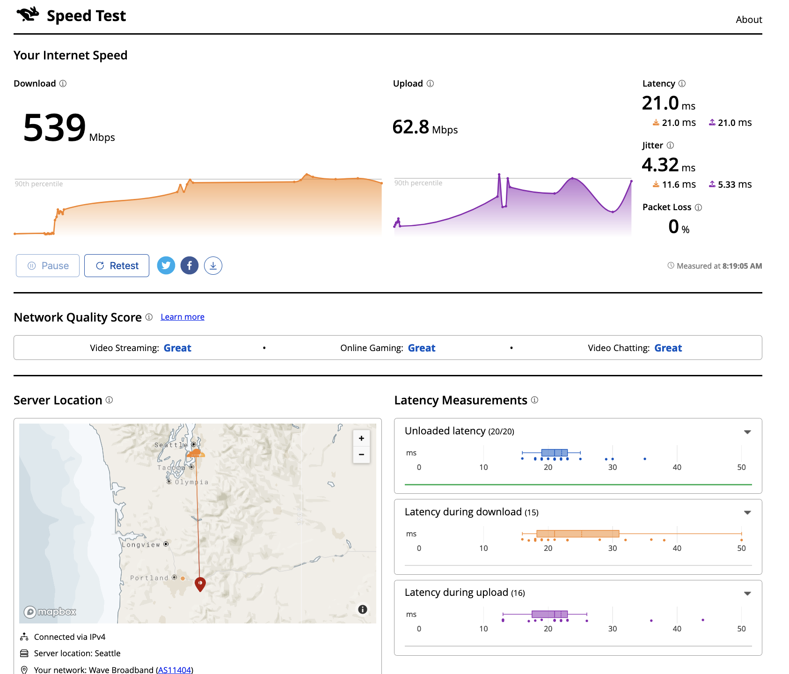

==================================================
Fighting Bufferbloat with FQ_CoDel
==================================================

Bufferbloat is the undesirable latency that comes from a router or
other network equipment buffering too much data.
This occurs because the router cannot immediately transmit data through
a slow (bottleneck) link, so it "buffers" those packets.
New traffic can get stuck behind those buffered packets,
resulting in enormous (even multi-second) delays to all traffic.
End users see this as lagging in games, stuttering in video & voice calls,
or a general sense that "the network is slow".

The AQM/SQM algorithms can eliminate that latency, significantly
improving the end-user experience.
One AQM is **FQ_CoDel** e.g. Flow Queueing with Controlled Delay.
It ensures that packets from small flows are sent in a timely fashion,
while large flows share the bottleneck's capacity.

Here is an overview of the FQ_CoDel algorithm that performs these tasks in parallel:

1. Separate every traffic flow's arriving packets into their own queue.

2. Remove a small batch of packets from a queue, round-robin style,
   and transmit that batch through the (slow) bottleneck link to the ISP.
   When each batch has been fully sent, retrieve a batch from the next queue, and so on.

3. Offer back pressure to flows that are sending “more than their share” of data.

This last step is the heart of the FQ_CoDel algorithm.
It measures the time that a packet remains in a queue (its "sojourn time").
That's how it determines that a flow is using more than its share.
If packets have been in a queue "too long" 
(that is, if their sojourn times exceed the *target* setting
for longer than the *interval*),
FQ_CoDel begins to mark or drop some of those packets to cause the sender to slow down.

For more details, see RFC 8290 https://datatracker.ietf.org/doc/html/rfc8290. 

Parameters of FQ_CoDel
----------------------

FQ_CoDel uses the following parameters in its algorithm.

======================= ====================================================================
 **target**             *Maximum time packets should dwell in a queue.
                        (Default: 5ms)*
 **interval**           *When sojourn times exceed the target for more than
                        this interval, drop or mark packets to slow that flow.
                        (Default: 100ms)*
 **quantum**            *Maximum number of bytes to dequeue for transmission at one time.
                        Should be set to the value of Interface MTU.
                        (Default: 1514 bytes, 1500+14B hardware header, max 9000)*
 **limit**              *Size of all queues managed by FQ_CoDel instance.
                        It is the hard limit on the real queue size in packets
                        (Default: 10240, max 20480).*
 **flows**              *Sets the number of queues into which the incoming packets are classified
                        (Default: 1024, max 65536)*
 **CoDel ECN**          *Enable packet marking for ECN-enabled TCP flows when queue delay becomes high.
                        (Default: Disabled)*           
======================= ====================================================================

Configuring FQ_CoDel for OPNsense
---------------------------------

In the configuration steps below, assume these advertized ISP speeds:

+----------------+----------+-----------------+
|                | Download |      Upload     |
+================+==========+=================+
|      Mbit/s    |   530    |        30       |
+----------------+----------+-----------------+

To begin, go to :menuselection:`Firewall --> Shaper --> Pipes`. Select the *advanced mode*

After configuring the Pipes and Queues (below), be sure to read the
`Tuning FQ_CoDel`_ section below that describes the brief 
final tuning process.

Step 1a - Create Download Pipe
^^^^^^^^^^^^^^^^^^^^^^^^^^^^^^
On the **Pipes** tab click the **+** button in the lower right corner.
An empty **Edit Pipe** screen pops up.

Create Pipe For Download
""""""""""""""""""""""""
========================= ============= ===========================================================================================================
Setting                   Default       Description
========================= ============= ===========================================================================================================
 **enabled**              Checked       *Check to enable the pipe*
 **bandwidth**            495           *Set initially to 85% of ISP advertized BW, tune later - numeric*
 **bandwidth Metric**     Mbit/s        *Metric associated with the bandwidth*
 **queue**                (empty)       *Leave empty: queues are configured separetely*
 **mask**                 (none)        *Leave empty*
 **scheduler type**       FQ_CoDel      *Enables FQ_CoDel in scheduler*
 **Enable CoDel**         (empty)       *Leave empty: use FQ as selected above*
 **(FQ-)CoDel target**    (empty)       *Leave as default (default 5ms); tune later*
 **(FQ-)CoDel interval**  (empty)       *Leave as default: tune later*
 **(FQ-)CoDel ECN**       Checked       *Check to enable packet marking ECN for ECN enabled flows*
 **FQ-CoDel quantum**     (empty)       *Set to your WAN MTU. For Ethernet let it default*
 **FQ-CoDel limit**       (empty)       *Leave as default; tune later*
 **FQ-CoDel flows**       (empty)       *Leave as default (default 1024)*
 **description**          Download      *Free field, enter something descriptive*
========================= ============= ===========================================================================================================

Step 1b - Create Upload Pipe
^^^^^^^^^^^^^^^^^^^^^^^^^^^^^^
On the **Pipes** tab click the **+** button in the lower right corner.
An empty **Edit Pipe** screen pops up.

Follow the same process as for the Download pipe, 
entering the 85% upload bandwidth value
and entering "Upload" for the **description**

Step 2a - Create Download Queue
^^^^^^^^^^^^^^^^^^^^^^^^^^^^^^^
On the **Queues** tab click the **+** button in the lower right corner.
An empty **Edit queue** screen pops up.

Create Queue For Download
"""""""""""""""""""""""""
========================= ================== =============================================================================================================
 **enabled**              Checked            *Check to enable the queue*
 **pipe**                 Download           *Select our Pipe*
 **weight**               100                *FQ_CoDel ignores the weight: set to 100*
 **mask**                 (none)             *Leave empty: FQ will handle fairness*
 **Enable CoDel**         (empty)            *Leave empty: use FQ as selected in Pipe*
 **(FQ-)CoDel target**    (empty)            *Leave empty for a queue*
 **(FQ-)CoDel interval**  (empty)            *Leave empty for a queue*
 **(FQ-)CoDel ECN**       (empty)            *Leave empty for a queue*
 **description**          Download-Queue     *Free field, enter something descriptive*
========================= ================== =============================================================================================================

.. Note::

        target, interval, ECN actually reffer to CoDel and not FQ_Codel in the queue

Step 2b - Create Upload Queue
^^^^^^^^^^^^^^^^^^^^^^^^^^^^^^
On the **Queues** tab click the **+** button in the lower right corner.
An empty **Edit queue** screen pops up.

Follow the same process as for the Download queue, 
selecting the **Upload pipe**,
and entering "Upload-Queue" for the **description**

Step 3a - Create Download Rule
^^^^^^^^^^^^^^^^^^^^^^^^^^^^^^
On the **Rules** tab click the **+** button in the lower right corner.
An empty **Edit rule** screen pops up.

Create a Rule For Download
""""""""""""""""""""""""""
====================== =================== ===========================================================================================================
 **enabled**             Checked            *Check to enable the rule*
 **sequence**            1                  *Auto generated number, overwrite only when needed*
 **interface**           WAN                *Select the interface connected to the internet*
 **proto**               ip                 *Select the protocol, IP in our example*
 **source**              any                *The source address to shape, leave on any*
 **src-port**            any                *The source port to shape, leave on any*
 **destination**         any                *The destination IP to shape, leave on any*
 **dst-port**            any                *The destination port to shape, leave on any*
 **direction**           in                 *Matches incoming or outgoing packets or both (default). We want to shape Download e.g ingress on WAN* 
 **target**             Download-Queue      *Select the Download queue*
 **description**        Download-Rule       *Enter a descriptive name*
====================== =================== ===========================================================================================================

Step 3b - Create Upload Rule
^^^^^^^^^^^^^^^^^^^^^^^^^^^^^^
On the **Rules** tab click the **+** button in the lower right corner.
An empty **Edit rule** screen pops up.

Follow the same process as for the Download rule, 
using the same values except:

- **sequence** (set to 2); 
- **direction** (set to "out")
- **target** (set to "Upload-Queue");
- **description** (set to "Upload-Rule")

Step 4 - Finalizing the configuration
^^^^^^^^^^^^^^^^^^^^^^^^^^^^^^^^^^^^^

Now press |apply| to activate the traffic shaping rules.

.. |apply| image:: images/applybtn.png

-----------------------

Test for Bufferbloat
--------------------------------
There are several web sites that measure the latency during
download and upload to give an indication of bufferbloat in your network.
Each of these clearly labels the download and upload rates,
as well the latency during those tests.
See these screen shots below.

They are all substantially the same.
Pick one and use it for all your measurements.

**Waveform Speed Test** https://www.waveform.com/tools/bufferbloat

**Cloudflare** https://speed.cloudflare.com/

**Speedtest.net** http://speedtest.net

.. tuning_section:

Tuning FQ_CoDel
---------------------------

After you configure the pipes and queues (above),
take a few minutes to "tune" your FQ_CoDel
instance for your ISP. To do this:

First, run any of the speed tests above before applying any shaper.
Run several tests to get average data rates and latency.
Write those values down.

While you are configuring FQ_CoDel, enter an initial value for the
"bandwidth" that is 85% of the advertized rate from the ISP.
(That is, if the download service is 100mbps, set the speed to 85mbps;
for 40mpbs upload, set it to 40 x 85%, or 34mbps.)

The remainder of the process is iterative, but brief:

- Run a speed test to see the latency
- Increase the Download bandwidth setting a bit
- Run a speed test again. 
  If the latency remains low, increase the bandwidth setting again.
- Keep doing this until the latency increases, then back off the setting.
- Do the same with the Upload bandwidth setting

When each of the Download and Upload bandwidth settings are as high
as possible without increasing latency, you're done.

Detailed FQ-CoDel Tuning
----------------------------

FQ_CoDel is designed to be a "no-knobs" algorithm. 
After you enter the Download and Upload bandwidth settings,
the defaults for the other parameters work very well out of the box
for virtually all situations.
Before you invest further time in tuning, try the router for a day.
If it's "good enough", you are done.

Read on if you want to go further.

*FQ-CoDel "out of the box" default settings*

+----------------+----------------------------+
|FQ_C Parameter  |           Default          |
+================+==========+=================+
|     quantum    |            1514            |
+----------------+----------+-----------------+
|     target     |            5               |
+----------------+----------+-----------------+
|     interval   |            100             |
+----------------+----------+-----------------+
|     limit      |            10240           |
+----------------+----------+-----------------+
|     flows      |            1024            |
+----------------+----------+-----------------+
|     ECN        |            OFF             |
+----------------+----------+-----------------+

quantum
^^^^^^^^^^^^^^^^^^^
Quantum is one of these parameters that were constantly discussed what should be the proper value. Within the internet there is a lot of discussion that it should be set to 300 per 100Mbit/s of BW.
**This however is wrong.**

Quantum specifies number of bytes a queue can serve before being moved to the tail of old. As we are doing Fair Queueing we want to aim to serve all queues equally.

**The proper value of Quantum should be no more or less than is the WAN MTU.**

.. Note::

        There is however one exception for sub 100Mbit/s connections, Quantum should be set to 300. 
        This gives smaller packets precedence over larger packets.
      
      
target & interval
^^^^^^^^^^^^^^^^^^^

Target is a good parameter for tune to prevent CoDel being too aggressive. Target should be tuned to be at least the transmission time of a single MTU-sized packet at the WAN egress. This is basically the start time that will trigger the AQM to keep watch, and wait for Interval before taking any action.

If you have a very fast Fiber WAN connection or a slower Cable/DSL WAN connection is maybe worth to try to tune Target. If your average RTT is 12ms in normal non latency situations, 5ms default can be too low, as there is no reason to trigger the AQM.

To do this we can run excessive ping to the HOP after your OPNsense and take the **average rtt round up as your Target**. In this case 12ms

.. code-block::

    Example from the CLI of OPNsense

    traceroute 1.1.1.1
    traceroute to 1.1.1.1 (1.1.1.1), 64 hops max, 40 byte packets
    1  192.168.0.1  0.463 ms  0.453 ms  0.480 ms     <<<< LAN Interface of OPN
    2  10.205.5.1  10.879 ms  11.010 ms  11.079 ms   <<<< ISP directly connected Device to OPN WAN

    ping -s 1472 -c 1000 -D 10.205.5.1
    PING 10.205.5.1 (10.205.5.1) 1472(1500) bytes of data.
    1480 bytes from 10.205.5.1: icmp_seq=0 ttl=255 time=13.1 ms
    1480 bytes from 10.205.5.1: icmp_seq=1 ttl=255 time=10.4 ms

    --- 10.205.5.1 ping statistics ---
    1000 packets transmitted, 1000 packets received, 0.0% packet loss
    round-trip min/avg/max/stddev = 7.800/11.429/45.992/4.796 ms

.. Note::

        By default Target is set around 5-10% of Interval

.. Note::

        Interval default 100ms works usually well. It is the worst case RTT scenario through the bottleneck.
        If you want to tune Interval it needs to be set as the worst case RTT scenario through the bottleneck.
        If Interval is smaller than the real non-bottleneck RTT you may see more drops/markings which can impact throughput

limit
^^^^^^^^^^^^^^^^^^^

Default limit size of 10240 packets is to much. The creators recommended value 1000 for sub 10Gbit/s connections. The default limit will never reached for sub 10Gbit/s WAN connections. Before that could happen FQ_CoDel would already take action. So it's healthy to reduce limit.

The over-large packet limit leads to bad results during slow start on some benchmarks. Reducing it too low could impact new flow start.

However there is a problem with FQ_CoDel implementation in FreeBSD (as well OpenBSD), that causes CPU hogging and excessive logging, this is more visible when set to 1000. Which causes a backpush and additional unwanted latency.

**For now its best to have limit at default.**

.. Note::

        There is already a BUG opened for this and an email chain from one of the CoDeL creators. 
        This problem is overall affecting the performance, its not specific only to limit parameter, 
        and more so the more TCP flows are present

flows
^^^^^^^^^^^^^^^^^^^

The "flows" parameter sets the number of queues into which the incoming packets are classified. Due to the stochastic nature of hashing, multiple flows may end up being hashed into the same slot.

This parameter can be set only at initialisation time in the current implementation (needs reboot of device), since memory has to be allocated for the hash table.

.. Warning::

        Setting too high number can cause the device to be stuck. Be careful with this one.

ECN
^^^^^^^^^^^^^^^^^^^

Current best practice is to turn off ECN on uplinks running at less than 4Mbit (if you want good VOIP performance; a single packet at 1Mbps takes 13ms, and packet drops get you this latency back).

ECN IS useful on downlinks on a home router, where the terminating hop is only one or two hops away, and connected to a system that handles ECN correctly.

.. Note::

        If you are experiencing slow starts disable ECN
        
External references
-------------------

* https://www.rfc-editor.org/rfc/rfc8290.html
* https://www.rfc-editor.org/rfc/rfc8289#section-4.2
* https://man.freebsd.org/cgi/man.cgi?query=ipfw&apropos=0&sektion=8&manpath=FreeBSD+14.1-RELEASE&arch=default&format=html
* https://www.bufferbloat.net/projects/codel/wiki/Best_practices_for_benchmarking_Codel_and_FQ_Codel/
* https://forum.opnsense.org/index.php?topic=4949.msg20862#msg20862
* https://forum.opnsense.org/index.php?topic=39046.msg191251#msg191251
* https://www.man7.org/linux/man-pages/man8/tc-fq_codel.8.html
* https://bugs.freebsd.org/bugzilla/show_bug.cgi?id=276890
* https://marc.info/?t=170776797300003&r=1&w=2

