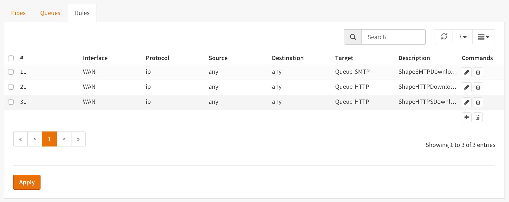

==================================================
Prioritize Applications (Weighted) using Queues
==================================================

By utilizing queues we can influence the bandwidth within a pipe and give certain
applications more bandwidth than others based on a weighted algorithm.

The idea is simple:
Let presume we have a pipe of 10 Mbps and 2 applications for instance smtp (email)
and http(s). The http(s) traffic will get a weight of 1 and the smtp traffic a
weight of 9, then when all capacity of our pipe is in use the email traffic will
get 9x more bandwidth than our http(s) traffic, resulting in 1 Mbps for http(s)
and 9 Mbps for smtp.

For our example we only look at download traffic, but the exact same can be done
for the upload traffic.

+----------------+--------+-------------------+
| Application    | Weight | Minimum Bandwidth |
+================+========+===================+
| SMTP (port 25) | 9      | 9 Mbps            |
+----------------+--------+-------------------+
| HTTP (80)      |        |                   |
+----------------+ 1      | 1 Mbps            |
| HTTPS (443)    |        |                   |
+----------------+--------+-------------------+

To start go to :menuselection:`Firewall --> Shaper --> Pipes`.

Step 1 - Create Download Pipe
------------------------------
On the **Pipes** tab click the **+** button in the lower right corner.
An empty **Edit Pipe** screen will popup.

Create Pipe For Download (10 Mbps)

====================== ================= ===============================================
 **enabled**            Checked          *Check to enable the pipe*
 **bandwidth**          10               *Numeric value of the desired bandwidth*
 **bandwidth Metric**   Mbit/s           *Metric to use with the numeric value*
 **mask**               (empty)          *Leave empty*
 **description**        PipeDown-10Mbps  *Free field, enter something descriptive*
====================== ================= ===============================================

Step 2 - Create Queues
----------------------
On the **Queues** tab click the **+** button in the lower right corner.
An empty **Edit queue** screen will popup.

Create Queue for SMTP

====================== ================== ================================================
 **enabled**            Checked            *Check to enable the pipe*
 **pipe**               PipeDown-10Mbps    *Select our Pipe*
 **weight**             9                  *Weight to use with the numeric value*
 **mask**               (empty)            *Leave empty*
 **description**        Queue-SMTP         *Free field, enter something descriptive*
====================== ================== ================================================

Create Queue for HTTP

====================== ================== ================================================
 **enabled**            Checked            *Check to enable the pipe*
 **pipe**               PipeDown-10Mbps    *Select our Pipe*
 **weight**             1                  *Weight to use with the numeric value*
 **mask**               (empty)            *Leave empty*
 **description**        Queue-HTTP         *Free field, enter something descriptive*
====================== ================== ================================================

Step 3 - Create Rules
----------------------
On the **Rules** tab click the **+** button in the lower right corner.
An empty **Edit rule** screen will popup.

Create a rule for smtp download traffic (email)

====================== =================== =====================================================
 **sequence**            11                 *Auto generated number, overwrite only when needed*
 **interface**           WAN                *Select the interface connected to the internet*
 **proto**               ip                 *Select the protocol, IP in our example*
 **source**              any                *The source address, leave on any*
 **src-port**            smtp               *The source port to shape, smtp or 25*
 **destination**         any                *The destination IP to shape, leave on any*
 **dst-port**            any                *The destination port to shape, leave on any*
 **target**             Queue-SMTP          *Select the SMTP queue*
 **description**        ShapeSMTPDownload   *Enter a descriptive name*
====================== =================== =====================================================

Create a rule for HTTP download traffic

====================== =================== =====================================================
 **sequence**            21                 *Auto generated number, overwrite only when needed*
 **interface**           WAN                *Select the interface connected to the internet*
 **proto**               ip                 *Select the protocol, IP in our example*
 **source**              any                *The source address, leave on any*
 **src-port**            http               *The source port to shape, http or 80*
 **destination**         any                *The destination IP to shape, leave on any*
 **dst-port**            any                *The destination port to shape, leave on any*
 **target**             Queue-HTTP          *Select the HTTP queue*
 **description**        ShapeHTTPDownload   *Enter a descriptive name*
====================== =================== =====================================================

Adding an extra rule for HTTPS traffic is simple as we can use the same HTTP queue if we like:

====================== ==================== =====================================================
 **sequence**            31                  *Auto generated number, overwrite only when needed*
 **interface**           WAN                 *Select the interface connected to the internet*
 **proto**               ip                  *Select the protocol, IP in our example*
 **source**              any                 *The source address, leave on any*
 **src-port**            https               *The source port to shape, https or 443*
 **destination**         any                 *The destination IP to shape, leave on any*
 **dst-port**            any                 *The destination port to shape, leave on any*
 **target**             Queue-HTTP           *Select the HTTP queue*
 **description**        ShapeHTTPSDownload   *Enter a descriptive name*
====================== ==================== =====================================================

This way HTTP and HTTPS traffic will be treated the same (total max of 1 Mbps).

Now press |apply| to activate the traffic shaping rules.

*Screenshot Rules*

