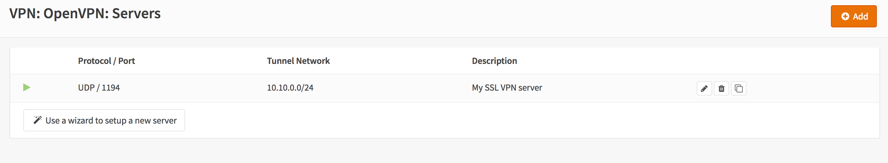

==========================
Setup SSL VPN Road Warrior
==========================

.. image:: images/sslvpn_image_new.png
   :width: 100%

Road Warriors are remote users who need secure access to the companies infrastructure.
OPNsense uses OpenVPN for its SSL VPN Road Warrior setup and offers OTP (One Time Password)
integration with standard tokens and Googles Authenticator.

.. Tip::

  Did you know that OPNsense offers two-factor authentication throughout the entire
  system? See for more information: :doc:`/manual/two_factor`

The main advantages of using SSL VPN for Road Warriors instead of IPsec are:

* Easy setup on almost all mobile clients using OPNsense's Client Configuration Export.
* Fine grained access control by using multiple servers or Client Specific Overrides.
* No issues with NAT without NAT-T

With this how-to we'll show you how to configure OPNsense's SSL VPN for road warriors
and give you configuration examples for:

* Two Factor Authentication (2FA)
* Multi Factor Authentication ( Client Certificate + Password + OTP )
* Client configuration on Windows, OSX, iOS and Android

.. Note::

   For the sample we will use a private ip for our WAN connection.
   This requires us to disable the default block rule on wan to allow private traffic.
   To do so, go to the **Interfaces->[WAN]** and uncheck "Block private networks".
   *(Dont forget to save and apply)*

   .. image:: images/block_private_networks.png

-----------------------------

------------
Sample Setup
------------
For the sample configuration we configure OPNsense

**Company Network with Remote Client**

.. nwdiag::
  :scale: 100%

    nwdiag {

      span_width = 90;
      node_width = 180;
      Internet [shape = "cisco.cloud"];
      fileserver [label="File Server",shape="cisco.fileserver",address="192.168.1.10"];
      fileserver -- switchlan;

      network LAN {
        switchlan [label="",shape = "cisco.workgroup_switch"];
        label = " LAN";
        address ="192.168.1.x/24";
        fw1 [address="192.168.1.1/24"];
      }

      network WAN  {
        label = " WAN";
        fw1 [shape = "cisco.firewall", address="172.18.0.129"];
        Internet;
      }

      network Remote {
          Internet;
          laptop [address="172.10.10.55 (WANIP),10.10.0.1 (SSL Tunnel)",label="Remote User",shape="cisco.laptop"];
      }
    }

Company Network
---------------
===================== =============================
 **Hostname**          fw1
 **WAN IP**            172.18.0.129
 **LAN IP**            192.168.1.1/24
 **LAN DHCP Range**    192.168.1.100-192.168.1.200
 **SSL VPN Clients**   10.10.0.0/24
===================== =============================

-----------------------------

---------------------
Step 0 - Preparation
---------------------
For our example we will use two factor authentication (2FA) and multi factor authentication.
So before we start with the SSL VPN configuration we will need an TOTP server and
a valid signing certificate authority.

For completeness of this how-to we will also prepare a user.

Configure TOTP server
---------------------
To configure a Time based One Time Password server go to **System->Access->Servers**
and click on **Add server** in the top right corner of the form.

.. TIP::

  You can also use the quick-search to jump right into the the Access Server
  configuration. Try it by typing *Ac...* and see for yourself:

  .. image:: images/qs-access_server.png
     :width: 100%
     :align: center

Now first change the **Type** to **Local + Timebased One time Password**
Enter a **Descriptive name** such as *TOTP VPN Access Server*

For our example we leave everything else default as we will be using Google's Authenticator
and the defaults are correct for that.

When using other tokens you may need to change the **Token length**.

Click **Save** to add the new server.

Add Certificate Authority
-------------------------
The VPN server needs a certificate authority to sign client or server certificates.

To setup a new certificate authority go to **System->Trust->Authorities** and click
on **add or import ca** in the top right corner of the form.

For our example we will use the following setting:

========================= ================================================
 **Descriptive name**       *SSL VPN CA*
 **Method**                 *Create an internal  Certificate Authority*
 **Key length (bits)**      *4096*
 **Digest Algorithm**       *SHA512*
 **Lifetime (days)**        *365*
 **Country Code :**         *NL*
 **State or Province :**    *ZH*
 **City :**                 *Middelharnis*
 **Organization :**         *OPNsense*
 **Email Address :**       *spam@opnsense.org*
 **Common Name :**          *internal-sslvpn-ca*
========================= ================================================

Click **Save** to add the new Certificate Authority.

Create a Certificate
---------------------
After creating the Authority we will also need a certificate.
To create a new certificate, go to **System->Trust->Certificates** and click
**add or import certificate** in the upper right corner of the form.

Fill in the form with (leave the rest default):

=========================== ================================================
 **Method**                 *Create an internal Certificate*
 **Descriptive name**       *SSLVPN Server Certificate*
 **Certificate authority**  *SSL VPN CA*
 **Type**                   *Server Certificate*
 **Key length (bits)**      *4096*
 **Digest Algorithm**       *SHA512*
 **Lifetime (days)**        *365*
 **Country Code :**         *NL*
 **State or Province :**    *ZH*
 **City :**                 *Middelharnis*
 **Organization :**         *OPNsense*
 **Email Address :**        *spam@opnsense.org*
 **Common Name :**          *SSLVPN Server Certificate*
=========================== ================================================

Click **Save** to create the certificate.

Adding a User
-------------
To add a new user go to **System->Access->Users** and click on the plus sign in
the lower right corner of the form.

Creating a user will be done in two steps, the first one is adding a basic user
with a username, password, TOTP seed and user certificate. The second step
(after saving) will be to activate the generated OTP seed with a Google
Authenticator compatible app.

For the first step we enter:

================== ===================
 **Username**       *Donald*
 **Password** (2x)  *S3cr3tP@ssw0rd*
 **Full name**      *Donald Duck*
 **Certificate**    *True*
 **OTP seed**       *True*
================== ===================

 Click **Save** and you will be redirected to create the User Certificate.
 Fill in the Certificate form with the following for our example (leave anything
 not listed on its presented defaults):

=========================== ========================================
 **Method**                  *Create an internal Certificate*
 **Descriptive Name**        *Leave default (Donald)*
 **Certificate authority**   *SSL VPN CA*
 **Type**                    *Client Certificate*
 **Key length**              *4096*
 **Digest Algorithm**        *SHA512*
=========================== ========================================

Click **Save** and you will be redirected to the User page.
Now we will activate your newly created seed with your Google Authenticator
compatible app. To do so click in the **Click to unhide** button in the
**OTP QR code** row and you will get a QR code to scan with your smartphone.
See also: :doc:`/manual/how-tos/two_factor`

-----------------------------

------------------------
Step 1 - Add SSL Server
------------------------
Adding a new SSL VPN server is relatively simple. We'll start by adding one that
uses our two factor authentication. This setup offers a good protection and it is
easy to setup on the clients as each client can use the same configuration.

Go to **VPN->OpenVPN->Servers** and click on **add server** in to top right corner
of the form.

For our example will use the following settings:

.. Note::

   The setting **Hardware Crypto** is not used for new systems equipped with **AESNI**,
   when the aesni module is loaded it will be used automatically.

===================================== ===============================================
 **Server Mode**                       *Remote Access (User Auth)*
 **Backend for authentication**        *TOTP VPN Access Server*
 **Protocol**                          *UDP*
 **Device Mode**                       *tun*
 **Interface**                         *WAN*
 **Local port**                        *1194*
 **Description**                       *My SSL VPN Server*
 **TLS Authentication**                *Leave both on enabled (checked)*
 **Peer Certificate Revocation List**  *N/A*
 **Server Certificate**                *SSLVPN Server Certificate (CA: SSL VPN CA)*
 **DH Parameters Length**              *4096*
 **Encryption algorithm**              *AES-256-CBC (256-bit)*
 **Auth Digest Algorithm**             *SHA512 (512-bit)*
 **Hardware Crypto**                   *No Hardware Crypto Acceleration*
 **Certificate Depth**                 *One (Client+Server)*
 **IPv4 Tunnel Network**               *10.10.0.0/24*
 **IPv6 Tunnel Network**               *Leave Empty*
 **Redirect Gateway**                  *Leave Unchecked*
 **IPv4 Local Network/s**              *192.168.1.0/24*
 **IPv6 Local Network/s**              *Leave Empty*
 **IPv4 Remote Network/s**             *Leave Empty*
 **IPv6 Remote Network/s**             *Leave Empty*
 **Concurrent connections**            *Leave Empty*
 **Compression**                       *Enabled with Adaptive Compression*
 **Type-of-Service**                   *Leave Unchecked*
 **Duplicate Connections**             *Leave Unchecked*
 **Disable IPv6**                      *Checked*
 **Dynamic IP**                        *Leave Unchecked*
 **Address Pool**                      *Leave Checked*
 **Topology**                          *Leave Unchecked*
 **DNS Default Domain**                *Leave Unchecked*
 **DNS Servers**                       *Leave Unchecked*
 **Force DNS cache update**            *Leave Unchecked*
 **NTP Servers**                       *Leave Unchecked*
 **NetBIOS Options**                   *Leave Unchecked*
 **Client Management Port**            *Leave Unchecked*
 **Renegotiate time**                  *0*
===================================== ===============================================

.. Note::
          **Renegotiate time** is used to renegotiate data channel key after n
          seconds (default=3600).When using a one time password, be advised that
          your connection will automatically drop because your password is not
          valid anymore.Set to 0 to disable, remember to change your client when
          changed later.

Click **Save** to add the new server.

----------------------

-----------------------
Step 2 - Firewall Rules
-----------------------
To allow SSL VPN client connections, we should allow access to the OpenVPN server
port on the WAN interface. When using multiple servers we need to open up each port.

For our configuration we only use one server accessible on udp port 1194.

.. image:: images/sslvpn_wan_rule.png
    :width: 100%

Next we also need to allow traffic from the VPN clients to our LAN interface.
For our example we will allow client to access anything on our local area network,
however you may decide just to allow traffic to one or more servers.

.. image:: images/sslvpn_openvpn_rule.png
    :width: 100%

-----------------------------

-------------------------------------
Step 3 - Export Client Configuration
-------------------------------------

Mac OSX & Windows
-----------------
For Mac OSX & Windows users we recommend using Viscosity from Sparklabs (https://www.sparklabs.com/viscosity/).
Viscosity is very easy to setup and use and works well on both platforms.

Go to **VPN->OpenVPN->Client Export** and select the newly created VPN server from
the list. Leave everything default and Download the **Viscosity Bundle** from the
list of export options under **Client Install Packages**.

Now on your Mac or Windows PC unpack the bundle and import the Viscosity.visc file.
Double clicking it should be enough to get it imported. When asked for an application
to open the file with search and select Viscosity.

Some sample screenshots (Mac OSX):

.. image:: images/viscosity_files.png
   :width: 100%

**Import Configuration**

.. image:: images/viscosity_imported.png
   :width: 100%

**Connect & login**

In the password field enter your TOTP token first followed by your password.

.. image:: images/viscosity_login.png
   :width: 100%

**Connected**

.. image:: images/viscosity_connected.png
   :width: 100%

-----------------------------

Android
-------
For Android users we recommend using OpenVPN for Android (https://play.google.com/store/apps/details?id=de.blinkt.openvpn)
from Arne Schwabe.

Go to **VPN->OpenVPN->Client Export** and select the newly created VPN server from
the list. Leave everything default and Download the inline **Android** configuration from the
list of export options under **Client Install Packages**.

Import the hostname-udp-1194-ios-config.ovpn file into OpenVPN for Android.
Clicking on the file should be enough to get it imported. When asked for an application
to open the file with, select OpenVPN for Android.

-----------------------------

iOS
---
For iOS users we recommend using OpenVPN Connect (https://itunes.apple.com/us/app/openvpn-connect/id590379981)
from OpenVPN Technologies.

Go to **VPN->OpenVPN->Client Export** and select the newly created VPN server from
the list. Leave everything default and Download the inline **OpenVPN Connect** configuration from the
list of export options under **Client Install Packages**.

Import the hostname-udp-1194-andoroid-config.ovpn file into OpenVPN Connect.
Clicking on the file should be enough to get it imported. When asked for an application
to open the file with, select OpenVPN Connect.

-----------------------------

------------------------------------
Step 4 - Multi Factor Authentication
------------------------------------
For two factor authentication you need the factors username/password and a token.
OPNsense supports another layer, namely a user certificate. This means that every
user will be uniquely identified by the user certificate. In this case the multi
factors are:

* User certificate
* Username/Password
* Token (TOTP)

Go to **VPN->OpenVPN->Servers** and click on the pencil icon next to the server
we just created to change the 2FA to multi factor authentication.

Now change **Server Mode** to *Remote Access (SSL/TLS + User Auth)* and leave
everything else unchanged. Click **Save** on the bottom of the form.

Now when you go to the client exporter, you will see that each user is listed separately.
In our case we see Donald listed. Exporting and importing this configuration works
exactly the same as before, the only difference is that each user requires a User certificate
and therefore their own configuration.

.. image:: images/sslvpn_client_certificate.png
   :width: 100%
