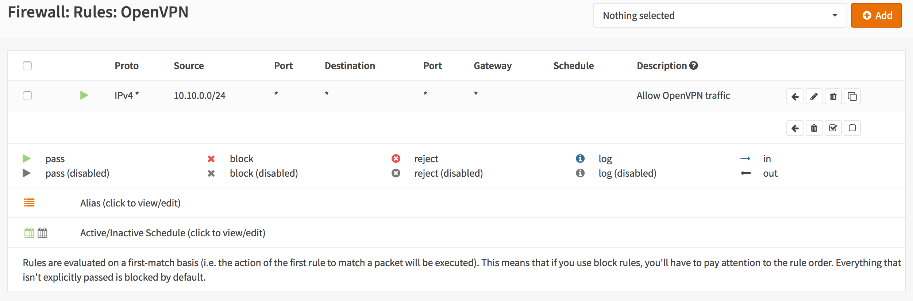

=================================
Setup SSL VPN site to site tunnel
=================================

Site to site VPN's connect two locations with static public IP addresses and allow
traffic to be routed between the two networks. This is most commonly used to
connect an organization's branch offices back to its main office, so branch users
can access network resources in the main office.

----------------
Before you start
----------------
Before starting with the configuration of an OpenVPN SSL tunnel you need to have a
working OPNsense installation wit a unique LAN IP subnet for each side of your
connection (you local network need to different than that of the remote network).

.. Note::

   For the sample we will use a private ip for our WAN connection.
   This requires us to disable the default block rule on wan to allow private traffic.
   To do so, go to the **Interfaces->[WAN]** and uncheck "Block private networks".
   *(Don't forget to save and apply)*

   .. image:: images/block_private_networks.png

-----------------------------

------------
Sample Setup
------------
For the sample configuration we use two OPNsense boxes to simulate a site to site
tunnel, with the following configuration:

.. sidebar:: Network Site A

    .. nwdiag::
      :scale: 100%

        nwdiag {

          span_width = 90;
          node_width = 210;
          Internet [shape = "cisco.cloud"];
          pclana [label="PC Site A",shape="cisco.pc"];
          pclana -- switchlana;

          network LANA {
            switchlana [label="",shape = "cisco.workgroup_switch"];
            label = " LAN Site A";
            address ="192.168.1.1.x/24";
            fw1 [address="192.168.1.1/24"];
            tunnel [label=" SSLVPN Tunnel",shape = cisco.cloud];
          }

          network WANA  {
            label = " WAN Site A";
            fw1 [shape = "cisco.firewall", address="172.10.1.1/16"];
            Internet;
          }

        }

Site A - Server
---------------
==================== =============================
 **Hostname**         fw1
 **WAN IP**           172.10.1.1/16
 **LAN IP**           192.168.1.1/24
 **LAN DHCP Range**   192.168.1.100-192.168.1.200
 **Tunnel Network**   10.10.0.0/24
==================== =============================

|
|
|
|

-----------------------------

.. sidebar:: Network Site B

    .. nwdiag::
      :scale: 100%

        nwdiag {

          span_width = 90;
          node_width = 210;
          Internet [shape = "cisco.cloud"];
          pclanb [label="PC Site B",shape="cisco.pc"];
          pclanb -- switchlanb;

          network LANB {
            label = " LAN Site B";
            address ="192.168.2.1.x/24";
            fw2 [address="192.168.2.1/24"];
            tunnel [label=" SSLVPN Tunnel",shape = cisco.cloud];
            switchlanb [label="",shape = "cisco.workgroup_switch"];
          }

          network WANB {
            label = " WAN Site B";
            fw2 [shape = "cisco.firewall", address="172.10.2.1/16"];
            Internet;
          }

        }

Site B - Client
---------------

==================== =============================
 **Hostname**         fw2
 **WAN IP**           172.10.2.1/16
 **LAN Net**          192.168.2.0/24
 **LAN DHCP Range**   192.168.2.100-192.168.2.200
 **Tunnel Network**   10.10.0.0/24
==================== =============================

|
|
|
|

-----------------------------

Full Network Diagram Including SSL VPN Tunnel
---------------------------------------------

.. nwdiag::
  :scale: 100%
  :caption: SSL VPN Site-to-Site tunnel network

    nwdiag {

      span_width = 90;
      node_width = 210;
      Internet [shape = "cisco.cloud"];
      pclana [label="PC Site A",shape="cisco.pc"];
      pclana -- switchlana;

      network LANA {
        switchlana [label="",shape = "cisco.workgroup_switch"];
        label = " LAN Site A";
        address ="192.168.1.1.x/24";
        fw1 [address="192.168.1.1/24"];
        tunnel [label=" SSLVPN Tunnel",shape = cisco.cloud];
      }

      network WANA  {
        label = " WAN Site A";
        fw1 [shape = "cisco.firewall", address="172.10.1.1/16"];
        Internet;
      }

      network WANB {
        label = " WAN Site B";
        fw2 [shape = "cisco.firewall", address="172.10.2.1/16"];
        Internet;
      }

      network LANB {
        label = " LAN Site B";
        address ="192.168.2.1.x/24";
        fw2 [address="192.168.2.1/24"];
        tunnel;
        switchlanb [label="",shape = "cisco.workgroup_switch"];
      }
      pclanb [label="PC Site B",shape="cisco.pc"];
      pclanb -- switchlanb;

    }

------------------------
Step 1 - Add SSL Server
------------------------
Adding a new SSL VPN server is relatively simple. We'll start by adding a server
that uses a shared key. This setup offers a good protection and it is
easy to setup.

Go to **VPN->OpenVPN->Servers** and click on **add server** in to top right corner
of the form.

For our example will use the following settings (leave everything else on its default):

.. Note::

   The setting **Hardware Crypto** is not used for new systems equipped with **AESNI**,
   when the aesni module is loaded it will be used automatically.

===================================== ===============================================
 **Server Mode**                       *Peer to Peer (Shared Key)*
 **Protocol**                          *UDP*
 **Device Mode**                       *tun*
 **Interface**                         *WAN*
 **Local port**                        *1194*
 **Description**                       *SSL VPN Server*
 **Shared Key**                        *Leave on enabled (checked) to create a new key*
 **Server Certificate**                *SSLVPN Server Certificate (CA: SSL VPN CA)*
 **DH Parameters Length**              *4096*
 **Encryption algorithm**              *AES-256-CBC (256-bit)*
 **Auth Digest Algorithm**             *SHA512 (512-bit)*
 **Hardware Crypto**                   *No Hardware Crypto Acceleration*
 **IPv4 Tunnel Network**               *10.10.0.0/24*
 **IPv4 Local Network/s**              *192.168.1.0/24*
 **IPv4 Remote Network/s**             *192.168.2.0/24*
 **Compression**                       *Enabled with Adaptive Compression*
===================================== ===============================================

    Click **Save** to add the new server.

    .. image:: images/sslvpn_server.png
       :width: 100%

----------------------

------------------------
Step 2 - Copy Shared Key
------------------------
To copy the newly created shared key, click on the pencil icon next to the
newly created SSL VPN server.

You will see the shared key, copy this and keep it safe!

Sample key:

.. code-block:: guess

  #
  # 2048 bit OpenVPN static key
  #
  -----BEGIN OpenVPN Static key V1-----
  0960c87c3aafa8f306fe270c1564380b
  7922543563a17b5d2636b4ef9412dd09
  9ad44974ca1b293963e0f8ac9cbdd97c
  2c31bf35f0df45c9e928ccb033e6d51d
  2caaec02d649ad081c68d7bc7d28030e
  9182c9597a83024097bea860e52d9c66
  1b9e0048fbf951ce8659bc56edb7f9a1
  14f7740fc9231a3750557e02eb112712
  ac4b9980d4c740ec96a4357f3940ed90
  d1bbf8eed3de135c886fe2eff8e8b943
  ab1f52b59def4c9ebeacc5eb48425189
  c43887a6237c29e0724f5f45a0f70635
  10680bec8bfb67c21bf2b4866268594c
  9ba093668064f9a898e6a6ad103b401d
  b2047132f0dc8db2230db38444d689fa
  ddba46bf6f892ae90c59415f94b82750
  -----END OpenVPN Static key V1-----

------------------------------
Step 3 - Server Firewall Rules
------------------------------
To allow SSL VPN client connections, we should allow access to the OpenVPN server
port on the WAN interface. When using multiple servers we need to open up each port.

For our configuration we only use one server accessible on UDP port 1194.

.. image:: images/sslvpn_wan_rule.png
    :width: 100%

Next we also need to allow traffic from the VPN client network (192.168.2.0/24).
For our example we will allow client to access anything on our local network(s),
however you may decide just to allow traffic to one or more IP's.

**You are done configuring Site A.**

-----------------------------

----------------------
Step 4 - Site B Client
----------------------
Now we will have to setup the client.
Login to the second firewall, go to **VPN->OpenVPN->Clients** and click on
**add client** in the upper right corner of the form.

Now enter the following into the form (and leave everything else default):

===================================== ===============================================
 **Server Mode**                       *Peer to Peer (Shared Key)*
 **Protocol**                          *UDP*
 **Device Mode**                       *tun*
 **Interface**                         *WAN*
 **Server host or address**            *172.10.1.1*
 **Server port**                       *1194*
 **Description**                       *SSL VPN Client*
 **Shared Key**                        *Uncheck to paste the shared key*
 ...                                   *Paste your shared key*
 **Server Certificate**                *SSLVPN Server Certificate (CA: SSL VPN CA)*
 **DH Parameters Length**              *4096*
 **Encryption algorithm**              *AES-256-CBC (256-bit)*
 **Auth Digest Algorithm**             *SHA512 (512-bit)*
 **Hardware Crypto**                   *No Hardware Crypto Acceleration*
 **IPv4 Tunnel Network**               *10.10.0.0/24*
 **IPv4 Remote Network/s**             *192.168.1.0/24*
 **Compression**                       *Enabled with Adaptive Compression*
===================================== ===============================================

Now click on **Save**  to apply your settings.

The Connection Status can be viewed under **VPN->OpenVPN->Connection Status**

.. image:: images/sslvpn_connection_status.png
   :width: 100%

------------------------------
Step 5 - Client Firewall Rules
------------------------------
To allow traffic from the remote network just add a rule under **Firewall->Rules**
OpenVPN tab.

.. image:: images/sslvpn_firewall_rule_client.png
   :width: 100%

**Done**
