=================
Tor Configuration
=================

.. Note::
    Saving changes in modal dialogs does not apply the settings.
    To apply them, you have to click the "Reload Service" button.

------------
Installation
------------

First of all, install the tor plugin (os-tor) from the plugins view.

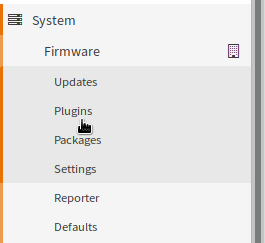

After a page reload you will get a new menu entry under services for Tor.
Open the menu and choose "Configuration" to configure the plugin.

----------------
General Settings
----------------

This section controls how Tor behaves in general as well as forward proxying.

Global Settings
===============

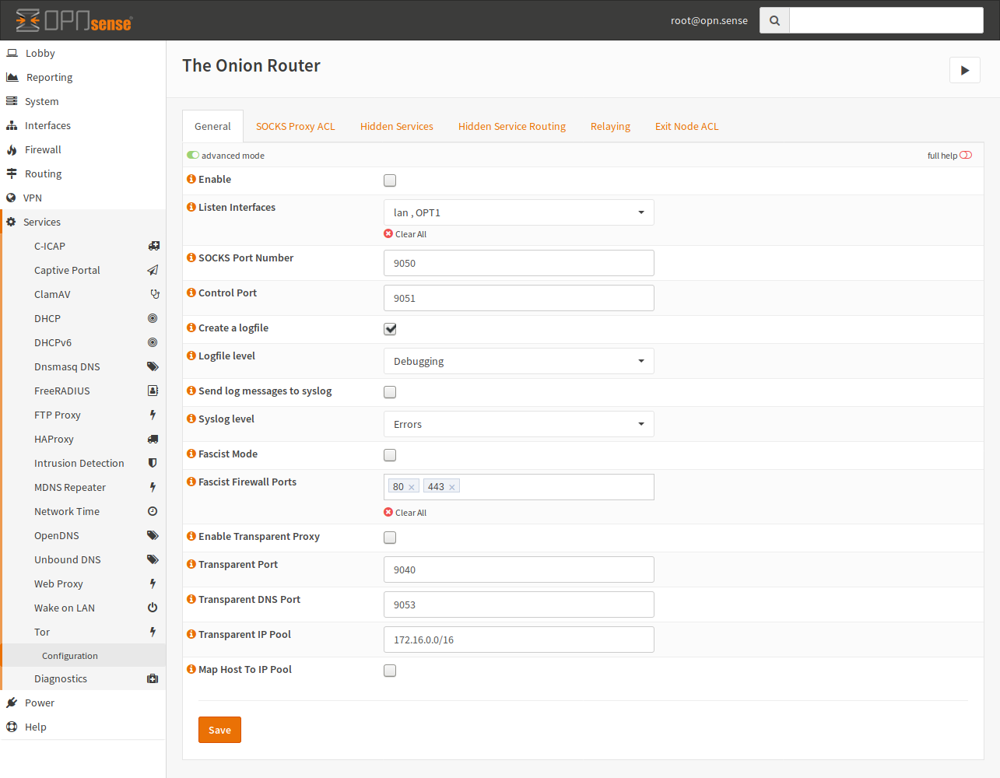

Tor Service Settings
--------------------

:Enable:
    Controls if the service should be running. If it is enabled, 
    it will also be enabled at boot time.
:Control Port:
    The control port is used for control communication with the Tor daemon.
    This Port requires a password, which will not be disclosed to the GUI but
    can be queried via the API. This setting is available for you to handle
    Port conflicts, so you can change this port.
:Create a logfile, Send log messges to syslog:
    Enable this checkbox if you want some logging. Please note that a detailed
    log may lead to privacy issues.
:Logfile, Syslog level:
    If the corresponding checkbox is enabled, this will be the minimum severity
    for sending or writing log messges.
:Fascist Mode:
    If internet access is filtered, you can try this option.
    Please note that this is not compatible with other features like "Hidden Services".
:Fascist Firewall Ports:
    These are the unfiltered ports of the firewall. The defaults of 80 and 443 are
    choosen, because they are commonly open.

Forward Proxy
-------------

.. Note::
    The SOCKS proxy is only useable from localhost (127.0.0.1 and ::1)
    unless an ACL is added in the "SOCKS Proxy ACL" section.

:Listen Interfaces:
    Add one or multiple interfaces, on which Tor should listen additionally
    to the loopback interface. This is required if you want to use Tor from
    other computers than the appliance itself. Tor will bind on the
    statically configured IP address from your interface configuration.
    If the interface has no static IP configured, it will be ignored.
:SOCKS Port Number:
    The port which should be used for the SOCKS server.

Transparent Forward Proxy
-------------------------

:Transparent Port:
    This port is the target for your NAT rule.
    Please create a rule for this port in the "Port Forward" section of the firewall.
:Transparent DNS Port:
    If you are using Tor transparently, you can resolve .onion addresses
    to IPs of the given pool for example. This also allows to keep DNS secret.
:Transparent IP Pool:
    This is used to provide an IP pool to Tor, which can be used for host mapping.
    This needs to be a /16 network at minimum.
:Map Host To IP Pool:
    This option will assign IP addresses to resolved .onion domains by the
    Tor DNS service. Checking this box is recommend but a transparent IP
    pool is required

SOCKS ACL
=========

.. WARNING::
    If untrusted devices have access to the SOCKS proxy,
    private information may be leaked.
    Please be careful with the networks you allow here.

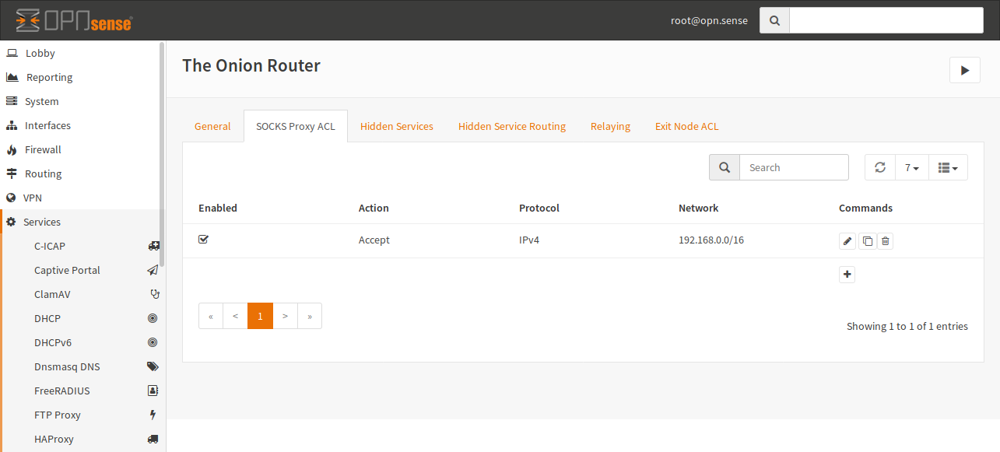

In this example, you can see that all Hosts of the
192.168.0.0/16 network have access to the Tor Proxy.
By default, connections are forbidden.

Creating a new entry is quite easy. Just click the `+` and
fill out the form:

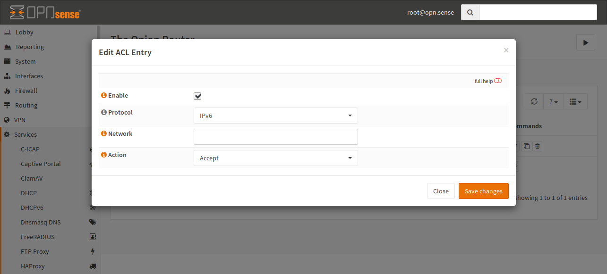

:Enable:
    The entry will be added to the configuration file.
    If this checkbox is unckecked, the entry is ignored.
:Protocol:
    Select the protocol in use for this ACL.
    You can choose between IPv4 and IPv6.
    By default, IPv6 is selected.
:Network:
    In this field, you have to add the network,
    on which this ACL should be applied in CIDR notation.
:Action:
    Select if the traffic should be accepted or rejected.

----------------
Hidden Services
----------------

A hidden service is an open TCP port, which is hosted in the Tor network
and therefore the origin of the service is hard to trace.
For example, you can host a website in Tor by running a webserver in your
network and forwarding a hidden service port to this webserver.

.. WARNING::
    This does not work with every protocol as there are protocols
    which open arbitrary ports. An example for that is FTP.
    You may work around this issue by limiting the usable ports
    of such services (for example 10 ports) and forward those to the server.

If you want to host a hidden service,
you need to open the hidden service tab and click the `+` button.

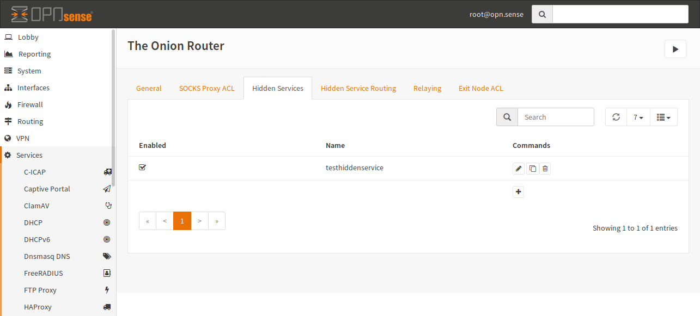

The following dialog will open and you can enter a name.

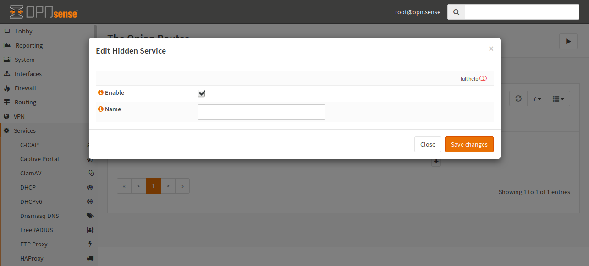

You are allowed to add any alphanumeric name here.
For example, you can call your service sampleservice.

Click "Save changes" and your service is saved to the
configuration file but not saved to the Tor configuration file.

Switch to the "Hidden Service Routing" tab:

For any port you want to forward, you have to click `+` and fill out the form:

.. image:: images/tor_hidden_services_route_edit.png

:Hidden Service:
    The service on which the port forward applies.
    The entries in this list are the services created in the previous step.
:Port:
    The virtual Port in the Tor network.
:Target Host:
    The host, on which the real service is running.
:Target Port:
    The real port of the service. Please note that
    this does not need to match the `Port` field but some
    services may act strange on mismatch.

The sample in the screenshot would forward traffic from the virtual host
in the Tor network it gets on port 80 to 127.0.0.1:8080

.. Warning::
    When using local connections like `127.0.0.1` or `::1`, your application
    may think this connection is trusted (localhost is not from the internet).
    Be careful when forwarding traffic to localhost.

In addition to regular onion services, the services can be protected even more
by requireing the client to know a secret cookie.

This setting needs to be configured on both ends. On the server hosting the
onion service, you need to configure it on the configuration tab for the onion
service.

For example, if you want to have a stealth service (undetectable without knowing
the key), you can configure it like the following:

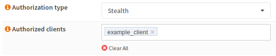

:Authorization Type:
    Can be `Stealth` or `Basic`. Basic means that multiple clients can use the
    entry point and it is still visible but unauthorized hosts can not connect.
:Authorized Clients:
    You can choose some names for your clients. Each client gets a authorization
    cookie assigned so they can connect to it. If you set this value, this onion
    service will not be available to the public anymore.

Now as this service will need to be configured to the client side as well,
you will need to add the secret to the configuration page. To configure a
authorization cookie for a service, you can open the 
`Onion Service Authentication` tab and fill out the form like on the screenshot:

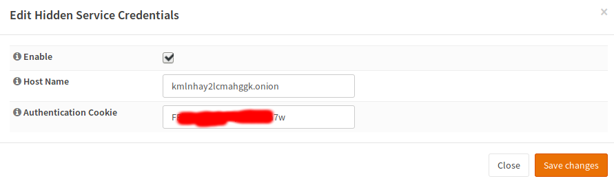

You need to configure the hostname and the authorization cookie you will get.

:Host Name:
    Enter the .onion address of the onion service.
:Authentication Cookie:
    This is the authentication code you will get from the maintainer of the
    onion service. Enter it into this field.

When you are done, save the settings and reload the service. After that, you should
be able to reach the service.

------
Relays
------

A Tor relay is a host which forwards traffic for other Tor nodes.
A relay that allows traffic to pass outside of the Tor network
is called an "Exit Node". If the relay is configured only for you
(not for public access), it is called a bridge.
Bridges are used to circumvent filtering of public entry nodes based
on IP/Port basis as the existence of bridges is usually unknown.

Relays And Bridges
==================

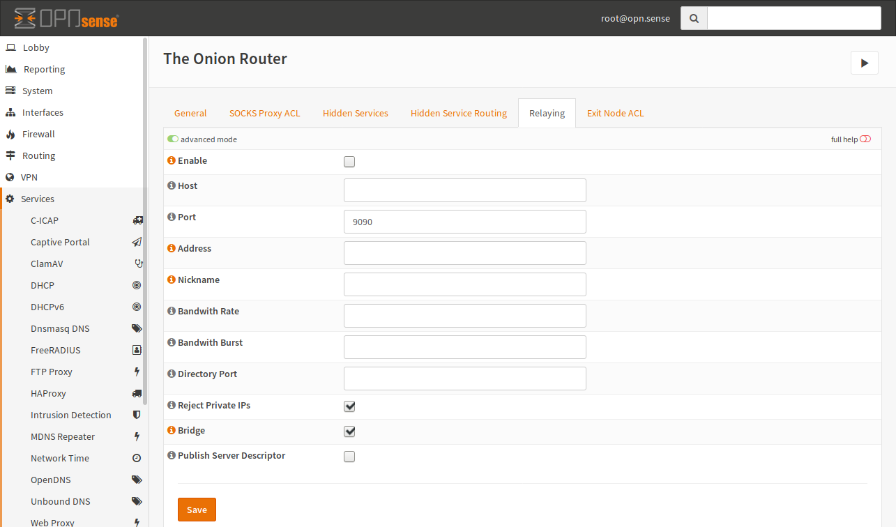

.. Note::
    To be a relay, your host must have a public
    available port. With relaying, you will increase the anonymity
    of Tor and it is less risky than an exit node.

:Enable:
    Enable this checkbox if you want to relay traffic (forward
    foreign traffic).
:Host:
    This is the host to bind the relay port to. This can be the public IP
    address. This setting is optional and may be omitted.
:Port:
    This is the public port used. Do not forget to add a firewall rule
    to pass traffic to this port. Otherwise it will not work.
:Address:
    You can enter the FQDN or the WAN IP of this Firewall.
:Nickname:
    A nickname can be used to identify your network but it must only
    consist of alphanumeric characters.
:Bandwith Rate:
    You can limit the bandwith Tor will use. By default, Tor will use the
    maximum amount of bandwith available.
    The value must be at least 72 kilobits per second.
:Bandwith Burst:
    See Bandwith Rate.
:Directory Port:
    If you have a lot of bandwith, you can also configure a directory port.
    You should not enable this port if your bandwith is small.
:Reject Private IPs:
    **IMPORTANT** DO NOT DISABLE UNLESS YOU KNOW WHAT YOU ARE DOING.
    This option blocks access to RFC1918 addresses regardless of the
    configured policy. If you disable this option, somebody can invade
    your network.
:Bridge:
    Enable this setting, if you want to be a bridge.
:Publish Server Descriptor:
    If this is disabled, Tor will not publish descriptors. If you don't
    want to be in a directory (for example for testing reasons),
    uncheck this option.

Exit Nodes
==========

.. Warning::
    Providing an exit node can lead to legal issues. It may be a good idea to
    consult a lawyer before setting up one as you might be made responsible for
    traffic, which originates from a malicious Tor user.

If you have relaying enabled, you can also become an exit node.
To allow outgoing connections, you have to open to the "Exit Node ACL" tab.

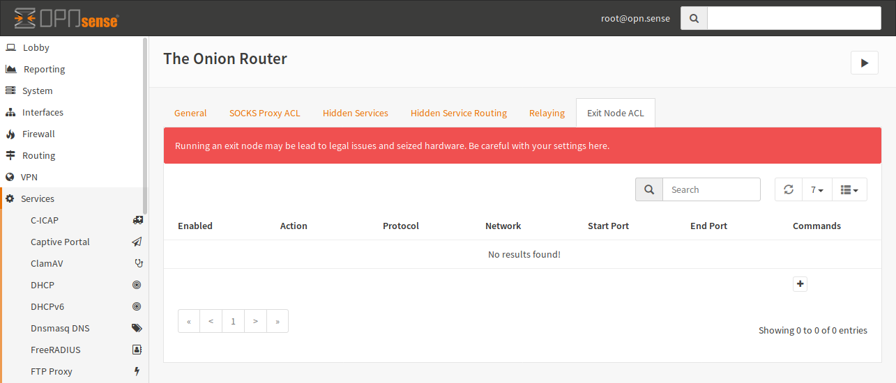

Click on `+` to add a new ACL.

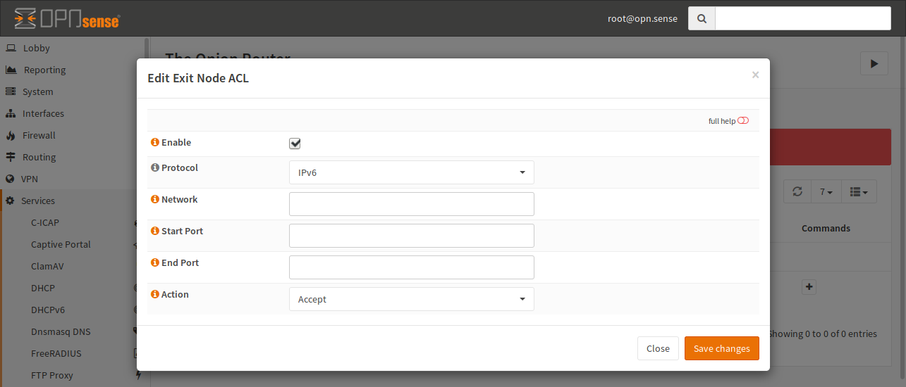

:Enable:
    If it is checked, the ACL will be used by Tor,
    otherwise the line is ignored.
:Protocol:
    Select the protocol, on which this ACL applies.
    You can select IPv4 and IPv6 here. IPv6 is the default.
:Network:
    You can enter a target network in CIDR notation or an IP
    address here. If no IP is given, any IP will match.
:Start Port, End Port:
    This match is the target port of a connection.
    You can provide only a start port if you want to match a single port.
    If you provide both, a port range will be used.
:Action:
    If you select "Reject", no exit node traffic will be sent to this host
    and it will not be forwarded. If you choose "Accept", your host may
    be choosen as an exit node in a circuit.
