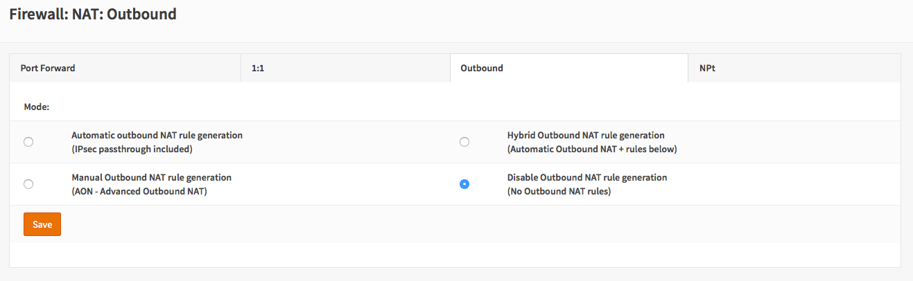
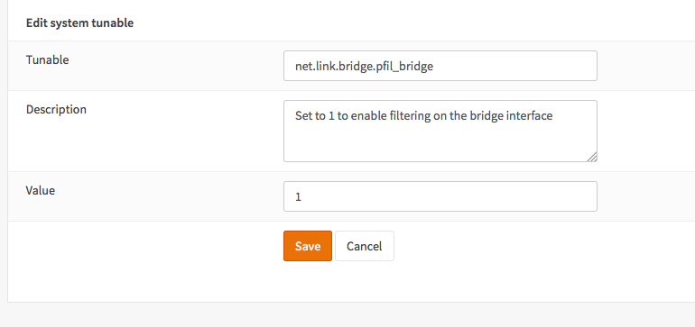
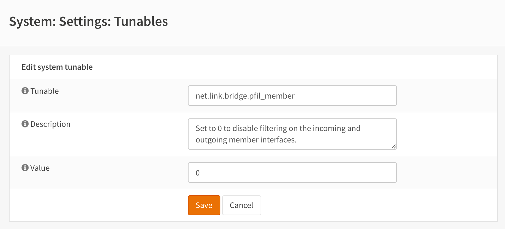
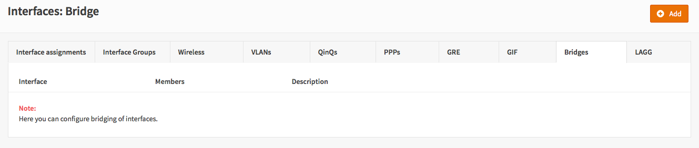
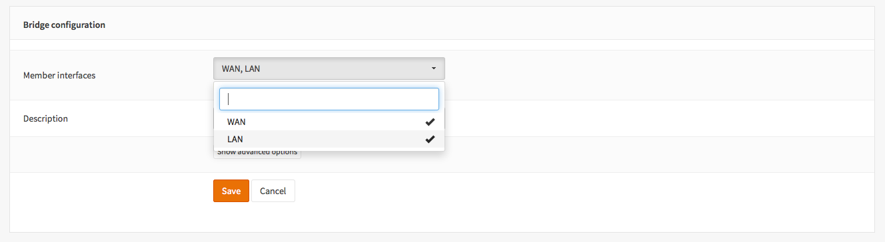
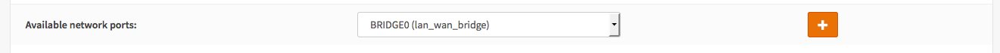
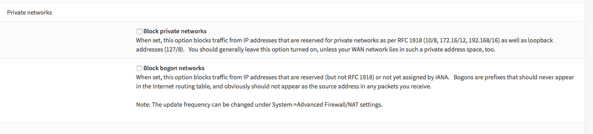
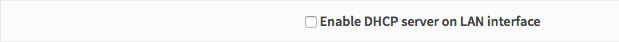
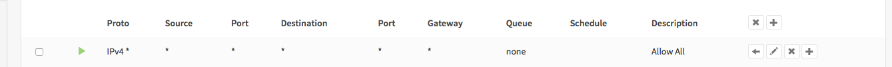
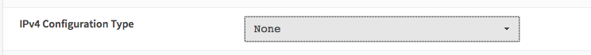

============================
Transparent Filtering Bridge
============================

-------
Warning
-------
The Transparent Filtering Bridge is not compatible with Traffic Shaping.
Do not enable the traffic shaper when using the filtering bridge.

--------
Abstract
--------

A transparent firewall can be used to filter traffic without creating
different subnets. This application is called filtering bridge as it
acts as a bridge connection two interfaces and applies filtering rules
on top of this.

For more information on Filtering Bridged on FreeBSD, see
`filtering-bridges <https://www.freebsd.org/doc/en/articles/filtering-bridges/article.html>`__

------------
Requirements
------------

-  For this howto we need a basic installation of OPNsense with factory
   defaults as a starting point.
-  And an appliance with 2 physical interfaces.

--------------
Considerations
--------------

To create this howto version OPNsense 15.7.11 has been used. Some screenshots
maybe outdated, but setting should apply up to at least 17.1.6. If you use a
different version some options can be different.

.. Note::

    The Menu System of the User Interface has been updated with sub items.
    Where tabs are shown in screenshots, these are now likely visible as submenu.

------------------------------
Configuration in 10 easy steps
------------------------------

.. contents::
  :local:

.. Warning::

  During the configuration you will be asked to "Apply" your changes several times,
  however this may affect the current connection. So **don't** apply anything until
  completely finished! You need to Save your changes for each step.

1. Disable Outbound NAT rule generation
---------------------------------------

To disable outbound NAT, go to
:menuselection:`Firewall --> NAT --> Outbound` and select “Disable Outbound NAT rule generation”.

|Filtering Bridge Step 1.png|

2. Change system tuneables
--------------------------

Enable filtering bridge by changing **net.link.bridge.pfil\_bridge**
from default to 1 in :menuselection:`System --> Settings --> System Tuneables`.

|Filtering Bridge Step 2.png|

And disable filtering on member interfaces by changing
**net.link.bridge.pfil\_member** from default to 0 in
:menuselection:`System --> Settings --> System Tuneables`.

|Filtering Bridge Step2a.png|

3. Create the bridge
--------------------

Create a bridge of LAN and WAN, go to
:menuselection:`Interfaces --> Devices --> Bridge`. Add Select LAN and WAN.

|Filtering Bridge Step 3a.png|

|Filtering Bridge Step 3b.png|

4. Assign a management IP/Interface
-----------------------------------

To be able to configure and manage the filtering bridge (OPNsense)
afterwards, we will need to assign a new interface to the bridge and
setup an IP address.

Go to :menuselection:`Interfaces --> Assign --> Available network port`, select
the bridge from the list and hit **+**.

|Filtering Bridge Step 4.png|

Now Add an IP address to the interface that you would like to use to
manage the bridge. Go to :menuselection:`Interfaces --> [OPT1]`, enable the interface
and fill-in the ip/netmask.

5. Disable Block private networks & bogon
-----------------------------------------

For the WAN interface we nee to disable blocking of private networks & bogus IPs.

Go to :menuselection:`Interfaces --> [WAN]` and unselect **Block private networks**
and **Block bogon networks**.

|Filtering Bridge Step 5.png|

6. Disable the DHCP server on LAN
---------------------------------

To disable the DHCP server on LAN go to :menuselection:`Services --> DHCPv4 --> [LAN]` and
unselect enable.

|Filtering Bridge Step 6.png|

7. Add Allow rules
-------------------
After configuring the bridge the rules on member interfaces (WAN/LAN) will be
ignored. So you can skip this step.

Add the allow rules for all traffic on each of the three interfaces (WAN/LAN/OPT1).

This step is to ensure we have a full transparent bridge without any filtering
taking place. You can setup the correct rules when you have confirmed the bridge
to work properly.

Go to :menuselection:`Firewall --> Rules` and add a rule per interface to allow all traffic
of any type.

|Filtering Bridge Step 7.png|

8. Disable Default Anti Lockout Rule
------------------------------------
After configuring the bridge the rules on member interfaces (WAN/LAN) will be
ignored. So you can skip this step.

As we now have setup allow rules for each interface we can safely remove
the Anti Lockout rule on LAN

Go to :menuselection:`Firewall --> Settings --> Admin Access`: Anti-lockout and select
this option to disable

9. Set LAN and WAN interface type to 'none'
-------------------------------------------

Now remove the IP subnets in use for LAN and WAN by changing the
interface type to none. Go to :menuselection:`Interfaces --> [LAN]` and :menuselection:`Interfaces --> [WAN]`
to do so.

|Filtering Bridge Step 9.png|

10. Now apply the changes
-------------------------

If you followed each step, then you can now apply the changes. The
Firewall is now converted to a filtering bridge.

.. rubric:: Done.. ready to set your own filtering rules
   :name: done..-ready-to-set-your-own-filtering-rules

Now you can create the correct firewall/filter rules and apply them. To
acces the firewall you need to use the IP adress you configured for the
OPT1 Interface.

.. WARNING::

    Rules need to be configured on the bridge. Rules on member interfaces will
    be ignored!

.. TIP::

  Don't forget to make sure your PC/Laptop is configured with an IP adress that
  falls within the IP range of the OPT1 subnet!

