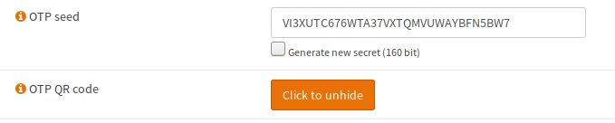
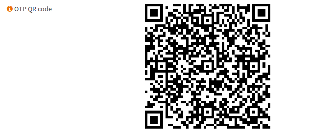
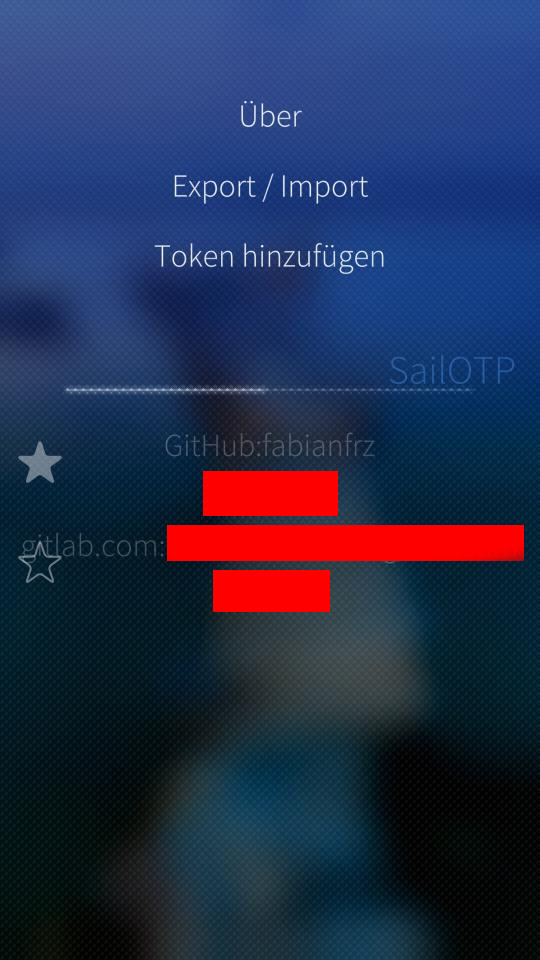
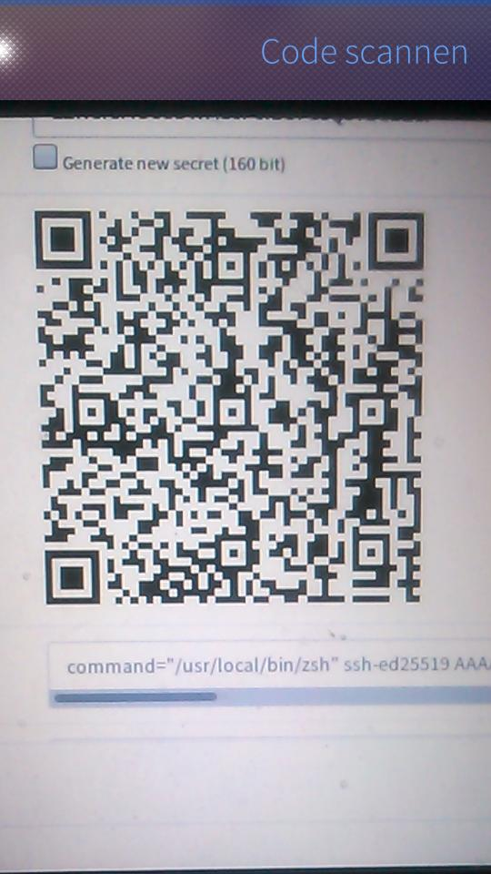
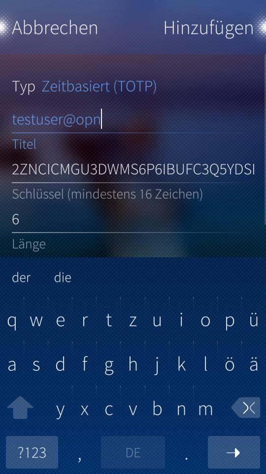
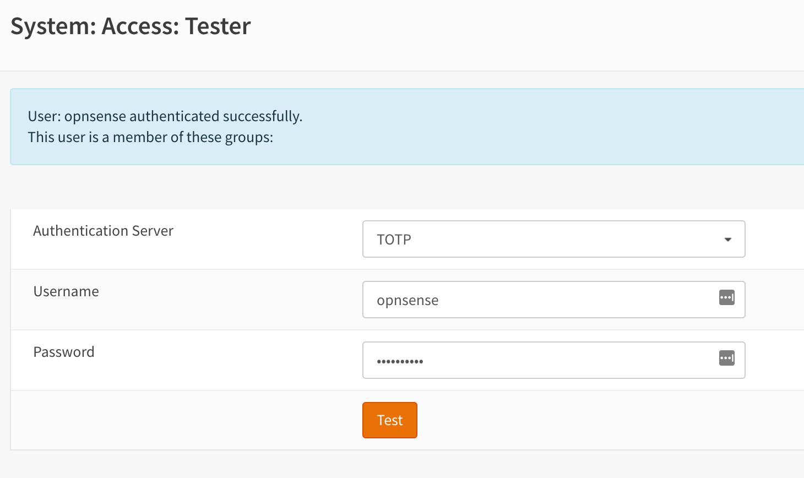
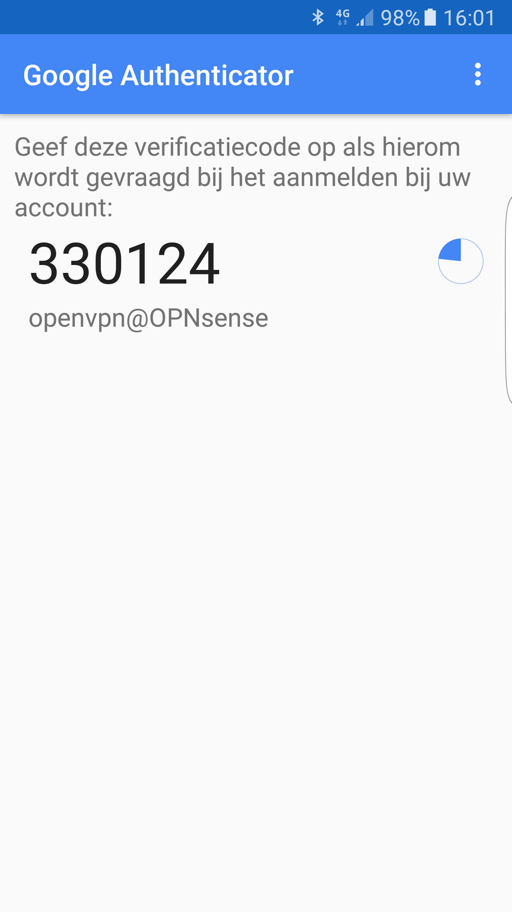

=========================================
Configure 2FA TOTP & Google Authenticator
=========================================
This how-to will show you how to setup a One-time Password 2 Factor Authentication
using OPNsense and Google's Authenticator. All services of OPNsense can be used
with this 2FA solution.

.. image:: /manual/images/two_factor_authentication.png
   :width: 100%

.. Note::

    To use the same feature with any time based one-time password token just enter
    the seed into the field in step 3 instead of creating a new seed. The seed needs
    to be in base32 format.

--------------------------------------
Step 1 - Add New Authentication Server
--------------------------------------
To add a TOTP server go to **System->Access-Servers** and press **Add server** in
the top right corner. Then fill in the form as follows:

====================== =================================== ========================================
 **Descriptive name**   TOTP Server                         *Choose a server name*
 **Type**               Local+Timebased One Time Password   *Select the TOTP server Type*
 **Token length**       6                                   *6 for Google Authenticator*
 **Time window**                                            *Leave Empty for Google Authenticator*
 **Grace period**                                           *Leave Empty for Google Authenticator*
====================== =================================== ========================================

-------------------------------------
Step 2 - Install Google Authenticator
-------------------------------------
Go to the App Store of your platform and search for Google Authenticator.
Install using the normal procedure for your device.

---------------------------
Step 3 - Add or modify user
---------------------------
For this example we will create a new user, go to **System->Access-Users** and click
on the plus sign in the lower right corner.

Enter a **Username** and **Password** and fill in the other fields just as you would
do for any other user. Then select the **Generate new (160bit) secret** under **OTP seed**.

When done press **Save**.

-------------------------------------------------
Step 4 - Activate Authenticator for this OTP seed
-------------------------------------------------
To activate your new OTP seed on the Google Authenticator, first reopen the user
you just created by clicking on the pencil icon.

Now it will show a QR code:

.. Warning::

    Be very careful with the seed or QR code as this is the only thing you need
    to calculate the token. **KEEP YOUR SEED/QR CODE SAFE !**

Now open your Google Authenticator compatible application and select the option to
start the configuration and then scan the QR code or alternatively enter the seed
directly.

In case of SailOTP the configuration works like this:

Pull down to open the application menu and choose the entry to add a new Token.

In the next step, you have to scan the previously created QR code by clicking
on the screen.

When the QR code is scanned, a new view will open where you can
see the details of the result. This view can be used to check if the generated
key and OTP settings of the scan results do match your settings.
Confirm if everything is ok by clicking "Add".

After this step, you will be back on the home screen of the app and will get
a Token for 30 Seconds.

Please note that there are many apps to generate the token. Some well known are:

==================== ======================= =====================================
Name                 Platform                URL
==================== ======================= =====================================
FreeOTP              Android, iOS            https://freeotp.github.io/
Google Authenticator Android, iOS            https://www.google.com/landing/2step/
==================== ======================= =====================================

-----------------------
Step 5 - Test the token
-----------------------
For testing the user authentication, OPNsense offers a simple tester.
Go to **System->Access->Tester**

Select the Authentication server you have configured, and enter the user name.
Then enter the ***token** + **password**, remember the order
is token and then password **in the same field**.

.. Note::
    Password field should be used to enter both token and your password, like:
    **Password:** 123456PASSWORD when the default configuration is used.
    The OTP authentication server can also be configured to have it in the
    reverse order like PASSWORD123456.

Hit the test button and if all goes well you should see *successfully authenticated*.

------------------------
Step 6 - Using the token
------------------------
To use the token in any application/service that you have configured, just open
the Google Authenticator and add the created token/key **before** your regular password.

.. Warning::
   Remember, you need to enter the token **before** or **after** you password
   (depending on your configuration)! And the password field should be used to enter
   both token and your password, like: **Password:** 123456PASSWORD

The code will change every 30 seconds.
Sample code:

