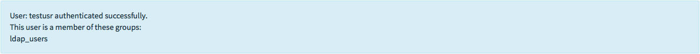
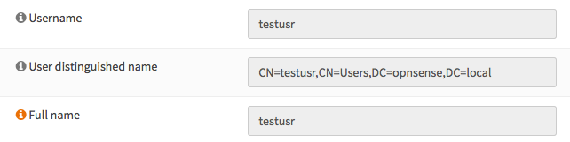
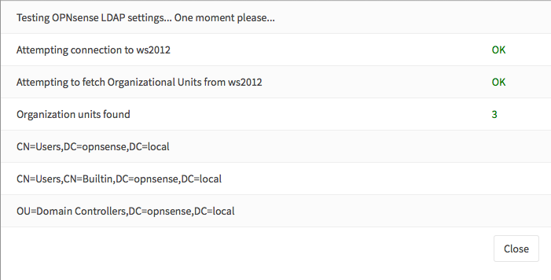

=====================================
Access / Servers / LDAP
=====================================

LDAP is the light weight directory access protocol used by Microsoft Active Directory,
OpenLDAP and Novell eDirectory, to name a few.

OPNsense can use a LDAP server for authentication purposes and for authorization
to access (parts) of the graphical user interface (web configurator). When using
LDAP for the GUI the privileges have to be defined with the local user manager,
to do so an import of the users from the LDAP source is required.

In this how-to we will show you how to configure both using Microsoft Active Directory
Server. If you only need LDAP for services like VPN, then you can skip step 3-5.

-------------
Prerequisites
-------------
A functional LDAP server (example is based on MS AD) is required.
You OPNsense firewall need to be fully configured and able to access the LDAP server.

Step 1 - Add New LDAP server
----------------------------
To add a new LDAP server as authentication source, go to :menuselection:`System --> Access --> Servers`
and click on **Add server** the top right corner, just above the form.

Enter the following information:

=========================================================================================================================

================================ ======================== ===============================================================
 **Descriptive name**             ws2012                   *Enter a descriptive name*
 **Type**                         LDAP                     *Select LDAP*
 **Hostname or IP address**       10.10.10.1               *Enter the IP address of you LDAP Server*
 **Port value**                   389                      *Enter the port number, 389 is default*
 **Transport**                    TCP - Standard           *Select Standard or Encrypted*
 **Protocol version**             3                        *Select protocol version*
 **Bind credentials**
  User DN:                        cn=testusr,CN=Users,     *Enter your credentials*
                                  DC=opnsense,DC=local
  Password:                       secret                   *alway use a strong password*

 **Search scope**                 Entire Subtree           *Select Entire Subtree to retrieve all*
 **Base DN:**                     DC=opnsense,DC=local     *Enter the Base DN*
 **Authentication containers**	  *Select*                 *Click & Select the containers from the list*
 **Extended Query**               &(objectClass=Person)    *Extend query, p.e. limit results to Persons*
 **Initial Template**             MicrosoftAD              *Select you LDAP Server Type*
 **User naming attribute**        samAccountName           *Auto filled in based upon Initial Template*
 **Read properties**                                       *Fetch account details after successful login*
 **Synchronize groups**                                    *Enable to Synchronize groups, requires the option above*
 **Limit groups**                                          *Select list of groups that maybe considered during sync**

================================ ======================== ===============================================================

.. Note::
   When clicking on the **Select** button right next to Authentication containers,
   something similar to will show up:

   .. image:: images/ldap_selectcontainer.png
      :width: 100%

.. Note::

    When using SSL/TLS, make sure the certificate authority of the remote server is configured in the :menuselection:`System -> Trust` section.

.. TIP::
   The **Extended Query** can be used to select users who are member of a specific
   group (only relevant for external services, when not using the local user database).
   One can use something like this:
   **&(memberOf=CN=myGroup,CN=Users,DC=opnsense,DC=local)** to select only members
   of  the group *"myGroup"*. To add a user to a specific group under Windows just
   edit the groups properties and select **Add...** to add the user under the tab
   **Members**.

   .. image:: images/ldap_mygroup_properties.png
      :width: 100%

Step 1.1 (optional) Synchronize groups.
.........................................

When using the local database to import users, you can also synchronize configured ldap groups when the remote server
supports this. To use this feature, enable :code:`Read properties` and :code:`Synchronize groups`.

.. Note::

    This feature needs the remote ldap server to respond with :code:`memberOf` when queried, how to enable this on
    various ldap providers lies outside the scope of this manual.

.. Note::

    Groups will be extracted from the first :code:`CN=` section and will only be considered when already existing in OPNsense.
    Group memberships will be persisted in OPNsense
    (you can always check which rights the user had the last time he or she successfully logged in).

Step 2 - Test
--------------
To test if the server is configured correctly, go to :menuselection:`System --> Access --> Tester`
and select your LDAP server and enter a valid username + password. Click on
**Test** and if everything is setup correctly it will show:

.. Note::
  When limited to just one group, the group name will not be shown in the listing.

If not (or your entered invalid credentials) it shows:

.. image:: images/ldap_testfail.png
   :width: 100%

.. Tip::

    When :code:`Read properties` is enabled, you should also see all properties returned by the server in the tester. This
    helps to identify if your server support group sync support (find :code:`memberOf` in the list).

Step 3 - Enable the authentication server
-----------------------------------------
Go to `System --> Access --> Settings --> Administration` and under the `Authentication` section at the bottom, change
the `Server` to your newly added LDAP server and save.

Step 4 - Import Users
---------------------
If you would like to give LDAP/Active Directory users access to the GUI, you need
to import the users into the local user manager. Go to :menuselection:`System --> Access --> Users`
you will see a cloud import icon at the lower right corner of the form.

.. image:: images/user_cloudimport.png
   :width: 39px

Click on the cloud import icon to start importing users.

A new form will be show with the individual users, select the ones you like to import.

Step 5 - Update LDAP user privileges
------------------------------------
Now if you go to :menuselection:`System --> Access --> Users` you will see all users including the
newly imported LDAP users. You can create a specific group for these users to
easily manage the privileges or use one of your earlier created groups.

When opening a LDAP user (edit) via the pecil icon right next to the name, you will
notice the difference as the **User Distinguished name** will be shown from the
LDAP server, just like this:

.. TIP::
   See :doc:`user-local` for more information on User, Groups and privileges.

Step 6 - Update system access settings
--------------------------------------
Now we have configures, verified and imported the users from our LDAP server, we
need to change the default settings to allow LDAP users to login.

Go to :menuselection:`System --> Access --> Settings` and change the Authentication Server from
**Local Database** to your newly created **LDAP** server. Leave the fallback on
**Local Database** and click on **Save and Test**.

The test result should look like this:

