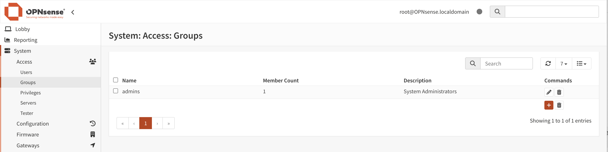

=======================
Users & Groups
=======================

With the local user manager of OPNsense one can add users and groups and define
the privileges for granting access to certain parts of the GUI (Web Configurator).

Adding Users
------------
To add a new user go to :menuselection:`System --> Access --> Users` and click on the **+** sign at
the bottom right corner of the form.

========================== =========== =========================================================
 **Disabled**               Unchecked   *Can be used to (temporarily) disable an account*
 **Username**               John        *A unique username*
 **Password**               secret      *A strong password*
 **Login shell**            /bin/csh    *The shell to use when logging in via the console.*
 **Full name**              John Doe    *Optional, Full username*
 **Expiration date**                    *Optional, if account should expire enter as mm/dd/yyy*
 **Group Membership**                   *Optional, select one or more groups*
 **Certificate**                        *Optional, check if a user certificate should be created*
 **OTP seed**                           *Optional, enter or generate a OTP seed (base32)*
 **Authorized keys**                    *Optional, paste ssh key for ssh console access*
 **IPsec Pre-Shared Key**               *Optional, IPsec PSK*
========================== =========== =========================================================

Creating Groups
---------------
Go to :menuselection:`System --> Access --> Groups` and click on the **+** sign in the lower right
corner of the form.

Enter a **Group name** and a **Description** and add users to the group.

