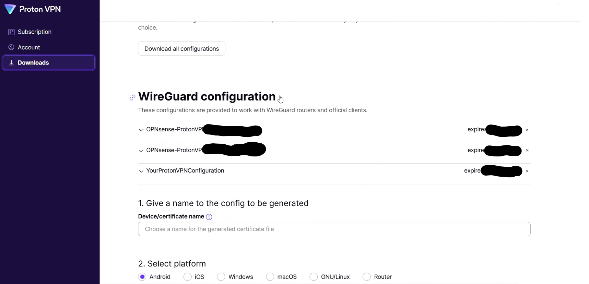

=======================================
WireGuard ProtonVPN Road Warrior Setup
=======================================

------------
Introduction
------------

ProtonVPN is a cloud-based VPN provider, offering secure tunneling with respect to privacy. 
To set up a WireGuard VPN to ProtonVPN we assume you are familiar with the concepts of WireGuard that
you have read the basic howto :doc:`wireguard-client`.

-----------------------------------------
Step 1 - Download ProtonVPN configuration
-----------------------------------------

The configuration is available in the ProtonVPN website.
The `landing page <https://account.protonvpn.com/dashboard>`__ appears after signing in. 
Click on Downloads from the left hand panel or go to the `downloads page <https://account.protonvpn.com/downloads>`__ and
scroll down to the `Wireguard configuration <https://account.protonvpn.com/downloads#wireguard-configuration>`__

The existing Wireguard configurations appear first with their expiration dates and following are the options to generate new ones.

1.1 Select a name for the generated configuration
-------------------------------------------------

.. image:: images/proton_configuration_name.png
   :width: 25%

.. Note::
    If one is not provided a unique ID will be generated by ProtonVPN

1.2 Select platform
-------------------------------

Select Router as a platform

.. image:: images/proton_platform_selection.png
   :width: 25%

1.3 Select VPN options
----------------------

There are 3 options for NetShield blocker filtering

1.  No filtering
2.  Block malware
3.  Block malware, ads and trackers

There are also options to enable Moderate NAT, NAT-PMP (Port Forwarding) and VPN accelerator as well. The features are documented in the ProtonVPN website.

.. image:: images/proton_vpn_filter_options.png
   :width: 25%

1.4 Select a server to connect to
---------------------------------

ProtonVPN proposes the best server or allows the user to select manually.

.. image:: images/proton_server_select_1.png
   :width: 25%

There are 2 main choices:

1.  Standard vs Secure Core configuration
2.  Exit country

Pick the one that satisfies your requirements and click on `Create` to generate the configuration.
Upon successful completion a window like the following will appear on the screen.

The full configuration looks like this:

.. code-block:: none

    [Interface]
    # Bouncing = 0
    # NetShield = 1
    # Moderate NAT = off
    # NAT-PMP (Port Forwarding) = off
    # VPN Accelerator = on
    PrivateKey = 2Kh7TlGz+7PCFa0jEHat8IWkYZgPmDLAiagGq+dyLks=
    Address = 10.2.0.2/32
    DNS = 10.2.0.1

    [Peer]
    # NO#21
    PublicKey = KOITt3KQ72LHPbpVp7kp4cQo/qw2qvKPrN732UTWWFw=
    AllowedIPs = 0.0.0.0/0
    Endpoint = 146.70.170.18:51820

.. Note::
    The private key disappears after creating the configuration so it must be stored. It will be used in the following
    section to generate the public key. Both are needed for successful configuration.

.. Warning::
    **Do not re-use the private keys in these examples**

---------------------------------------------
Step 2 - Generate public key from private key
---------------------------------------------

ProtonVPN, unlike Mullvad or other WG implementations, only provides a private key. The private key appears briefly when generating the configuration in the web UI.
The public key will be derived from the private key with the "wg pubkey" command.

`Windows`

.. code-block:: sh

    echo wgPrivateKey | wg pubkey

`Linux`

.. code-block:: sh

    wg pubkey < wgPrivateKey > wgPublicKey.pub

----------------------------------
Step 3 - Setup WireGuard Instance
----------------------------------

- Go to :menuselection:`VPN --> WireGuard --> Instances`
- Click **+** to add a new Instance configuration
- Turn on “advanced mode"
- Configure the Instance from the downloaded ProtonVPN configuration as follows (if an option is not mentioned below, leave it as the default):

    ===================== ===============================================================================================
     **Enabled**           *Checked*
     **Name**              *Call it whatever you want (eg* :code:`ProtonVPN-ExitCountry` *)*
     **Public Key**        *Insert the derived public key from the previous step*
     **Private Key**       *Insert the* :code:`PrivateKey` *field from the* :code:`\[Interface\]` *section*
     **Listen Port**       *51820 or a higher numbered unique port*
     **MTU**               *Needs to be 80 bytes shorter than normal MTU. Default 1420*
     **DNS Server**        *Insert the* :code:`DNS` *field from the* :code:`\[Interface\]` *section as is (without subnet mask)*
     **Tunnel Address**    *Insert the* :code:`Address` *field from the* :code:`\[Interface\]` *section` in CIDR format, eg 10.2.0.2/32*
     **Peers**             *Leave blank for now*
     **Disable Routes**    *Checked*
     **Gateway**           *Insert the same address as in the `DNS Server` field above*
    ===================== ===============================================================================================

- **Save** the Instance configuration, and then click **Apply**

-------------------------------
Step 4 - Configure the peer
-------------------------------

- Go to :menuselection:`VPN --> WireGuard --> Peers`
- Click **+** to add a new Peer
- Configure the Peer from the downloaded ProtonVPN configuration as follows (if an option is not mentioned below, leave it as the default):

    ====================== ====================================================================================================
     **Enabled**            *Checked*
     **Name**               *Call it whatever you want (eg* :code:`ProtonVPN_Location` *)*
     **Public Key**         *Insert the* :code:`PublicKey` *field from the* :code:`\[Peer\]` *section*
     **Allowed IPs**        *0.0.0.0/0*
     **Endpoint Address**   *Insert the IP address from the* :code:`Endpoint` *field in the* :code:`\[Peer\]` *section*
     **Endpoint Port**      *Insert the port number from the* :code:`Endpoint` *field in the* :code:`\[Peer\]` *section*
     **Instances**          *Select the instance configured in the previous step*
     **Keepalive**          *25*
    ====================== ====================================================================================================

- **Save** the Peer configuration, and then click **Apply**

.. Note::
    The UI for configuring the Instances and Peers changed with OPNsense verion 23.7.9 so some of the fields may be in different
    places.

--------------------------
Step 4 - Turn on WireGuard
--------------------------

Turn on WireGuard under :menuselection:`VPN --> WireGuard --> General` if it is not already on

----------------------------------------------------
Step 5 - Configure assignments, gateways and routing
----------------------------------------------------

The rest of the steps are mostly the same as described in the how-to on selective routing :doc:`wireguard-selective-routing`

-------------------
ProtonVPN DNS leaks
-------------------
Since ProtonVPN provides a DNS server an extra firewall rule may be required to route the DNS traffic to the
Wireguard gateway.

- Go to :menuselection:`Firewall --> Rules --> [Name of interface for network in which hosts/network resides, eg LAN for LAN hosts]`
- Click **Add** to add a new rule
- Configure the rule as follows (if an option is not mentioned below, leave it as the default):

    ============================ ====================================================================================================================
     **Action**                   *Pass*
     **Quick**                    *Checked*
     **Interface**                *Whatever interface you are configuring the rule on*
     **Direction**                *in*
     **TCP/IP Version**           *IPv4*
     **Protocol**                 *TCP/UDP*
     **Source / Invert**          *Unchecked*
     **Source**                   *IP of your DNS server*
     **Destination / Invert**     *Checked*
     **Destination**              *Select the* :code:`RFC1918_Networks` *Alias you created above in the dropdown*
     **Destination port range**   *DNS - DNS*
     **Description**              *Add one if you wish to*
     **Gateway**                  *Select the Wireguard gateway created according to the selective routing how-to page (eg* :code:`WAN_ProtonVPN` *)*
    ============================ ====================================================================================================================

- **Save** the rule, and then click **Apply Changes**
- Then make sure that the new rule is **above** any other rule on the interface that would otherwise interfere with its operation. For example, you want your new rule to be above the “Default allow LAN to any rule”

In layman terms if the DNS server makes any requests to a non-local address it will go through the VPN gateway.

All images from `ProtonVPN` website are the property of `ProtonVPN` and are used with written permission.

