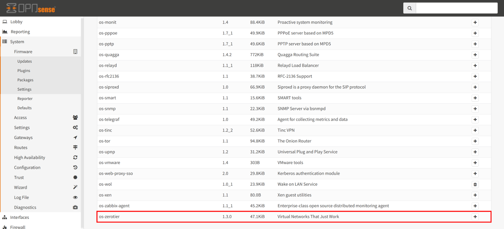
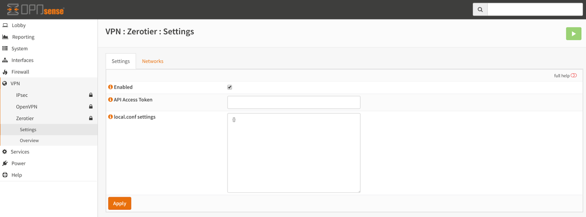
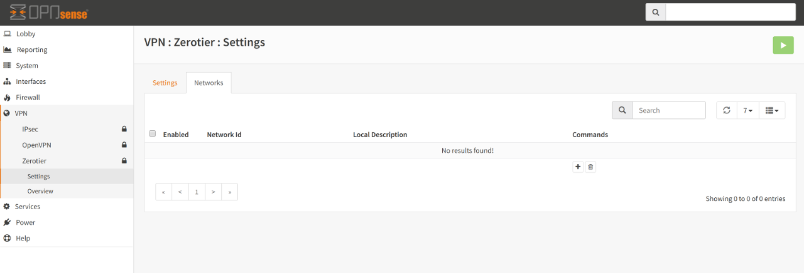
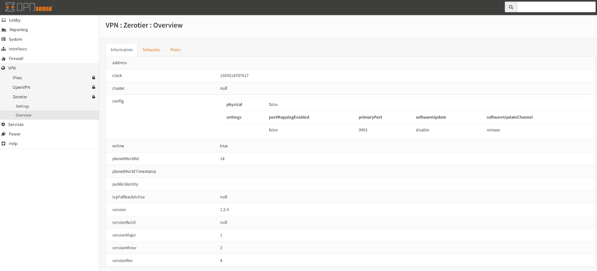
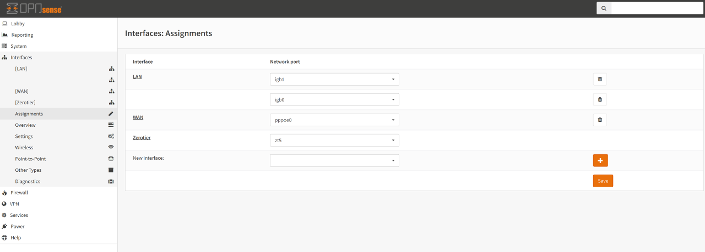
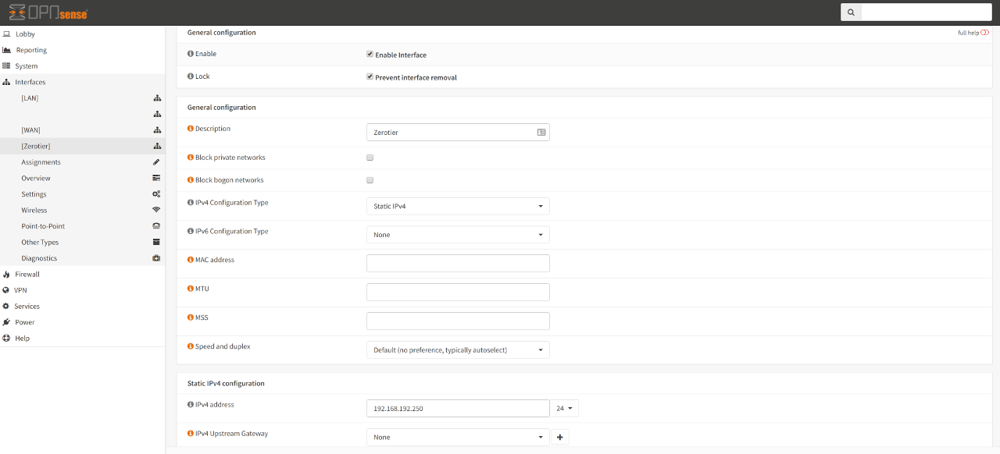

Zerotier Configuration
======================

.. Note::
    It is strongly recommended that the reader familiarise themselves with the
    `Zerotier Manual <https://www.zerotier.com/manual.shtml>`_, in order to further
    understand the concepts behind this plugin.

Prerequisites
--------------

Firstly, it is important that you have signed up to Zerotier at the `Zerotier
Portal <https://my.zerotier.com>`_. Second, you will need to create at least
one network on the portal in order to obtain a Network Id that this plugin
uses to **join** this node to the created Zerotier network. This network will
become your private network that by default is visible only to your nodes - in
other words, other nodes that are on that network can talk to each other, but
nothing else can talk to them - they are completely transparent to the
internet in general.  In effect you are layering a private network over the
public internet and all intra-node communication is encrypted and private
between them. This is further hinted at by the fact that the assigned IP
addresses are normally RFC1918 addresses, i.e., non-routable across the
internet.

Finally, in order to have a fully functioning private VPN between Zerotier
nodes, a combination of this plugin plus some configuration on the `portal
<https://my.zerotier.com>`_ **will** be required.

Installation
------------

From the Plugins view under ``System...Firmware``, install the os-zerotier
package. Once the new plugin has been installed, perform a page reload and a
new menu item should appear under VPN called Zerotier.

Clicking on the Zerotier menu item will reveal two further sub-menu items -
namely Settings and Overview.  Clicking on "Settings" will present a new view
with two named tabs. The first tab is called Settings and the second tab is
called Networks. These are further described below.

Settings
--------

This tab controls the overall operation of Zerotier. Anything changed here is
applied globally to all defined networks and to the Zerotier service itself.

:Enabled:
    Controls if the service should be running. If it is disabled, then access
    to the Networks tab will be disabled. If it is enabled, access to the
    Networks tab will be enabled and the service will also start at boot time.

:API Access Token (optional):
    This optional entry is for future use and further development of the
    Zerotier plugin. The API access token can be generated by logging into
    your `portal <https://my.zerotier.com>`__ and creating a new API Access Token.
    When the token has been generated, copy the value into this input box.

:local.conf settings (optional):
    As described in the Zerotier Manual, a local.conf can be created to enable
    or disable custom node-specific configuration overrides. Further details of
    permitted options can be found on the `ZeroTier Manual
    <https://www.zerotier.com/manual.shtml>`__. Please note that the local.conf
    **must** be a valid JSON document otherwise the service will fail to start.

Networks
--------

This table allows for the creation, modification and deletion of Zerotier
networks. Adding a Network here will join your OPNsense installation to the
specified Zerotier network.

.. Note::
    Remember, you **will** have to log into the Zerotier `portal
    <https://my.zerotier.com>`__, select the network and authorise the node before
    it can be assigned an IP address (or indeed, talk to other nodes on that
    network).

Adding a network is quite straight-forward. Simply click on the + symbol key
in the following:

:Network Id:
    This is the 64-bit (16 character hex) address that is generated on the
    portal when creating a Zerotier network.

:Local Description (optional):
    You may key in a description here that will help you remember what the
    network is for. Please note that this field is **not** the same as the
    name/description of the Zerotier network - it's simply an aide-mémoire to
    help you remember what the network is for.

Adding a network does **not** automatically cause your OPNsense installation
to join that network. In order to join that network it **must** be ``Enabled``
first. Likewise, to remove your OPNsense node from the configured network
simply deselect ``Enabled``, thus disabling the network.

Once a network has been added and enabled the node **must** be authorised to
join the network on the portal. Simply enabling the network on your OPNsense
installation marks that node as a member of that network. It now has to
request permission to talk to the other nodes on that network. To achieve
this, you log into the portal, select the network, find the node address (this
can found on the OPNsense Zerotier Overview menu item, under the Information
tab) and authorise it by clicking on the "Auth?" check box beside the node. It
should go from "red" to "green" to indicate that it has been authorised.

Some final "Network" operations:

If you wish to completely remove the network, simply select the network and
click on the ``Bin`` icon.

If you wish to edit the network, click on the ``Pencil`` icon.

To "clone" the network entry, click on the ``Copy`` icon. Please ensure you
change the Network Id, as having two networks with the same id is an invalid
configuration.

For a very quick overview of the Zerotier network information, click on the
``Information`` icon. A more detailed view of the network can be found under
the ``Overview...Networks`` menu item.

ZeroTier Overview
-----------------

The following 3 tabs reveal Global, Network and Peer information. They can
only be viewed if the Zerotier plugin is enabled, so please ensure that the
service is enabled first. For information on the terminology used, please
refer to the `Zerotier Manual <https://www.zerotier.com/manual.shtml>`__.

Information Overview
--------------------

This tab shows "Global" information concerning the overall health of the
Zerotier service.

Networks Overview
------------------

This tab shows each configured **and** enabled network that this OPNsense
installation has joined. If no networks are enabled, no information is shown.

Peers Overview
--------------

This tab shows the peers (leaf, planets and moons - Zerotier terminology) known
by this node.

Interface Assignment
--------------------

.. WARNING::
    It is **highly** recommended that the interface have auto-assignment of IP
    addresses turned off **for this particular node only**. You want to give
    the interface a statically assigned, stable IP address (from the Zerotier
    network IP range) and not have the Zerotier service auto-assign an IP
    address.  Auto-assignment of IP addresses for nodes is controlled on the
    `Zerotier Portal <https://my.zerotier.com>`_ 

After joining a Zerotier network (and authorising it on the portal) you may
now wish to assign the Zerotier virtual interface on OPNsense in order to
avail of OPNsense functionality such as firewalling and routing (using OSPF
for example).

To achieve this:

Click on the ``Interfaces`` menu item, then click on ``Assignments``. There
you should discover a new interface currently unassigned that begins with the
letters ``zt``. Next, click on the ``+`` symbol to assign it. In this example
it creates a new interface called ``OPT1``. Clicking on ``OPT1`` shows the
``Enable`` and ``Lock`` options. Check both options.

.. WARNING::
    It is **very** important that ``Lock`` (i.e., Prevent interface removal)
    is enabled. This is because Zerotier is a software interface and not
    guaranteed to be brought "up" whilst the system is booting. It could
    happen shortly afterwards, hence locking the interface tells OPNsense not
    to remove it, thinking it's gone bad.

Once the new interface has been enabled, it is recommended to change the
Description away from ``OPT1`` to something more descriptive for your needs.

For ``IPv4 Configuration Type``, choose ``Static IPv4`` then in the
appropriate input boxes, key in the IPv4 address that you have assigned to
this node via the ``Zerotier`` portal. Keep the ``IPv4 Upstream Gateway`` set
to ``None.``

You may choose to do the same for ``IPv6 Configuration Type``.

Once the interface has been assigned with an IP, it show now also show up on
``Firewall`` Rules etc...plus any other operations that be done on a
interfaces can also be applied to your assigned interface.
