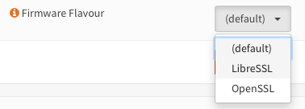

=====================================
Initial Installation & Configuration
=====================================

.. rubric:: Software setup
   :name: firstHeading
   :class: firstHeading page-header

.. Note::
   Just looking on how to invoke the installer? When the live environment has been
   started just login with user **installer** and password **opnsense**.

------------
Architecture
------------

The **software setup** and installation of OPNsense® is available for
`x86-32 <https://en.wikipedia.org/wiki/X86-32>`__ and
`x86-64 <https://en.wikipedia.org/wiki/X86-64>`__ bit microprocessor
architectures.

----------------
Embedded vs Full
----------------

Full installs can run on `SD memory
cards <https://en.wikipedia.org/wiki/Secure_Digital>`__, `solid-state
disks (SSD) <https://en.wikipedia.org/wiki/Solid-state_drive>`__ or
`hard disk drives
(HDD) <https://en.wikipedia.org/wiki/Hard_disk_drive>`__.

Since version 15.1.10 (04 May 2015) the option to install an
`embedded <https://en.wikipedia.org/wiki/Embedded_operating_system>`__
OPNsense image is also supported.

The main differences between an embedded image and a full image are:

+-----------------------+-----------------------+
| Embedded              | Full                  |
+=======================+=======================+
| Uses NanoBSD          | Uses FreeBSD          |
+-----------------------+-----------------------+
| Writes to RAM disk    | Writes to local disk  |
+-----------------------+-----------------------+
| No log data retention | Log data retention    |
| after reboot          | after reboot          |
+-----------------------+-----------------------+
| Not intended for      | Suitable for disk     |
| local disk writes     | writes.               |
+-----------------------+-----------------------+
| Embedded only use     | Can enable RAM disk   |
|                       | for embedded mode.    |
+-----------------------+-----------------------+

Embedded images (nanobsd) store logging and cache data in memory only, while full versions
will keep the data stored on the local drive. A full version can mimic the
behavior of an embedded version by enabling RAM disks, this is especially
useful for SD memory card installations.

.. Warning::
    See the chapter :doc:`Hardware Setup <hardware>` for
    further information on hardware requirements prior to an install.

--------
Download
--------

The OPNsense distribution can be `downloaded <https://opnsense.org/download>`__
from one of our `mirrors <https://opnsense.org/download>`__.

------------------
Installation Media
------------------
Depending on you hardware and use case different installation media are provided:

+--------+-----------------------------------------------------+
|Type    | | Description                                       |
+========+=====================================================+
| dvd    | | ISO installer image with live system capabilities |
|        | | running in VGA-only mode                          |
+--------+-----------------------------------------------------+
| vga    | | USB installer image with live system capabilities |
|        | | running in VGA-only mode                          |
+--------+-----------------------------------------------------+
| serial | | USB installer image with live system capabilities |
|        | | running in serial console (115200) mode with      |
|        | | secondary VGA support (no kernel messages though) |
+--------+-----------------------------------------------------+
| nano   | | a preinstalled serial image for 4GB USB sticks,   |
|        | | SD or CF cards for use with embedded devices      |
+--------+-----------------------------------------------------+

.. Warning::

  Flash memory cards will only tolerate a limited number of writes
  and re-writes. For embedded (nano) versions memory disks for /var and /tmp are
  applied by default to prolong CF (flash) card lifetimes.

  To enable for non embedded versions: Enable **System⇒Settings⇒Miscellaneous⇒RAM** Disk
  Settings; afterwards reboot. Consider to enable an external syslog server as well.

------------------------------
Media Filename Composition
------------------------------
.. blockdiag::
  :scale: 100%

   diagram {
     default_shape = roundedbox;
     default_node_color = white;
     default_linecolor = darkblue;
     default_textcolor = black;
     default_group_color = lightgray;

     OS [label="OPNsense-##.#.##-OpenSSL-", width=200];

     platform_1 [label = "i386-" ];
     platform_2 [label = "amd64-" ];

    OS -> dvd-;

    group {
       orientation = portrait
       label = "Type";
       fontsize = 20;

       dvd- -> nano- -> serial- -> vga-;

     }

     group {
        orientation = portrait
        label = "Architecture";
        fontsize = 20;

        platform_1 -> platform_2;

     }

     group {
          orientation = portrait
          label = "Image Format";
          fontsize = 20;

          "iso.bz2" -> "img.bz2";

     }

     dvd- -> platform_1 -> "iso.bz2";

   }

.. Note::

  **Please** be ware that the latest installation media does not always
  correspond with the latest released version. OPNsense installation images are
  provided on a regular bases together with mayor versions in January and July.
  More information on our release schedule is available from our package
  repository see `README <https://pkg.opnsense.org/releases/16.1/README>`__

--------------------
OpenSSL and LibreSSL
--------------------

OPNsense images are provided based upon `OpenSSL <https://www.openssl.org>`__.
The `LibreSSL <http://www.libressl.org>`__ flavor can be selected from within
the GUI ( System⇒Firmware⇒Settings ). In order to apply your choice an update
must be performed after save, which can include a reboot of the system.

-------------------
Installation Method
-------------------

Download the installation image from one of the mirrors listed on the `OPNsense
<https://opnsense.org/download/>`__ website.

The easiest method of installation is the USB-memstick installer. If
your target platform has a serial interface choose the "serial image.
64-bit and 32-bit install images are provided. The following examples
apply to both.

Write the image to a USB flash drive (>= 1GB) or an IDE hard disk,
either with dd under FreeBSD or under Windows with physdiskwrite

Before writing an (iso) image you need to unpack it first (use bunzip2).

**FreeBSD**
::

  dd if=OPNsense-##.#.##-[Type]-[Architecture].img of=/dev/daX bs=16k

Where X = the device number of your USB flash drive (check ``dmesg``)

**Linux**
::

  dd  if=OPNsense-##.#.##-[Type]-[Architecture].img of=/dev/sdX bs=16k

where X = the IDE device name of your USB flash drive (check with hdparm -i /dev/sdX)
(ignore the warning about trailing garbage - it's because of the digital signature)

**OpenBSD**

::

     dd if=OPNsense-##.#.##-[Type]-[Architecture].img of=/dev/rsd6c bs=16k

The device must be the ENTIRE device (in Windows/DOS language: the 'C'
partition), and a raw I/O device (the 'r' in front of the device "sd6"),
not a block mode device.

**Mac OS X**

::

      sudo dd  if=OPNsense-##.#.##-[Type]-[Architecture].img of=/dev/rdiskX bs=64k

where r = raw device, and where X = the disk device number of your CF
card (check Disk Utility) (ignore the warning about trailing garbage -
it's because of the digital signature)

**Windows**

::

      physdiskwrite -u OPNsense-##.#.##-[Type]-[Architecture].img

(use v0.3 or later!)

.. rubric:: Install Instructions
   :name: install-to-system

The boot process gives you the opportunity to run several optional configuration
steps. It has been designed to always boot into a live environment in order to
be able to access the GUI or even SSH directly. If a timeout was missed simply
restart the boot procedure.

OPNsense Importer
-----------------
All images feature the new "opnsense-importer" utility, which is now invoked
instead of the early installer. You can stop the automatic timeout by pressing
any key. Afterwards you will have the opportunity to select a disk to import
from. If the option times out or the importer is exited without a disk selection,
the factory defaults will be used for the boot.

The next prompt will be for manual interface selection.
This step is well-established since OPNsense 15.7 .

Live environment
----------------
The system will then continue into a live environment. If the config importer
was used previously on an existing installation, the system will boot up with a
fully functional setup, but will not overwrite the previous installation. Use
this feature for safely previewing upgrades.

If you have used a DVD, VGA, Serial image you are by default able to log into
the root shell using the user "root" with password "opnsense" to operate the
live environment.

The GUI will listen on https://192.168.1.1/ for user "root" with password
"opnsense" by default unless a previous configuration was imported. Using SSH,
the "root" and "installer" users are available as well on IP 192.168.1.1. Note
that these install medias are read-only, which means your current live
configuration will be lost after reboot.

Nano image
----------
If you have used a Nano image, your system is already up and running as it is
designed as such. It is set to read-write attempting to minimise write cycles by
mounting relevant partitions as memory file systems and reporting features
disabled by default.

Create a bootable USB flash drive with the downloaded and unpacked image
file. Configure your system to boot from USB.

Install to target system
------------------------
If you have used a DVD, VGA, Serial image you are by default able to start the
installer using the user "installer" with password "opnsense". On a previously
imported configuration the password will be the same as root's password.

Should the installer user not work for any reason, log in as user "root", select
option 8 from the menu and type "opnsense-installer". The "opnsense-importer" can
be run this way as well should you require to run the import again.

The installer can always be run to clone an existing system, even for Nano
images. This can be useful for creating live backups for later recovery.

The installation process involves a few simple steps.

.. Note::
   To invoke the installer login with user **installer** and password
   **opnsense**

.. Tip::
   The installer can also be started from the network using ssh, default ip
   address is 192.168.1.1

#. Configure console - The default configuration should be fine for most
   occasions.
#. Select task - The **Quick/Easy Install** option should be fine for most
   occasions. For installations on embedded systems or systems with minimal
   diskspace choose **Custom Installation** and do not create a swap slice.
   Continue with default settings.
#. **Are you SURE?** - When proceeding OPNsense will be installed on the
   **first hard disk** in the system.
#. Reboot - The system is now installed and needs to be rebooted to
   continue with configuration.

.. Warning::
   You will lose all files on the installation disk. If another disk is to be
   used then choose a Custom installation instead of the Quick/Easy Install.

---------------------
Initial configuration
---------------------
After installation the system will prompt you for the interface
assignment, if you ignore this then default settings are applied.
Installation ends with the login prompt.

By default you have to log in to enter the console.

**Welcome message**
::

    * * * Welcome to OPNsense [OPNsense 15.7.25 (amd64/OpenSSL) on OPNsense * * *
     
    WAN (em1)     -> v4/DHCP4: 192.168.2.100/24
    LAN (em0)     -> v4: 192.168.1.1/24
     
    FreeBSD/10.1 (OPNsense.localdomain) (ttyv0)
     
    login:   

.. TIP::

    A user can login to the console menu with his
    credentials. The default credentials after a fresh install are username "root"
    and password "opnsense".

VLANs and assigning interfaces
    If choose to do manual interface assignment or when no config file can be
    found then you are asked to assign Interfaces and VLANs. VLANs are optional.
    If you do not need VLAN's then choose **no**. You can always configure
    VLAN's at a later time.

LAN, WAN and optional interfaces
    The first interface is the LAN interface. Type the appropriate
    interface name, for example "em0". The second interface is the WAN
    interface. Type the appropriate interface name, eg. "em1" . Possible
    additional interfaces can be assigned as OPT interfaces. If you
    assigned all your interfaces you can press [ENTER] and confirm the
    settings. OPNsense will configure your system and present the login
    prompt when finished.

Minimum installation actions
    In case of a minimum install setup (i.e. on CF cards), OPNsense can
    be run with all standard features, expect for the ones that require
    disk writes, e.g. a caching proxy like Squid. Do not create a swap
    slice, but a RAM Disk instead. In the GUI enable **System⇒Settings⇒Miscellaneous⇒RAM Disk Settings**
    and set the size to 100-128 MB or more, depending on your available RAM.
    Afterwards reboot.

**Enable RAM disk manually**

.. image:: ./images/Screenshot_Use_RAMdisks.png
   :width: 100%

Then via console, check your /etc/fstab and make sure your primary
partition has **rw,noatime** instead of just **rw**.

.. rubric:: Console
   :name: console

The console menu shows 13 options.

::

   0)     Logout                              7)      Ping host
   1)     Assign interfaces                   8)      Shell
   2)     Set interface(s) IP address         9)      pfTop
   3)     Reset the root password             10)     Filter logs
   4)     Reset to factory defaults           11)     Restart web interface
   5)     Reboot system                       12)     Upgrade from console
   6)     Halt system                         13)     Restore a configuration

Table:  *The console menu*

.. rubric:: opnsense-update
   :name: opnsense-update

OPNsense features a command line
interface (CLI) tool "opnsense-update". Via menu option **8) Shell**, the user can
get to the shell and use opnsense-update.

For help type *opnsense-update -help* and [Enter]

.. rubric:: Upgrade from console
   :name: upgrade-from-console

The other method to upgrade the system is via console option **12) Upgrade from console**

.. rubric:: GUI
   :name: gui

An update can be done through the GUI via **System⇒Firmware⇒Updates**.

.. image:: ./images/firmware-update.png
   :width: 100%
