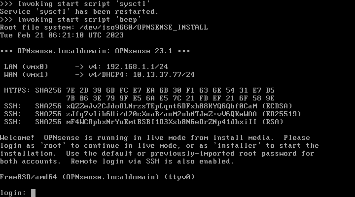
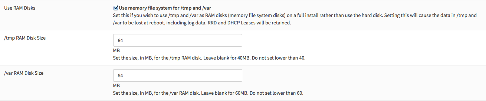
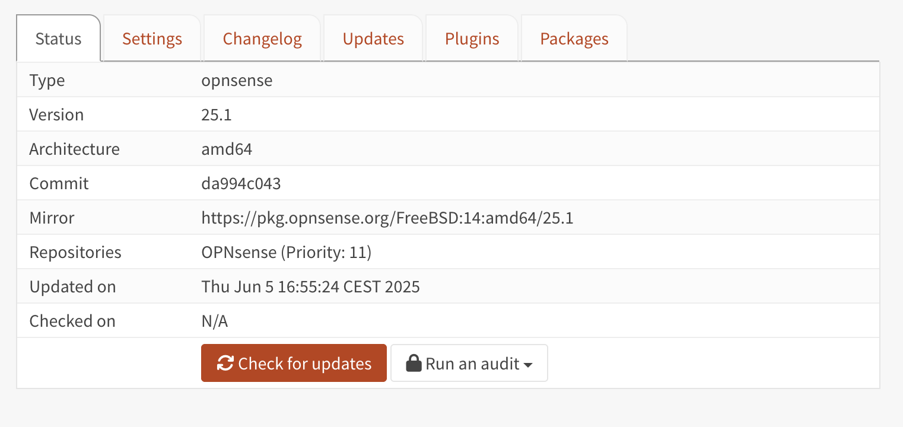

=====================================
Initial Installation & Configuration
=====================================

.. Note::
   Just looking on how to invoke the installer? When the live environment has been
   started just login with user **installer** and password **opnsense**.

.. contents:: Index

------------
Architecture
------------

The **software setup** and installation of OPNsense® is available
for the `x86-64 <https://en.wikipedia.org/wiki/X86-64>`__ microprocessor
architecture only.

----------------
Embedded vs Full
----------------

OPNsense offers two Image types with all major releases: embedded and full images.
The Embedded Image is intended for environments where preinstalling
the storage media is required due to a lack of local resources on the firewall
like storage, and/or console access (VGA/Serial).  The image is tailored to reduce
write cycles as well, but the image can be used anywhere.  Another reason for the
Embedded Image is to eliminate the need for local console access for installing OPNsense.
Installation is managed by prewriting the image to a storage device, installing the
storage device, and booting the system.

Full Images provide installation tools like OPNsense Importer, Live Environment,
and Installer.  Full Images are released to support different console/hardware installation
requirements.

Both image types can be installed and run from virtual disks (VM), `SD memory
cards <https://en.wikipedia.org/wiki/Secure_Digital>`__,
USB disks, `solid-state
disks (SSD) <https://en.wikipedia.org/wiki/Solid-state_drive>`__, or `hard disk drives
(HDD) <https://en.wikipedia.org/wiki/Hard_disk_drive>`__.

The main differences between embedded and full images are:

+-----------------------+-----------------------+
| Embedded              | Full                  |
+=======================+=======================+
| Writes to RAM disk    | Writes to local disk  |
+-----------------------+-----------------------+
| No log data retention | Log data retention    |
| after reboot          | after reboot          |
+-----------------------+-----------------------+
| Not intended for      | Suitable for disk     |
| local disk writes     | writes.               |
+-----------------------+-----------------------+
| Embedded only use,    | Can enable RAM disk   |
| SWAP file is optional | for embedded mode.    |
+-----------------------+-----------------------+

Embedded image store logging and cache data in memory only, while full versions
will keep the data stored on the local drive. A full version can mimic the
behavior of an embedded version by enabling RAM disks, this is especially
useful for SD memory card installations.

.. Warning::
    See the chapter :doc:`Hardware Sizing & Setup <hardware>` for further information
    on hardware requirements prior to an install.

-------------------------------
Installation Images
-------------------------------

Depending on your hardware and use case, different installation options are available:

+--------+---------------------------------------------------+------------+
| Type   | Description                                       | Image Type |
+========+===================================================+============+
| dvd    | ISO image boots into a live environment in        | Full       |
|        | VGA-only mode with UEFI support                   |            |
+--------+---------------------------------------------------+------------+
| vga    | USB image boots into a live environment           | Full       |
|        | in VGA-only mode with UEFI support                |            |
+--------+---------------------------------------------------+------------+
| serial | USB image boots into live environment running in  | Full       |
|        | serial console (115200) mode only with            |            |
|        | UEFI support                                      |            |
+--------+---------------------------------------------------+------------+
| nano   | Image for preinstalling onto >=4 GB USB drives,   | Embedded   |
|        | SD, or CF cards for use with embedded devices     |            |
|        | running in serial console (115200) mode with      |            |
|        | secondary VGA support (no kernel messages though) |            |
+--------+---------------------------------------------------+------------+

.. Note::
   All Full Image types can run both `OPNsense Importer <https://docs.opnsense.org/manual/install.html#opnsense-importer>`__
   before booting into the Live environment and also run
   `Installer <https://docs.opnsense.org/manual/install.html#install-to-target-system>`__ once booted into the Live environment.

.. Warning::
   Flash memory cards will only tolerate a limited number of writes and re-writes. For
   Nano image memory disks for **/var/log** and **/tmp** are applied by
   default to prolong CF (flash) card lifetimes.

   To enable non-embedded versions: Go to :menuselection:`System --> Settings --> Miscellaneous --> Disk / Memory Settings`,
   change the setting, then reboot. Consider enabling an external syslog server as well.

------------------------------
Image Filename Composition
------------------------------
.. blockdiag::

   diagram {
     default_shape = roundedbox;
     default_node_color = white;
     default_linecolor = darkblue;
     default_textcolor = black;
     default_group_color = lightgray;

     OS [label="OPNsense-##.#.##-OpenSSL-", width=200];

     platform [label = "amd64-" ];

    OS -> dvd-;

    group {
       orientation = portrait
       label = "Type";
       fontsize = 20;

       dvd- -> nano- -> serial- -> vga-;

     }

     group {
        orientation = portrait
        label = "Architecture";
        fontsize = 20;

        platform;

     }

     group {
          orientation = portrait
          label = "Image Format";
          fontsize = 20;

          "iso.bz2" -> "img.bz2";

     }

     dvd- -> platform -> "iso.bz2";

   }

.. Note::
   **Please** be aware that the latest installation media does not always correspond
   with the latest released version available. OPNsense installation images are provided
   on a scheduled basis with major release versions in January and July. More information
   on our release schedule is available from our package repository, see
   `README <https://pkg.opnsense.org/releases/mirror/README>`__.  We are encouraged to update
   OPNsense after installation to be on the latest release available, see
   `Update Page <https://docs.opnsense.org/manual/updates.html>`__.

-------------------------
Download and Verification
-------------------------

The OPNsense distribution can be `downloaded <https://opnsense.org/download>`__
from one of our `mirrors <https://opnsense.org/download>`__.

OpenSSL is used for image file verification.  4 files are needed for verification process:

* The SHA-256 checksum file (<filename>.sha256)
* The bzip compressed image file (<filename>.<image>.bz2)
* The signature file for the uncompressed image file (<filename>.<image>.sig)
* The openssl public key (<filename>.pub)

Use one of the OPNsense mirrors to download these files:

1. Go to the bottom of OPNSense `download <https://opnsense.org/download>`__ page.
2. Click one of the available mirrors closest to your location.
3. Download one of each file mentioned above for your Image type.

The OpenSSL public key (.pub) is required to verify against.  Although the file is
available on the mirror's repository, you should not trust the copy there. Download
it, open it up, and verify the public key matches the one from other sources. If it
does not, the mirror may have been hacked, or you may be the victim of a man-in-the-middle
attack. Some other sources to get the public key from include:

* https://pkg.opnsense.org/releases/mirror/README
* https://forum.opnsense.org/index.php?board=11.0
* https://opnsense.org/blog/
* https://github.com/opnsense/changelog/tree/master/community
* https://pkg.opnsense.org (/<FreeBSD:<version>:<architecture>/<release version>/sets/changelog.txz)

.. Note::
   Only major release announcements for images contain the public key, and update
   release announcements will not. i.e. 22.1 will have a copy of the public key in the release
   announcement, but 22.1.9 will not.

Once you download all the required files and verify that the public key matches
the public key found in one of the alternate sources listed above, you can be relatively
confident that the key has not been tampered with. To verify the downloaded image, run
the following commands (substituting the filenames in brackets for the files you downloaded):

::

   openssl sha256 OPNsense-<filename>.bz2

Match the checksum command output with the checksum values in the file ``OPNsense-<version>-OpenSSL-checksums-amd64.sha256``.
If the checksums don't match, redownload your image file.

If checksums match continue with the verification commands.

::

   openssl base64 -d -in OPNsense-<filename>.<image>.sig -out /tmp/image.sig
   openssl dgst -sha256 -verify OPNsense-<filename>.pub -signature /tmp/image.sig OPNsense-<filename>.<image>

.. Warning::

   Make sure to unpack the image using :code:`bunzip2` before verifying. Our signatures are generated before compressing them
   (as of OPNsense version 24.1)

If the output of the second command is “**Verified OK**”, your image file was verified
successfully, and its safe to install from it. Any other outputs, and you may need
to check your commands for errors, or the image file may have been compromised.

-------------------
Installation Media
-------------------

Now that you have downloaded and verified the installation image from above.  You must unpack the
image file before you can write the image to disk.
For Unix-like OSes use the following command:

::

   bzip2 -d OPNsense-<filename>.bz2

For Windows use an application like `7zip <https://www.7-zip.org/download.html>`_.  The ``.bz2`` will
be removed from the end of the filename after command/application completes.

After unpacking the image you can create the installation media. The easiest method to install
OPNsense is to use the USB "`vga <https://docs.opnsense.org/manual/install.html#installation-media>`_"
Image. If your target platform has a serial console interface choose the
“`serial <https://docs.opnsense.org/manual/install.html#installation-media>`_” image. If you
need to know more about using the serial console interface, consult the :doc:`serial access how-to<how-tos/serial_access>`.

Write the image to a USB flash drive (>=1 GB) or hard disk, using either dd for Unix-like
OSes and for Windows use physdiskwrite, `Etcher <https://www.balena.io/etcher#download-etcher>`_,
or `Rufus <https://rufus.ie/>`_.

**FreeBSD**
::

     dd if=OPNsense-##.#.##-[Type]-[Architecture].img of=/dev/daX bs=16k

Where X = the device number of your USB flash drive (check ``dmesg``)

**OpenBSD**
::

     dd if=OPNsense-##.#.##-[Type]-[Architecture].img of=/dev/rsd6c bs=16k

The device must be the ENTIRE device (in Windows/DOS language: the 'C'
partition), and a raw I/O device (the 'r' in front of the device "sd6"),
not a block mode device.

**Linux**
::

     sudo dd if=OPNsense-##.#.##-[Type]-[Architecture].img of=/dev/sdX bs=16k

where X = the IDE device name of your USB flash drive (check with hdparm -i /dev/sdX)
(ignore the warning about trailing garbage - it's because of the digital signature)

**macOS**
::

     sudo dd if=OPNsense-##.#.##-[Type]-[Architecture].img of=/dev/rdiskX bs=64k

where r = raw device, and where X = the disk device number of your CF
card (check Disk Utility) (ignore the warning about trailing garbage -
it's because of the digital signature)

**Windows**
::

     physdiskwrite -u OPNsense-##.#.##-[Type]-[Architecture].img

(use v0.3 or later!)

-------------------------
System Boot Preparation
-------------------------

After preparing the installation media, we need to make sure we can access the console
(either via keyboard and [virtual]monitor or :doc:`serial connectivity<how-tos/serial_access>`).  Next we need to know
how to access the boot menu or the system bios (UEFI) to boot from the installation media.  Most times will be a function
(F#), Del, or ESC key that needs to pressed immediately after powering on (or rebooting) the system.  Usually within the
first 2 to 3 seconds from powering up.

.. Tip::

    OPNsense devices from the `OPNsense shop <https://shop.opnsense.com/>`__ use :code:`<ESC>` to enter the bios and boot selection
    options.

.. Note::

    Serial connectivity settings for DECXXXX devices can be found  :doc:`here </hardware/serial_connectivity>`

-------------------------
Installation Instructions
-------------------------

.. rubric:: Install Instructions
   :name: install-to-system

OPNsense installation boot process allows us to run several optional configuration steps. The
boot process was designed to always boot into the live environment, allowing us to access the
GUI or even SSH directly. If a timeout was missed, restart the boot procedure.

OPNsense Importer
-----------------
All Full Images have the OPNsense Importer feature that offers flexibility in
recovering failed firewalls, testing new releases without overwriting the current
installation by running the new version in memory with the existing configuration
or migrating configurations to new hardware installations.  Using Importer is slightly
different between previous installs with existing configurations on disk vs new
installations/migrations.

For systems that have OPNsense installed, and the configuration intact.  Here is the process:

#. Boot the system with installation media
#. Press any key when you see **“Press any key to start the configuration importer”**.

   #. If you see OPNsense logo you have past the Importer and will need to reboot.

#. Type the device name of the existing drive that contains the configuration and press enter.
#. If Importer is successful, the boot process will continue into the Live environment using the stored configuration on disk.
#. If Importer was unsuccessful, we will returned to the device selection prompt.  Confirm the
   device name is correct and try again.  Otherwise, there maybe possible disk corruption and
   restoring from backup.

At this point the system will boot up with a fully functional firewall in Live enironment using existing configuration
but will not overwrite the previous installation. Use this feature for safely previewing or testing upgrades.

For New installations/migrations follow this process:

#. We must have a 2nd USB drive formatted with FAT or FAT32 File system.

   #. Preferable non-bootable USB drive.

#. Create a **conf** directory on the root of the USB drive
#. Place an *unencrypted* <downloaded backup>.xml into /conf and rename the file to **config.xml** (:code:`/conf/config.xml`)
#. Put both the Installation media and the 2nd USB drive into the system and power up / reboot.
#. Boot the system from the OPNsense Installation media via Boot Menu or BIOS (UEFI).
#. Press aany key when you see: **“Press any key to start the configuration importer”**
#. Type the device name of the 2nd USB Drive, e.g. `da0` or `nvd0` , and press Enter.

   #. If Importer is successful, the boot process will continue into the Live environment using
      the configuration stored on the USB drive.
   #. If unsuccessful, importer will error and return us to the device selection prompt. Suggest
      repeating steps 1-3 again.

Live Environment
----------------
..
   Should we state the ability to manually identify network adapters before entering the live environment?

After booting with an OPNsense Full Image (DVD, VGA, Serial), the firewall will
be in the Live environment with and without the use of OPNsense Importer.  We
can interact with the Live environment via Local Console, GUI (HTTPS), or SSH.

By default, we can log into the shell using the user :code:`root` with the password
:code:`opnsense` to operate the live environment via the local console.

The GUI is accessible at `https://192.168.1.1/ <https://192.168.1.1/>`__ using Username:
:code:`root` Password: :code:`opnsense` by default (unless a previous configuration was imported).

Using SSH we can access the firewall at IP **192.168.1.1** .  Both the **root** and **installer**
users are available with the password specified above.

.. Note::
   That the installation media is read-only, which means your current live configuration will
   be lost after reboot.

Continue to `OPNsense Installer`_ to install OPNsense to the local storage device.

OPNsense Installer
---------------------
.. Note::
   To invoke the installer login with user **installer** and password
   **opnsense**

After successfully booting up with the OPNsense Full Image (DVD, VGA, Serial),
the firewall will be at the Live Environment's login: prompt.  To start the
installation process, login with the user ``installer`` and password ``opnsense``.
If Importer was used to import an existing configuration, the installer and root
user password would be the root password from the imported configuration.

If the installer user does not work, log in as user root and select: ``8) Shell``
from the menu and type ``opnsense-installer``.  The ``opnsense-importer`` can also
be run this way should you require to rerun the import.

The installer can always be run to clone an existing system, even for Nano
images. This can be useful for creating live backups for later recovery.

.. Tip::
   The installer can also be started from an inside host using ssh.  Default ip
   address is ``192.168.1.1``

The installation process involves the following steps:

#. Keymap selection - The default configuration should be fine for most Occasions.
#. Install (UFS|ZFS) - Choose UFS or ZFS filesystem. ZFS is in most cases the best option
   as it is the most reliable option, but it does require enough capacity (a couple of gigabytes at least).
#. Partitioning (ZFS) - Choose a device type. The default option (stripe) is usually acceptable
   when using a single disk.
#. Disk Selection (ZFS) - Select the Storage device e.g. ``da0`` or ``nvd0``
#. Last Chance! - Select Yes to continue with partitioning and to format the disk. However, doing
   so will **destroy** the contents of the disk.
#. Continue with recommended swap (UFS) - Yes is usually fine here unless the install target
   is very small (< 16GB)
#. Select Root Password - Change and confirm the new root password
#. Select Complete Install - Exits the installer and reboots the machine. The system is now installed
   and ready for initial configuration.

.. Warning::
   You will lose all files on the installation disk. If another disk is to be
   used then choose a Custom installation instead of the Quick/Easy Install.

Nano Image
----------

To use the nano image follow this process:

#. Create the system disk with using the nano image.  See `Installation Media`_
   how to write the nano image to disk.
#. Install the system disk drive into the system.
#. Configure the system (BIOS) to boot from this disk.
#. After the system boots, the firewall is ready to be configured.

Using the nano image for embedded systems, your firewall is already up and running. The configuration
settings to enable Memory Disks (RAM disks) that minimize write cycles to relevant partitions by
mounting these partitions in system memory and reporting features are disabled by default.

---------------------
Initial Configuration
---------------------
After installation the system will prompt you for the interface
assignment, if you ignore this then default settings are applied.
Installation ends with the login prompt.

By default you have to log in to enter the console.

**Welcome message**
::

    * * * Welcome to OPNsense [OPNsense 15.7.25 (amd64/OpenSSL) on OPNsense * * *
     
    WAN (em1)     -> v4/DHCP4: 192.168.2.100/24
    LAN (em0)     -> v4: 192.168.1.1/24
     
    FreeBSD/10.1 (OPNsense.localdomain) (ttyv0)
     
    login:   

.. TIP::

    A user can login to the console menu with his
    credentials. The default credentials after a fresh install are username "root"
    and password "opnsense".

VLANs and assigning interfaces
    If choose to do manual interface assignment or when no config file can be
    found then you are asked to assign Interfaces and VLANs. VLANs are optional.
    If you do not need VLANs then choose **no**. You can always configure
    VLANs at a later time.

LAN, WAN and optional interfaces
    The first interface is the LAN interface. Type the appropriate
    interface name, for example "em0". The second interface is the WAN
    interface. Type the appropriate interface name, eg. "em1" . Possible
    additional interfaces can be assigned as OPT interfaces. If you
    assigned all your interfaces you can press [ENTER] and confirm the
    settings. OPNsense will configure your system and present the login
    prompt when finished.

Minimum installation actions
    In case of a minimum install setup (i.e. on CF cards), OPNsense can
    be run with all standard features, except for the ones that require
    disk writes, e.g. a caching proxy like Squid. Do not create a swap
    slice, but a RAM Disk instead. In the GUI enable :menuselection:`System --> Settings --> Miscellaneous --> RAM Disk Settings`
    and set the size to 100-128 MB or more, depending on your available RAM.
    Afterwards reboot.

**Enable RAM disk manually**

Then via console, check your /etc/fstab and make sure your primary
partition has **rw,noatime** instead of just **rw**.

.. rubric:: Console
   :name: console

The console menu shows 13 options.

::

   0)     Logout                              7)      Ping host
   1)     Assign interfaces                   8)      Shell
   2)     Set interface(s) IP address         9)      pfTop
   3)     Reset the root password             10)     Filter logs
   4)     Reset to factory defaults           11)     Restart web interface
   5)     Reboot system                       12)     Upgrade from console
   6)     Halt system                         13)     Restore a configuration

Table:  *The console menu*

.. rubric:: opnsense-update
   :name: opnsense-update

OPNsense features a command line
interface (CLI) tool "opnsense-update". Via menu option **8) Shell**, the user can
get to the shell and use opnsense-update.

For help, type *man opnsense-update* and press [Enter].

.. rubric:: Upgrade from console
   :name: upgrade-from-console

The other method to upgrade the system is via console option **12) Upgrade from console**

.. rubric:: GUI
   :name: gui

An update can be done through the GUI via :menuselection:`System --> Firmware --> Updates`.

