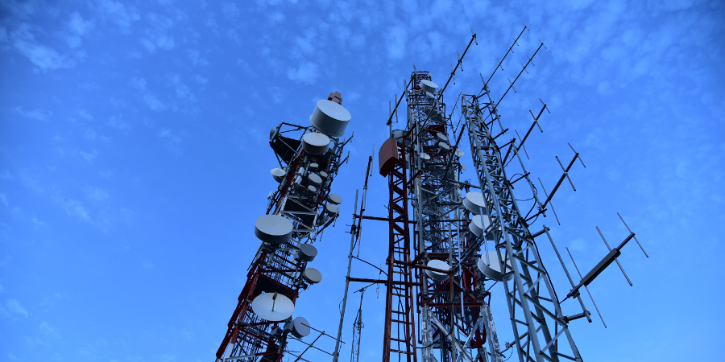

=========================
Interface configuration
=========================

All traffic in OPNsense travels via interfaces. By default, WAN and LAN are assigned, but many more are possible, like
GUESTNET (:doc:`captive portal </manual/captiveportal>`) and PFSYNC (:doc:`high availability </manual/hacarp>`).

.. Note::
    For legacy compatibility WAN interfaces set to type DHCP or interfaces with an *Upstream Gateway*
    send reply packets to the corresponding gateway directly, also when the sender is on the same interface.
    This will break connectivity in some rare scenarios and can be disabled via
    **Firewall->Settings->Advanced->Disable reply-to**.

-----------------------------
Assignments
-----------------------------

Most interfaces have to be assigned to a physical port. By default, LAN is assigned to port 0 and WAN is assigned to
port 1. Assignments can be changed by going to :menuselection:`Interfaces --> Assignments`. This lists existing
interfaces, with the interface name on the left and the physical port selected in the dropdown. New ones can be
created here as well, using a non-occupied physical port.

When creating a new interface or changing an existing one (which can be done by clicking its name in the overview),
the following options are available:

=========================== ============================================================================================================================================================
 Option                      Explanation
=========================== ============================================================================================================================================================
 **General configuration**
 Enable interface            Disable the interface without needing to remove its assignment altogether.
 Prevent interface removal   Avoids accidentally removing an interface (has to be turned off and saved before an interface can be removed).
 **General configuration**
 Description                 A short description for clarification, if the name does not suffice.
 Block private networks      Block traffic claiming to come from private addresses. On WAN interfaces, this kind of traffic should not happen legitimately.
 Block bogon networks        Block traffic claiming to come from invalid or reserved addresses (Martian packets). Note that this also includes multicast traffic using OSPF and RTMP.
 IPv4 Configuration type     How to obtain the IPv4 address for this connection.
 IPv6 Configuration type     How to obtain the IPv6 address for this connection.
 MAC Address                 Can be used to spoof the MAC address. Can usually be left blank (in which case it will use the actual MAC address of the hardware).
 MTU                         `Maximum Transfer Unit <https://en.wikipedia.org/wiki/Maximum_transmission_unit>`_.
 MSS                         `Maximum Segment Size <https://en.wikipedia.org/wiki/Maximum_segment_size>`_.
 Speed and duplex            It is recommended to leave this on the default, unless you know what you are doing and the setting you pick matches the one on the physical port.
 Dynamic gateway policy      If the destination is directly reachable via an interface requiring no intermediary system to act as a gateway,
                             you can select this option which allows dynamic gateways to be created without direct target addresses. Some tunnel types support this.
=========================== ============================================================================================================================================================

.. Note::

    When configuring VPN clients without static tunnel addresses, you can use the "Dynamic gateway policy" option to automatically generate gateways to the device (without address).

In addition to these settings, the following blocks will be enabled depending on what is configured under
“IPv4 Configuration type” and “IPv6 Configuration type”.

For IPv4:

=============================== ===============================================================================================================================================================================================================
 Option                          Explanation
=============================== ===============================================================================================================================================================================================================
 **Static IPv4 configuration**
 IPv4 address
 IPv4 Upstream Gateway           When an Upstream Gateway is set, packets entering the interface will also sent out on the same interface when replied. In addition outbound nat will be set up automatically when mode is set to *Automatic* or *Hybrid*.
 **DHCP client configuration**
 Configuration Mode
 Alias IPv4 address              Used as a fixed alias IPv4 address by the DHCP client.
 Reject Leases From              Can be used to ignore DHCP leases from ISP-issued modems, for example.
 Hostname                        This value is sent as the DHCP client identifier and hostname when requesting a DHCP lease. Some ISPs may require this (for client identification).
 Override MTU                    An ISP may incorrectly set an MTU value which can cause intermittent network disruption. By default this value will be ignored. Unsetting this option will allow to apply the MTU supplied by the ISP instead.
 **PPP configuration**
 Service Provider                By selecting a country, provider and plan here, OPNsense can fill in the other fields for you. If your provider or plan not in the list, you have to set them manually.
 Username
 Password
 Phone number
 Access Point Name (APN)
 Modem port
 Advanced PPP                    Will take you to the Point-to-Point device settings.
 **PPPoE configuration**
 Username
 Password
 Service name                    Leave blank unless specified by provider.
 Host-Uniq                       See above.
 Dial-on-demand                  Only connect when traffic is sent over the interface
 Idle timeout (seconds)
 Advanced and MLPPP              Will take you to the Point-to-Point device settings.
 **PPTP/L2TP configuration**
 Username
 Password
 Local IP address
 Remote IP address
 Dial-on-demand                  Only connect when traffic is sent over the interface
 Idle timeout (seconds)
 Advanced                        Will take you to the Point-to-Point device settings.
=============================== ===============================================================================================================================================================================================================

For IPv6:

================================= ===============================================================================================================================================
 Option                            Explanation
================================= ===============================================================================================================================================
 **Static IPv6 configuration**
 IPv6 address
 IPv6 Upstream Gateway
 Use IPv4 connectivity             Set the IPv6 address on the IPv4 PPP connectivity link.
 **DHCPv6 client configuration**
 Configuration Mode                Setting this to “Advanced” will make the settings below “Use VLAN priority” visible.
 Request only an IPv6 prefix       Only request an IPv6 prefix; do not request an IPv6 address.
 Prefix delegation size            The delegated prefix length provided by the DHCPv6 server. Normally specified by the ISP.
 Send IPv6 prefix hint             Send an IPv6 prefix hint to indicate the desired prefix size for delegation
 Use IPv4 connectivity             Set the IPv6 address on the IPv4 PPP connectivity link.
 Use VLAN priority                 Certain ISPs may require that DHCPv6 requests are sent with a specific VLAN priority.
 Interface Statement               Click the “i” to see what the four subfields do.
 Identity Association
 Prefix Interface
 Authentication
 Keyinfo
 **SLAAC configuration**
 Use IPv4 connectivity             Set the IPv6 address on the IPv4 PPP connectivity link.
 **6RD Rapid Deployment**
 6RD prefix                        The 6RD IPv6 prefix assigned by your ISP. e.g. '2001:db8::/32'
 6RD Border Relay                  The 6RD IPv4 gateway address assigned by your ISP
 6RD IPv4 Prefix length            The 6RD IPv4 prefix length. Normally specified by the ISP. A value of 0 means we embed the entire IPv4 address in the 6RD prefix.
 6RD IPv4 Prefix address           The 6RD IPv4 prefix address. Optionally overrides the automatic detection.
 **Track IPv6 interface**
 IPv6 Interface                    This selects the dynamic IPv6 WAN interface to track for configuration.
 IPv6 Prefix ID                    The delegated IPv6 prefix ID. This determines the configurable /64 network ID based on the dynamic IPv6 connection.
 Manual Configuration              If this option is set, you will be able to manually set the DHCPv6 and Router Advertisements service for this interface. Use with care.
================================= ===============================================================================================================================================

-----------------------------
Mobile Networking
-----------------------------

OPNsense supports 3G and 4G (LTE) cellular modems as failsafe or primary WAN
interface. Both USB and (mini)PCIe cards are supported.

.............................
Supported Devices
.............................
While all devices supported by FreeBSD will likely function under OPNsense their
configuration depends on a AT command string that can differ from device to device.
To make thing easier some of these strings are part of a easy selectable profile.

Tested devices by the OPNsense team include:

* **Huaweu M909S-120** (device cuaUx.0) (Requires separate SIM card holder/adapter) [Tested: OPNsense 21.1]
* **Huawei ME909u-521** (device cuaUx.0)
* **Huawei E220** (device cuaUx.0)
* **Sierra Wireless MC7304** (device cuaUx.2) [as of OPNsense 16.7]

.. Note::

  If you have tested a cellular modem that is not on this list, but does work then
  please report it to the project so we can list it and inform others.

.............................
Configure Cellular modems
.............................
Setting up and configuring a cellular modem is easy, see: :doc:`/manual/how-tos/cellular`

.............................
3G - 4G Cellular Failover
.............................
To setup Cellular Failover, just follow these two how-tos:

#. :doc:`/manual/how-tos/cellular`
#. :doc:`/manual/how-tos/multiwan`

.. Note:: Treat the cellular connection the same as a normal WAN connection.
