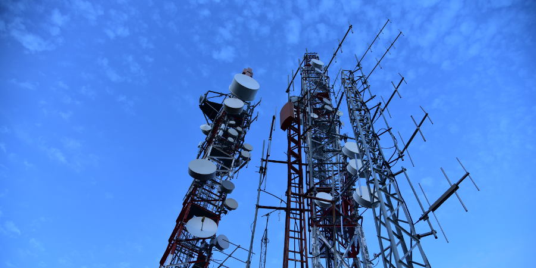

=========================
Interface configuration
=========================

All traffic in OPNsense travels via interfaces. By default, WAN and LAN are assigned, but many more are possible, like
GUESTNET (:doc:`captive portal </manual/captiveportal>`) and PFSYNC (:doc:`high availability </manual/hacarp>`).

Interface settings are now managed through an MVC/API implementation integrated into the grid under
:menuselection:`Interfaces --> Assignments`. Commonly required advanced DHCP options that were not part of the
legacy basic mode are available when advanced mode is enabled in the assignment dialog.

The legacy advanced and file-based DHCP modes are not supported by the MVC/API implementation. Saving an
interface in the Assignments dialog removes those settings. The legacy :file:`/interfaces.php` page remains
available by entering its URL directly and retains the old-style settings. It is expected to move to a plugin
for OPNsense 27.1.

Saving operational settings queues them for reconfiguration and permanent storage. Select **Apply** to process
the queue using the rewritten backend sequence, which otherwise behaves similarly to applying changes on the
legacy page. Pending changes are held in temporary storage; rebooting without applying them discards them.

.. Note::

    For legacy compatibility WAN interfaces set to type DHCP or interfaces with a *Gateway Rules* selection
    send reply packets to the corresponding gateway directly, also when the sender is on the same interface.
    This will break connectivity in some rare scenarios and can be disabled via
    **Firewall->Settings->Advanced->Disable reply-to**.

-----------------------------
Assignments
-----------------------------

Most interfaces have to be assigned to a physical port. By default, LAN is assigned to port 0 and WAN is assigned to
port 1. Go to :menuselection:`Interfaces --> Assignments` to manage both assignments and their configuration. The
grid lists every assigned interface and its device, address modes and status. Use the edit button on a row to change
an existing interface. Use the add button to assign and configure an available device. Save changes in the dialog,
then select **Apply** on the Assignments page to activate all pending interface changes.

.. Note::

    Changing an interface's device or address configuration can interrupt connectivity. The description and lock
    fields are saved immediately; operational changes remain pending until they are applied.

The edit dialog groups the common options as follows. Advanced fields are shown when advanced mode is enabled.

=========================== ============================================================================================================================================================
 Option                      Explanation
=========================== ============================================================================================================================================================
 **Basic configuration**
 Identifier                  The internal interface name, such as ``wan``, ``lan`` or ``opt1``. This value is read-only.
 Enabled                     Enable or disable the interface without removing its assignment.
 Lock                        Prevent accidental removal. Clear this option and save before deleting the assignment.
 Description                 A short name used to identify the interface throughout the user interface.
 **Device configuration**
 Device                      The physical or virtual device assigned to this interface. A device can only be assigned once.
 Promiscuous mode            Permanently receive all packets visible to the device. Leave disabled unless the use case requires it.
 MAC address (spoof)         Override the device MAC address. This advanced option normally remains empty. A single VLAN also requires promiscuous mode;
                             alternatively spoof its parent device.
 MTU                         `Maximum Transmission Unit <https://en.wikipedia.org/wiki/Maximum_transmission_unit>`_. Leave empty to use the device default.
 MSS                         Enable TCP MSS clamping to the entered value minus the IPv4 or IPv6 header size.
 **Hardware settings**
 Media (speed and duplex)    Leave at the default unless the selected value is known to match the connected port.
 Overwrite global settings   Use the hardware CRC, TSO, LRO and VLAN filtering values below instead of the settings from :menuselection:`Interfaces --> Settings`.
 Hardware CRC                Disable checksum offloading for this interface.
 Hardware TSO                Disable TCP segmentation offloading for this interface.
 Hardware LRO                Disable large receive offloading for this interface.
 VLAN Hardware Filtering     Enable, disable or retain the device default for VLAN hardware filtering.
 **Generic configuration**
 Block private networks      Block traffic from RFC 1918, loopback, link-local and carrier-grade NAT source addresses. Normally only enable this on a WAN using public address space.
 Block bogon networks        Block traffic from reserved or unallocated source prefixes that should not occur in the public Internet routing table.
=========================== ============================================================================================================================================================

.. Note::

    When configuring VPN clients without static tunnel addresses, you can use the "Dynamic gateway policy" option to automatically generate gateways to the device (without address).

The address fields shown in the dialog depend on the selected **IPv4 Configuration Type** and
**IPv6 Configuration Type**.

For IPv4:

=============================== ===============================================================================================================================================================================================================
 Option                          Explanation
=============================== ===============================================================================================================================================================================================================
 IPv4 Configuration Type         Select ``None``, ``Static IPv4``, ``DHCP`` or the mode matching an assigned PPP device.
 **Static IPv4**
 IPv4 address                    Enter the address and prefix length in CIDR notation, for example ``192.168.1.1/24``.
 IPv4 gateway rules              Select a gateway belonging to this interface. Reply-to policy and, in Automatic or Hybrid mode, outbound NAT rules are then generated for it.
 **DHCP**
 Alias IPv4 address              Fixed alias address used by the DHCP client.
 Alias IPv4 subnet mask          Prefix length for the alias address.
 Reject Leases From              Ignore offers from the listed DHCP servers, for example an ISP modem that issues private addresses after losing upstream connectivity.
 Hostname                        Client identifier and hostname sent with the DHCP request. Some ISPs require this.
 Honour MTU                      Allow the DHCP-provided MTU to be applied. This advanced option is disabled by default because an incorrect value can disrupt connectivity.
 Use VLAN priority               Apply the selected 802.1p priority to DHCPv4 requests when required by the ISP.
 Send Options                    Advanced DHCPv4 options sent to the server, one per line.
 Request Options                 Advanced DHCPv4 options requested from the server, one per line.
=============================== ===============================================================================================================================================================================================================

For IPv6:

================================= ===============================================================================================================================================
 Option                            Explanation
================================= ===============================================================================================================================================
 IPv6 Configuration Type           Select ``None``, ``Static IPv6``, ``DHCPv6``, ``Link-local``, ``SLAAC``, a tunnel or prefix-tracking mode, or ``PPPoEv6`` for a PPPoE device.
 **Static IPv6**
 IPv6 address                      Enter the address and prefix length in CIDR notation.
 IPv6 gateway rules                Select an IPv6 gateway belonging to this interface to generate the corresponding reply-to policy.
 **DHCPv6**
 Use VLAN priority                 Apply the selected 802.1p priority to DHCPv6 requests when required by the ISP.
 Prefix delegation size            Delegated prefix length supplied by the ISP, or ``None`` when no prefix should be requested.
 Request prefix only               Request a delegated prefix without requesting an address.
 Information Only                  Advanced stateless mode that requests configuration parameters but no address.
 Request DNS configuration         Request DNS server information from the DHCPv6 server.
 Send prefix hint                  Indicate the desired delegation size to the DHCPv6 server.
 Send rapid commit                 Request a two-message rapid-commit exchange instead of waiting for advertisements.
 Optional prefix ID                Hexadecimal subnet ID to select from the delegated prefix.
 Optional interface ID             Hexadecimal value used for the lower interface-identifier portion of the address.
 Optional prefix IAID              Non-standard identity-association ID for the prefix request, when required.
 Send Options                      Advanced DHCPv6 options sent to the server, one per line.
 Request Options                   Advanced DHCPv6 options requested from the server, one per line.
 **Link-local**                    Generate an automatic link-local address (LLA) based on the MAC address of the interface.
                                   Received router advertisements (RA) will not be processed.
 **SLAAC**                         Same as link-local mode, but received router advertisements (RA) will be processed,
                                   which means there will be one or more automatically generated IPv6 addresses based on the MAC address of the interface.
 **6RD Rapid Deployment**
 6RD prefix                        The 6RD IPv6 prefix assigned by your ISP. e.g. '2001:db8::/32'
 6RD Border Relay                  The 6RD IPv4 gateway address assigned by your ISP
 6RD IPv4 Prefix length            The 6RD IPv4 prefix length. Normally specified by the ISP. A value of 0 means we embed the entire IPv4 address in the 6RD prefix.
 6RD IPv4 Prefix address           The 6RD IPv4 prefix address. Optionally overrides the automatic detection.
 **Identity association / Track Interface (legacy)**
 Parent interface                  Select the dynamic IPv6 interface whose delegated prefix should be used.
 Assign prefix ID                  The hexadecimal /64 network ID selected from the delegated prefix.
 Reserved prefix range             Length of the range reserved for downstream delegation.
                                   The range starts at the given prefix ID. The default is to only reserve the given prefix ID.
 Optional interface ID             Hexadecimal value used for the lower interface-identifier portion of the address.
 Optional prefix IAID              Non-standard identity-association ID for the tracked prefix, when required.
 Manual configuration              Allow manual DHCPv6 and Router Advertisement service configuration. Use with care.
 **Gateway configuration**
 Dynamic gateway policy            Create a gateway without a fixed next-hop address for supported tunnel and other point-to-point interfaces.
================================= ===============================================================================================================================================

.. Note::

    *Identity Association* offers similar functionality like *Track Interface (legacy)*, but without automatic ISC-DHCPv6 and Radvd configuration. It is intended
    for pure RA and DHCPv6 configuration using Dnsmasq or Kea/Radvd.

-----------------------------
Mobile Networking
-----------------------------

OPNsense supports 3G and 4G (LTE) cellular modems as failsafe or primary WAN
interface. Both USB and (mini)PCIe cards are supported.

.............................
Supported Devices
.............................
While all devices supported by FreeBSD will likely function under OPNsense their
configuration depends on a AT command string that can differ from device to device.
To make thing easier some of these strings are part of a easy selectable profile.

Tested devices by the OPNsense team include:

* **Huaweu M909S-120** (device cuaUx.0) (Requires separate SIM card holder/adapter) [Tested: OPNsense 21.1]
* **Huawei ME909u-521** (device cuaUx.0)
* **Huawei E220** (device cuaUx.0)
* **Sierra Wireless MC7304** (device cuaUx.2) [as of OPNsense 16.7]

.. Note::

  If you have tested a cellular modem that is not on this list, but does work then
  please report it to the project so we can list it and inform others.

.............................
Configure Cellular modems
.............................
Setting up and configuring a cellular modem is easy, see: :doc:`/manual/how-tos/cellular`

.............................
3G - 4G Cellular Failover
.............................
To setup Cellular Failover, just follow these two how-tos:

#. :doc:`/manual/how-tos/cellular`
#. :doc:`/manual/how-tos/multiwan`

.. Note:: Treat the cellular connection the same as a normal WAN connection.
