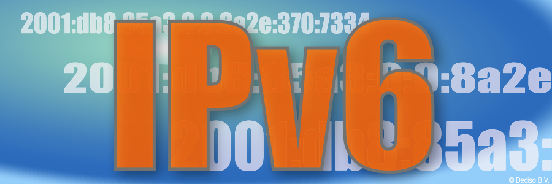

==================================================
IPv6 setup
==================================================

Introduction
=================

To this day IPv6 remains an elusive topic. IPv6 has long been shipped as a default option in OPNsense and received
gradual improvements over the years, but configuration complexity, ISP problems and sometimes
also software bugs can cause connectivity to fail or not establish at all.
This guide aims to provide groundwork for how IPv6 can be configured and how to spot known mistakes and troubleshoot connectivity.

When talking about external and internal interfaces this guide uses "WAN" and "LAN",
not excluding the possibility for multiple interfaces on each side being used at the same time.

Note this guide will not cover NAT on IPv6 for simplicity's sake.

IPv6 Modes
===================

Depending on the IPv6 mode selected IPv6 behaviour differs in outcome. The matching mode must be selected for your ISP.
If in doubt ask for assistance via your ISP or ask on the forum how other users of your ISP configured it successfully.

None
-------------------------------

This mode turns off IPv6 connectivity for this particular interface. Use this mode when the default mode (DHCPv6) does not work or causes broken connectivity with your ISP. It does not prohibit IPv6 globally and some services might even locally require IPv6 in order to communicate to itself (such as Squid web proxy for example).

.. Note::

    You can use this mode for WAN and LAN connections.

Static IPv6
-------------------------------

When the ISP offers a static address block you can assign one /64 network to your WAN interface and other /64 networks to your LANs. You can even delegate bigger networks within your prefix to downstream routers via DHCPv6 which is generally available in static mode. Note that you need to create and set a gateway address for this mode to connect to your next gateway hop which your ISP should provide to you as well.

.. Note::

    You can use this mode for WAN and LAN connections.

.. Tip::

    In PPPoE IPv4 mode the "Use IPv4 connectivity" option will assign the IPv6 on the PPPoE device itself instead of the parent device. The use of this option depends on your ISP.

DHCPv6
-------------------------------

For dynamic address offerings (that most likely are also shifting the prefix) this mode is the most common configuration and therefore also the default setting for a preset WAN. In this mode a prefix will be acquired if offered, either with or without an additional IP address for your WAN. Note that the interface will not assign a /64 to itself from the prefix in contrast to static IPv6. Internally, a single globally unique address is either acquired via DHCP or SLAAC (not to be confused with SLAAC mode) but in general a ISP-provided link-local address is automatically used for the connectivity to the next hop gateway. Setting "Request only an IPv6 prefix" may be required in case the ISP refuses to hand out an address and/or prefix.

In PPPoE IPv4 mode the "Use IPv4 connectivity" option will acquire address information on the PPPoE device itself instead of the parent device. The use of this option depends on your ISP. Note that in this mode PPPoEv6 is also enabled as some ISPs require it for IPv6 functionality.

.. Note::

    You can use this mode for WAN connections only.

PPPoEv6
-------------------------------

In PPPoEv6 mode a single address is acquired via the PPPoE IPv4 connection. WAN connectivity to the next gateway hop is established automatically if supported by the ISP.

.. Note::

    You can use this mode for WAN connections only.

SLAAC
-------------------------------

Use "Stateless Address Autoconfiguration" for the IPv6 connectivity only. In cases where Static IPv6 or DHCPv6 not available this mode may still provide ISP connectivity.

In PPPoE IPv4 mode the "Use IPv4 connectivity" option will acquire address information on the PPPoE device itself instead of the parent device. The use of this option depends on your ISP.

.. Note::

    You can use this mode for WAN connections only.

6to4 Tunnel
-------------------------------

This is an IPv6 over IPv4 tunnelling mode as specified in RFC3056 over a fixed IPv4 router address. It does not require any client side configuration, but is not being used much anymore due to 6rd.

.. Note::

    You can use this mode for WAN connections only.

6rd Tunnel
-------------------------------

6rd means "IPv6 Rapid Deployment" which is a generalised form of 6to4 connectivity where a variable prefix can be obtained through configuration. Some ISPs may still use this mode although it's not very popular in general. The configuration for 6rd may be delivered by IPv4 DHCP connectivity, but is currently not being parsed and presented to the user.

.. Note::

    You can use this mode for WAN connections only.

Track Interface
-------------------------------

This mode uses a WAN DHCPv6 interface to assign a single /64 network to your LAN interfaces. The "Manual configuration" option switches from automatically configuring router advertisements and DHCPv6 (including prefix delegation if the prefix is big enough) to how Static IPv6 configured devices are able to use it from the menu (off  by default).

.. Note::

    You can use this mode for LAN connections only.

Basic setup and troubleshooting
=======================================

There are two steps for providing IPv6:

1.  Provide IPv6 to your WAN and the firewall itself.
2.  Provide IPv6 to your LAN including the clients behind it.

For step 1 start with selecting the appropriate IPv6 mode, reconfigure the WAN interface and try to ping an IPv6 address or host from the firewall itself, e.g.:

Test if ping over IPv6 to Internet is successful (also possible via :menuselection:`Interfaces-->Diagnostics-->Ping`).

::

  # ping -6 heise.de

Test if IPv6 default route exists (also possible via :menuselection:`System-->Routes-->Status` and search for default).

::

  # netstat -nr6 | grep default

.. Note::

    If one or both of these do not work you are looking at a configuration problem on the WAN side or your ISP does not support IPv6 for you at this point.
    Do not try to debug step 2 at this point wondering why clients cannot connect.

For step 2 static and tracking modes are what can be used on a LAN to provide attached clients with IPV6 connectivity.

Tracking mode is enabled by default and the DHCPv6 on the WAN automatically sets up both Router Advertisements and DHCPv6 server including the use of prefixes being delegated to clients if the present prefix has enough room left to delegate.

When using static mode or the "Manual configuration" setting in tracking you can configure both Router Advertisements and DHCPv6 server from the menu, but defaulting to off. Most endpoint devices work fine with only Router Advertisements set, but if you deal with downstream routers it can be beneficial to set up DHCPv6 server as well to delegate part of the prefix.

.. Note::

    Note that certain network stack implementations such as Android phones only support Router Advertisement configuration via SLAAC and DCHPv6 leases do not work there.

Make sure to test the following on multiple different clients to see if connectivity can be established at all or not:

*   https://test-ipv6.com/
*   https://ipv6-test.com/

These two pages can help you diagnose remaining issues as well.
Make sure to set up both DHCPv6 server and Router advertisements during testing when debugging IPv6 connectivity. If you eventually do not have any need for one or the other it's also ok to disable them. A completely static setup is also possible.

Dynamic address assignments
=======================================

When not using static addresses on the clients, there are some very important differences between IPv4 and IPv6.
In case of IPv4, addresses are being provided using a dhcp server, which usually also propagates a default route to the client.

For IPv6 the first service to look at for autoconfigurating clients is the  :doc:`/manual/radvd` daemon, which defines how clients
receive their routes and how they will receive an addresss. The available options are provided in the referred document.

The :doc:`DHCPv6 server </manual/dhcp>`, when used, can be configured in a similar way as when using IPv4.

Configuration examples
=======================================

- :doc:`/manual/how-tos/IPv6_ZenUK`
- :doc:`/manual/how-tos/ipv6_tunnelbroker`
- :doc:`/manual/how-tos/ipv6_dsl`
