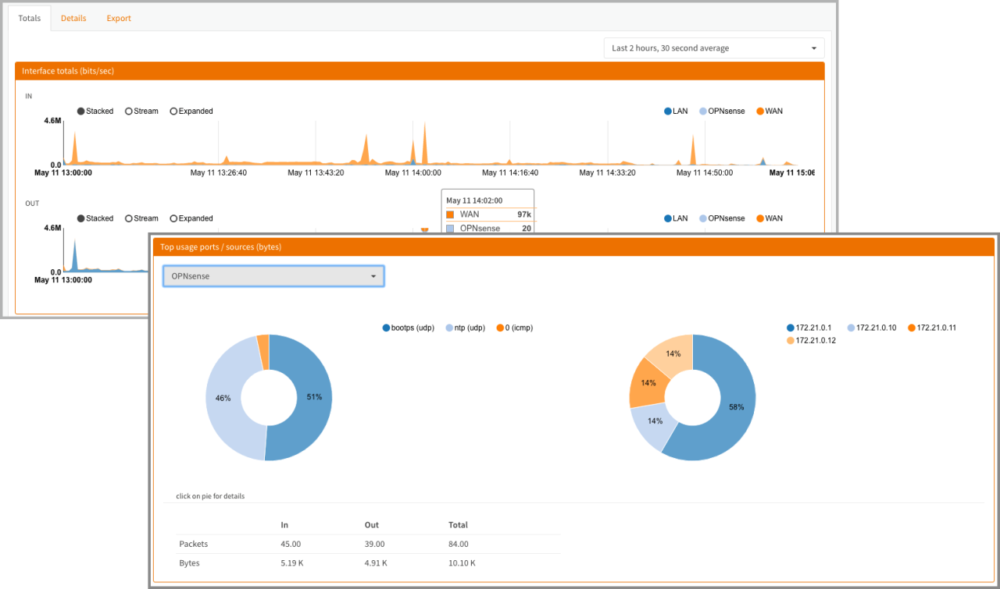
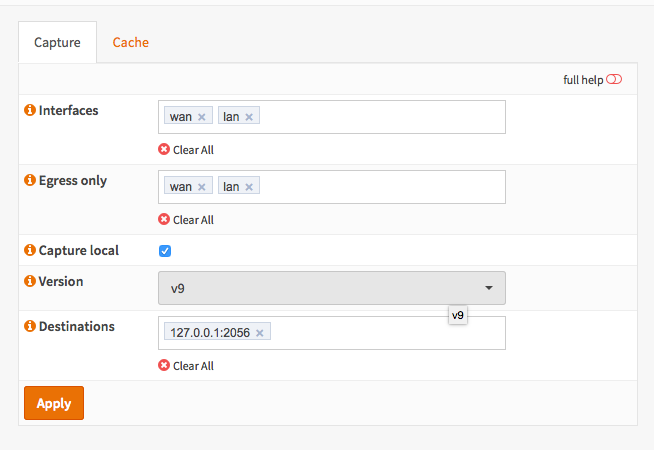
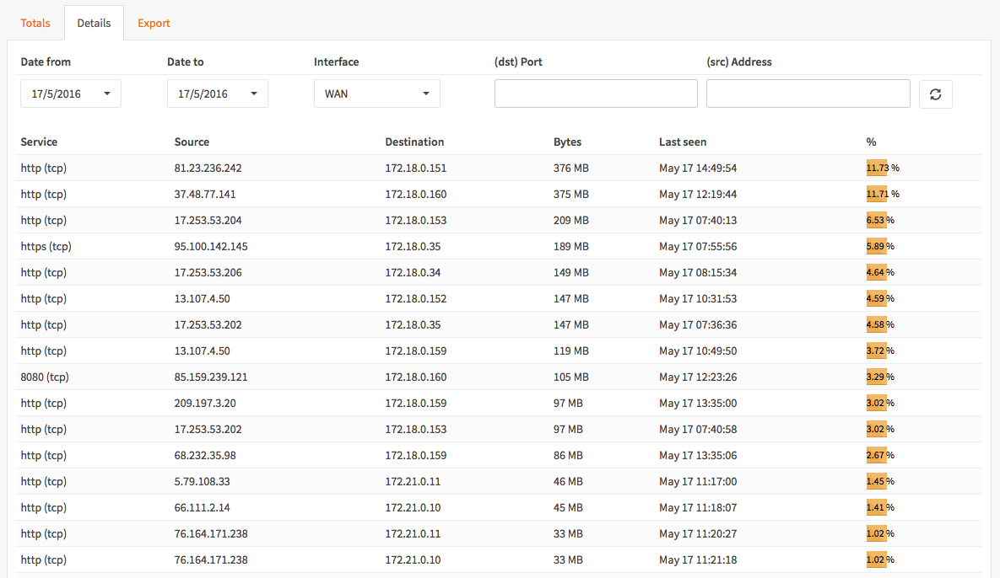

=========================
Netflow Export & Analyses
=========================

Netflow is a monitoring feature, invented by Cisco, it is implemented in the FreeBSD
kernel with ng_netflow (Netgraph). Since Netgraph is a kernel implementation it
is very fast with little overhead compared to softflowd or pfflowd.

While many monitoring solutions such as Nagios, Cacti and vnstat only capture traffic
statistics, Netflow captures complete packet flows including source, destination
ip and port number.

OPNsense offers full support for exporting Netflow data to external collectors as
well as a comprehensive Analyzer for on-the-box analysis and live monitoring.

OPNsense is the only open source solution with a build-in Netflow analyzer integrated
into it's Graphical User Interface.

------------------
Supported Versions
------------------
OPNsense support both Netflow version 5 (IPv4) and version 9 (IPv4 & IPv6).

--------------
Netflow Basics
--------------
For analyzing the flow data it is important to understand the difference between
ingress and egress traffic.

Ingress
-------
Traffic to or coming from the firewall.

Egress
------
Traffic passing trough the firewall.

Ingress + Egress = Double flow count
------------------------------------
When enabling both ingress and egress, traffic gets counted double due to Network
Address Translation as all packets going to the WAN coming from the LAN pass the
Network translation of the firewall therefor also creating an ingress flow.

If you are not interested in ingress traffic then OPNsense offers the option to
filter this traffic. When utilizing a proxy on the same device its important to
capture the ingress flows as well, otherwise all proxy traffic won't be visible.
Downside is of course that all traffic not passing the proxy will we counted twice
due to the mentioned NAT effect.

----------------
Netflow Exporter
----------------
OPNsense Netflow Exporter supports multiple interfaces, filtering of ingress flows
and multiple destinations including local capture for analysis by Insight (OPNsense
Netflow Analyzer).

--------------------------
Netflow Analyzer - Insight
--------------------------
OPNsense offers a full Netflow Analyzer with the following features:

* Captures 5 detail levels

    * Last 2 hours, 30 second average
    * Last 8 hours, 5 minute averagae
    * Last week, 1 hour average
    * Last month, 24 hour average
    * Last year, 24 hour average

* Graphical representation of flows (stacked, stream and expanded)
* Top usage per interface, both ips and ports.
* Full in/out traffic in packets and bytes
* Detailed view with date selection and port/ip filter (up to 2 months)
* Data export to csv for offline analysis

    * Selectable Detail Level
    * Selectable Resolution
    * Selectable Dat range

-------------
Configuration
-------------

Setup Netflow Exporter
----------------------
See :doc:`/manual/how-tos/netflow_exporter`

Setup Insight
-------------
See :doc:`/manual/how-tos/insight`
