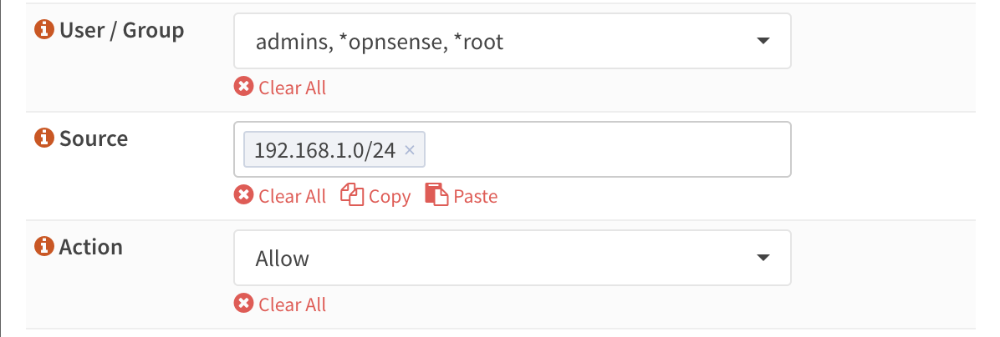

======================================
Advanced Proxy access management
======================================

As part of the OPNsense Business Edition, Deciso offers a plugin to add fine grained access control to your existing
web proxy setup.

One of the features often requested is to easily (dis)allow (groups of) users access to certain domain or url parts,
the :code:`OPNProxy` plugin addition offers this functionality at ease.

Prerequisites
---------------------------

Before installing and using this plugin, make sure your web proxy is configured and enabled including some sort of authentication
(unless network only authentication should be used).

.. Note::
    To enable authentication, goto :menuselection:`Services->Web Proxy->Administration` then collapse "Forward Proxy" and
    choose "Authentication Settings". Choose a method and apply settings.

.. Note::
    In order for authentication scheme's to work, users do need to exist in the firewall. You can either import them (when using ldap)
    or make sure the same username exists locally to map groups too.

.. Warning::
    Do not install other plugins or configuration files hooking into the proxy as these might interfere with the working
    of the system.

Installation
---------------------------

Installation of this plugin is rather easy, go to :menuselection:`System --> Firmware --> Plugins` and search for **os-OPNProxy**,
use the [+] button to install it.

Next go to :menuselection:`Services --> Web Proxy --> Access control` to start configuring polcies.

.. Note::

    Redis is required for this plugin to operate, when accessing the access control settings page for the first time you will be pointed to the correct
    setting to enable it directly. (just enable and apply should be enough)

General
---------------------------

In order to utilise user/group based policies, the proxy needs to be able to inspect the traffic and know the identity of the
user.

Since most of the internet is being encrypted nowadays, you would need to enable some sort of ssl inspection in between.
When setting "Enable SSL inspection" in :menuselection:`Services -> Webproxy -> Administration -> Forward Proxy`
you are able to use a "man-in-the-middle" approach (where the proxy intercepts traffic and is able to filter it).
A disadvantage of this option is that your clients would need to trust the firewalls certificate (CA selected in "CA to use").
When enabled full paths can be filtered.

A bit lighter option would be to use SSL inspection with "Log SNI information only" enabled,
in which case the firewall would know which domain you are trying to visit, but can not inspect the content of the request (or response for that matter).

.. Note::

    When enabling "Log SNI information only", only domain based policies will be usable for SSL/TLS based requests.

The standard authentication options available in OPNsense apply, which can be configured in
:menuselection:`Services -> Webproxy -> Administration -> Forward Proxy -> Authentication settings`. Please make sure
to import/add the users in OPNsense in order to user their authorisation settings (existence and group membership).

.. Note::

    Standard (global) policies take precedence over the ones defined in the access control plugin, this includes
    "SSL no bump sites" when full TLS/SSL inspection is used.
    (it's not possible to block no bump sites in full inspection mode)

Transparant proxies
---------------------------

It is possible to use the proxy in transparant mode, but there are some constraints and ceveats to take into account when doing so.
This paragraph tries to explain them one by one.

* Using "Log SNI information only" is not supported in a useful way. As the browser is not aware of the proxy, it will request
  access to an ip address in stead of a hostname. With full intercept mode, this is not really an issue as the next request will
  be the actual question and does contain the hostname, but without interception, you can only filter on ip address which is often not very useful.
* The client has to trust the CA which the proxy uses to automatically create certificates, which means all TLS requests will be signed by the firewall instead of the
  actual trustee.
* User based authentication is not possible, as the client doesn't know it's being intercepted, it's also not possible to
  request a username and password. OPNproxy only supports basic authentication.

.. Note::
  When changing the "Log SNI information only"  option, you have to restart the proxy as well. As the apply button will not
  reload the proxy in full.

Authentication options
---------------------------

Every policy defined in this plugin can contain users/groups and/or networks, if one option is omitted from the
input its being ignored, when both are specified, both should apply.

Example usage scenarios:

* User :code:`X` from network :code:`Y` is not allowed to visit :code:`gambling` websites
* All users from group :code:`Z` are not allowed to visit :code:`gambling` websites
* All users in network :code:`Y` are allowed to visit the OPNsense website.
* All users in network :code:`Y` are not allowed to visit :code:`gaming` websites. (two policies)

.. Note::

  When not using user based authentication (network only), the default policy is :code:`deny` so you would need to add
  at least one policy accepting traffic in these cases.

Policy types
---------------------------

Part of OPNproxy is a standard list of categorized locations, which can be easily added to a policy, these type of policies
are the default ones. You will find categories here like :code:`adult`, :code:`advertisements`, :code:`malware` and many others.

In some cases however our defaults are not enough, for this reason we also offer the posibility to push your own list of
domains and locations into a custom policy.

Every policy contains what to match (either a standard category or a list of domains and paths), what to do (allow or deny)
and an audience (the users and/or groups the policy applies to).

Since both users and groups can be selected within the same policy, we choose to prefix users with a :code:`*`.

.. Tip:

    For easy administration it's generally a good idea to use groups in policies instead of users.

Prioritisation within our access control is quite easy and should cover all possible scenarios, below the order in which
decisions are made:

1.  No policy, default allow. When authentication is properly setup, this means that access depends on supplying valid credentials.
2.  Explicit allow, the closest matching policy (see text below) returns accept, access will be granted (also when another policy returns deny)
3.  Explicit deny, the closest matching policy returns deny, access will be denied

Closest matching explained
.............................

One of the key features of our access control system is a method to find the best suitable policy for the requested domain
or url.

This means that if someone defines two ACL's one denying access to all google.nl subdomains (:code:`.google.nl`) and
one allowing access to the favicon on the page :code:`www.google.nl/favicon.ico`, only access to favicon.ico is allowed on
the google.nl website.

If one of our default policies contains a website you still want to allow, you can easily add the domain (with or without path)
to another policy to still grant access. This is one of the main reasons we prioritise :code:`allow` over :code:`deny` in these
policies.

Custom policies
---------------------------

Custom policies are defined as lists of domains with optional paths using one line per item.
When domain policies should include subdomains, they should be prefixed with a point (.), e.g. :code:`.nl` matches
all dutch top level domains.

Some companies use very strict policies, in which case one should only be allowed to access specific domains. For this case
we added a special wildcard (:code:`*`). When set in a policy it will mark the absolute top level domain.

.. Tip::

    If one should only be allowed to access pkg.opnsense.org you would create two policies, one containing a deny policy
    on :code:`*` and one containing an allow policy on :code:`pkg.opnsense.org`.

Using the policy tester
---------------------------

When doubting if a specific location would be accessible by a user, one can always use the included ACL tester.
Although mainly used for debugging purposes, it will easily inform you about the decision the webproxy will take
when using our acl's.

The policy tester contains two fields and a test button, just enter a username followed by a url (e.g. https://www.google.nl/)
and hit the test button. Depending on settings it will return a response like:

.. code-block:: json

  {
    "message": "ERR message=\"reason:c1380754-e14b-4dc7-bcf9-96307450c025 policy_type:custom\" user=\"root\"\n",
    "user": {
      "uid": "root",
      "id": "0",
      "applies_on": [
        "u:root",
        "g:admins"
      ]
    },
    "policy": {
      "action": "deny",
      "id": "c1380754-e14b-4dc7-bcf9-96307450c025",
      "applies_on": [
        "g:admins"
      ],
      "policy_type": "custom",
      "description": "test_custom2",
      "path": "/",
      "wildcard": true,
      "domain": "google.nl"
    }
  }

Which informs you about all settings relevant for the lookup, the message returned (to squid), the user found and the policy matched
using the rules described earlier.

Auto update supplied policies
--------------------------------------

In order to update the default type policies automatically, you can install a cron job in :menuselection:`System --> Settings --> Cron`.
Search for :code:`OPNProxy apply policies` and schedule once a day.

.. Warning::

  Do not execute this job more than once a day as this will add load to your machine without changing anything. Our dataset
  is updated every day.

